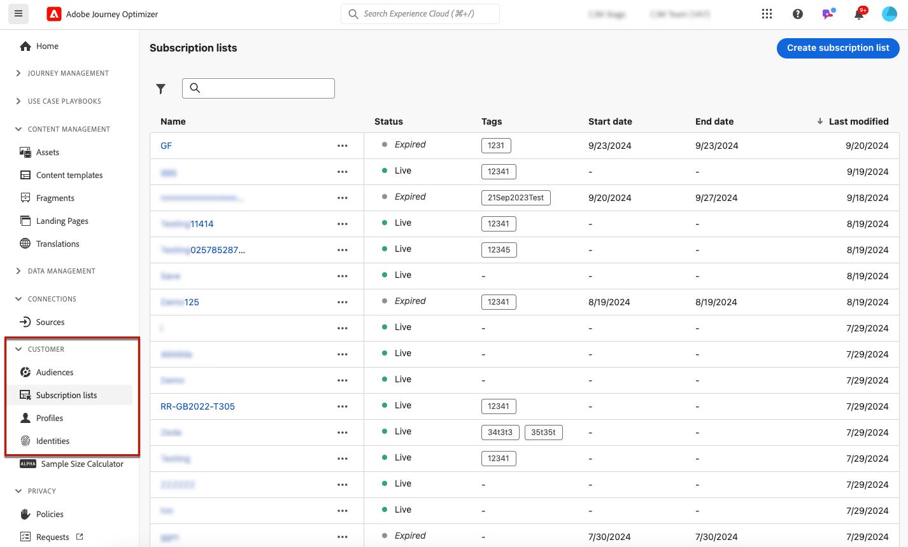

# 訂閱清單 {#create-subscription-list}

>[!CONTEXTUALHELP]
>id="ajo_subscription_list"
>title="設定訂閱清單"
>abstract="建立訂閱清單以收集已選擇接收有關特定主旨或事件的通訊內容的設定檔。 "
>additional-url="https://experienceleague.adobe.com/docs/journey-optimizer/using/content-management/landing-pages/subscription-list.html?lang=zh-Hant#define-subscription-list" text="建立訂閱清單"

訂閱服務是指為已選擇接收特定主旨/事件/興趣/等之通訊的客戶提供的行銷商品和服務。 持續進行。 在[!DNL Journey Optimizer]中，這些選擇加入的客戶會收集到訂閱清單中。

訂閱服務可用於：

* 電子報，例如：「執行系列」
* 事件，例如：「Summit 2021」
* 網路研討會，例如：「進一步瞭解crypto」
* 對特定產品/運動/服務/等的興趣，例如：「有興趣在未來12個月內購買房子」
* 通知方式的偏好設定，例如：「通過電子郵件接收新歌曲通知」

可透過[登陸頁面](create-lp.md)將設定檔新增至訂閱清單。 在[此區段](lp-use-cases.md#subscription-to-a-service)中呈現範例。

## 建立訂閱清單 {#define-subscription-list}

若要建立訂閱清單，請遵循下列步驟。

1. 若要存取訂閱清單，請選取&#x200B;**[!UICONTROL 客戶]** > **[!UICONTROL 訂閱清單]**。

   

1. 選取&#x200B;**[!UICONTROL 建立訂閱清單]**&#x200B;按鈕。

   

1. 新增標題和說明。 這些欄位為必填欄位。

   

   >[!CAUTION]
   >
   >目前您無法在&#x200B;**[!UICONTROL 標題]**&#x200B;欄位中使用空格或輸入其他訂閱清單已存在的名稱。

1. 您可以定義開始日期和結束日期。

   

1. 從&#x200B;**[!UICONTROL 標籤]**&#x200B;欄位選取或建立Adobe Experience Platform標籤，將您的登入頁面分類以改善搜尋。 [了解更多](../start/search-filter-categorize.md#tags)

1. 按一下&#x200B;**[!UICONTROL 儲存]**。

## 使用訂閱清單 {#use-subscription-lists}

建立訂閱清單後，您可以：

* 將設定檔新增至訂閱清單

  您可以訂閱電子報或註冊活動來邀請人員&#x200B;**加入清單**。 您也可以&#x200B;**傳送個人化訊息**&#x200B;給訂閱者。

  例如，若要邀請對象註冊活動或訂閱電子報，您可以傳送訊息給他們，並附上登陸頁面的連結，讓他們加入活動或訂閱。 透過登入頁面表單選擇加入的設定檔會新增至您為此目的建立的訂閱清單。

* 傳送訊息給訂閱者

  您也可以在建立歷程及新增個人化時，使用訂閱清單作為對象。

  例如，當客戶訂閱串流服務時，它可以觸發立即傳送歡迎電子郵件系列，鼓勵他們第一次登入應用程式並設定其檢視偏好設定。

瞭解如何在[此使用案例](lp-use-cases.md#subscription-to-a-service)中使用您的訂閱清單。

## 瀏覽您的訂閱清單 {#browse-subscription-lists}

清單會顯示所有已建立的訂閱清單。 您可以根據建立日期或修改日期及其狀態來篩選它們。

可能的狀態如下：

* **[!UICONTROL 未開始]**：您定義的開始日期晚於當天。 訂閱的設定檔將不會收到與此訂閱清單相關的通訊。
* **[!UICONTROL 即時]**：當天介於訂閱清單開始日期與結束日期之間，或者您未定義結束/開始日期，這表示訂閱清單永遠是即時。
* **[!UICONTROL 已到期]**：已超過結束日期，因此訂閱清單不再有效。 任何訂閱的設定檔都不會再收到與此訂閱清單相關的通訊。

## 監視您的訂閱清單 {#monitor-subscription-lists}

您可以透過專用報告監控您的訂閱清單影響。 您可以存取兩種型別的報表：

* 訂閱清單即時報告

  從「最近24小時」索引標籤存取的即時報告，會顯示過去24小時內發生的事件，從事件發生起的最短時間間隔為兩分鐘。 [了解更多](../reports/subscription-report-live.md)

* 訂閱清單所有時間報表，含Customer Journey Analytics

  這些報表著重於至少兩小時前發生的事件，並涵蓋選定時段內的事件。 **訂閱報告**&#x200B;可提供與特定清單相關的設定檔訂閱和取消訂閱的基本深入分析，協助您瞭解不同訂閱行銷活動和方案在提高參與度和轉換數方面的成效。 [了解更多](../reports/subscription-report-global-cja.md)
