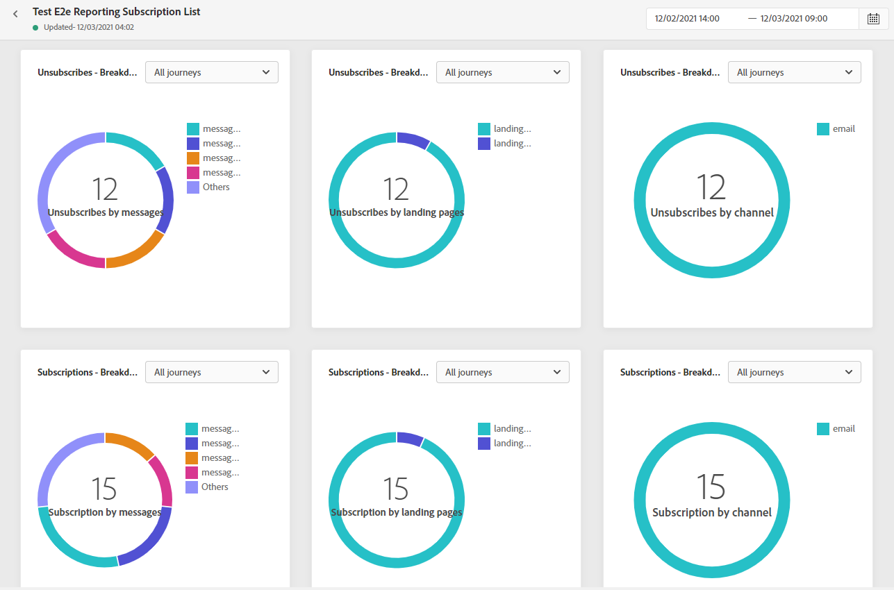

# 訂閱報告 {#subscription-report}

訂閱報告顯示有關訂閱者活動的詳細資訊。 有兩種報告類型可用：

* 的 **[!UICONTROL Live report]** 以僅在過去24小時內測量和可視化交貨的訂閱和取消訂閱。

* 的 **[!UICONTROL Global report]** 以測量和直觀顯示所選時段內交貨的預訂和取消預訂。

要訪問報表，請選擇 **實況** 或 **[!UICONTROL Global report]** 的子菜單。

## 訂閱即時報告 {#subscription-live}

的 **[!UICONTROL Subscription performance]** 關鍵績效指標 **[!UICONTROL Subscriptions by journey]**/**[!UICONTROL Unsubscribes by journey]** 表格詳細列出了訪問者與登錄頁的接觸情況。 表和KPI包含與登錄頁相關的可用資料，例如：

* **[!UICONTROL Subscribes]**:過去24小時內的訂閱總數。

* **[!UICONTROL Unsubscribes]**:過去24小時內取消訂閱的總數。

的 **[!UICONTROL Subscription performance]** 圖表顯示了過去24小時內訂閱的演變。

的 **訂閱 — 細分** 和 **取消訂閱 — 細分** 圖表表示過去24小時內訂閱或未訂閱的總人數，具體取決於消息、登錄頁和渠道。

## 訂閱全局報告 {#subscription-global}

的 **[!UICONTROL Subscription performance]** 關鍵績效指標 **[!UICONTROL Subscriptions by journey]**/**[!UICONTROL Unsubscribes by journey]** 表格詳細列出了訪問者與登錄頁面的接觸的相關資訊。 表和KPI包含與登錄頁相關的可用資料，例如：

* **[!UICONTROL Subscribes]**:有關期間的訂閱總數。

* **[!UICONTROL Unsubscribes]**:有關期間未訂閱的總數。

的 **[!UICONTROL Subscription performance]** 圖形顯示相關時段的訂閱的演變。

的 **訂閱 — 細分** 和 **取消訂閱 — 細分** 表示根據消息、登錄頁和渠道在選定時間段內訂閱或取消訂閱的總人數。
