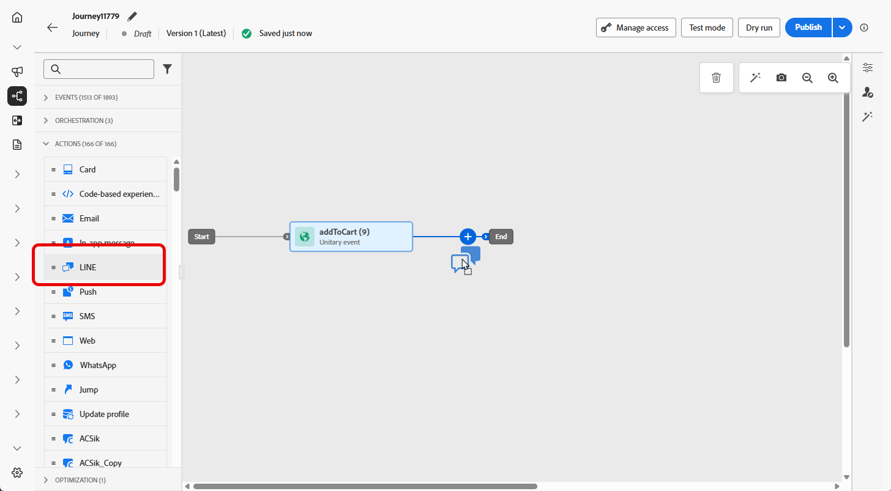
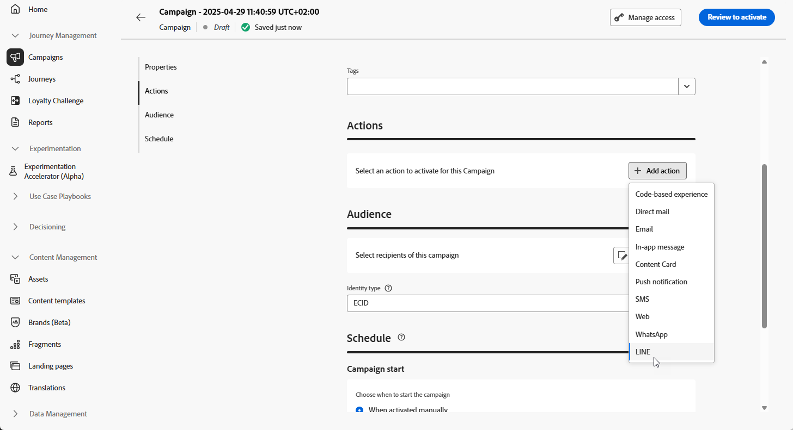

# 建立 LINE 訊息 {#create-line}

## 新增LINE訊息 {#create-line-journey-campaign}

瀏覽下列標籤，瞭解如何在行銷活動或歷程中新增LINE訊息。

>[!BEGINTABS]

>[!TAB 新增LINE訊息至歷程]

1. 開啟您的歷程，然後從浮動視窗的&#x200B;**動作**&#x200B;區段拖放&#x200B;**LINE**&#x200B;活動。

   

1. 提供訊息的基本資訊（標籤、說明、類別），然後選擇要使用的訊息設定。

   如需如何設定歷程的詳細資訊，請參閱[此頁面](../building-journeys/journey-gs.md)

   根據預設，**[!UICONTROL 組態]**&#x200B;欄位會預先填入使用者用於該頻道的最後一個組態。

您現在可以從&#x200B;**[!UICONTROL 編輯內容]**&#x200B;按鈕開始設計SMS訊息的內容，如下所述。

>[!TAB 新增LINE訊息至行銷活動]

1. 存取&#x200B;**[!UICONTROL 促銷活動]**&#x200B;功能表，然後按一下&#x200B;**[!UICONTROL 建立促銷活動]**。

1. 選取您要執行的行銷活動型別

   * **已排程 — 行銷**：立即或在指定日期執行行銷活動。 已排程的行銷活動旨在傳送行銷訊息。 可從使用者介面設定及執行。

   * **API觸發 — 行銷/異動**：使用API呼叫執行行銷活動。 API觸發的行銷活動旨在傳送行銷或交易式訊息，也就是在個人執行動作後傳送的訊息：密碼重設、購物車購買等。

1. 從&#x200B;**[!UICONTROL 屬性]**&#x200B;區段，編輯行銷活動的&#x200B;**[!UICONTROL 標題]**&#x200B;和&#x200B;**[!UICONTROL 描述]**。

1. 按一下&#x200B;**[!UICONTROL 選取對象]**&#x200B;按鈕，從可用的Adobe Experience Platform對象清單中定義要定位的對象。 [了解更多](../audience/about-audiences.md)。

1. 在&#x200B;**[!UICONTROL 身分識別名稱空間]**&#x200B;欄位中，選擇要使用的名稱空間，以識別所選對象中的個人。 [了解更多](../event/about-creating.md#select-the-namespace)。

1. 在&#x200B;**[!UICONTROL 動作]**&#x200B;區段中，選擇&#x200B;**[!UICONTROL 行]**，然後選取或建立新的組態。

   在[此頁面](line-configuration.md)中進一步瞭解LINE組態。

   

1. 按一下&#x200B;**[!UICONTROL 建立實驗]**&#x200B;以開始設定您的內容實驗，並建立處理以測量其效能，並為您的目標對象識別最佳選項。 [了解更多](../content-management/content-experiment.md)

1. 在&#x200B;**[!UICONTROL 動作追蹤]**&#x200B;區段中，指定您是否想要追蹤簡訊訊息中連結的點按次數。

1. 行銷活動旨在特定日期或循環頻率執行。 在&#x200B;**[!UICONTROL 本節]**&#x200B;中瞭解如何設定行銷活動的[排程](../campaigns/create-campaign.md#schedule)。

1. 從&#x200B;**[!UICONTROL 動作觸發程式]**&#x200B;功能表，選擇SMS訊息的&#x200B;**[!UICONTROL 頻率]**：

   * 一次
   * 每日
   * 每週
   * Month

您現在可以從&#x200B;**[!UICONTROL 編輯內容]**&#x200B;按鈕開始設計文字訊息的內容，如下所述。

>[!ENDTABS]

## 定義您的LINE內容{#line-content}

Adobe Journey Optimizer支援LINE的下列訊息型別：

* **文字**：傳送純文字或格式化的文字訊息。
* **貼圖**：加入LINE的原生貼圖，以新增字元和表現力。
* **影像**：附加影像以增強視覺吸引力。
* **影片**：分享動態通訊的影片內容。
* **位置**：使用地圖傳送位置資訊。
* **範本**：利用預先定義的範本以傳送一致的訊息。
* **Flex訊息**：使用JSON型Flex訊息，建立內容豐富的複雜版面配置。

您可以直接編輯JSON內容來設定這些訊息型別，以允許動態和個人化的訊息策略。

若要設定LINE內容，請遵循下列步驟。

1. 在歷程或行銷活動設定畫面中，按一下&#x200B;**[!UICONTROL 編輯內容]**&#x200B;按鈕以設定文字訊息內容。

1. 按一下&#x200B;**[!UICONTROL 編輯程式碼]**&#x200B;以編輯JSON內容。

1. 使用個人化編輯器來定義內容、新增個人化和動態內容。 您可以使用任何屬性，例如設定檔名稱或城市。 您也可以定義條件式規則。 瀏覽下列頁面，瞭解個人化編輯器中[個人化](../personalization/personalize.md)和[動態內容](../personalization/get-started-dynamic-content.md)的詳細資訊。

1. 按一下「**[!UICONTROL 儲存]**」並在預覽中查看您的訊息。

1. 使用&#x200B;**[!UICONTROL 模擬內容]**&#x200B;按鈕，預覽您的LINE訊息內容與個人化內容。

一旦您執行測試並驗證內容後，您就可以傳送LINE訊息給對象。 這些步驟在[此頁面](send-line.md)中有詳細說明

傳送後，您可以在行銷活動或歷程報告中測量LINE的影響。 如需報告的詳細資訊，請參閱[本區段](../reports/campaign-global-report-cja.md)。
