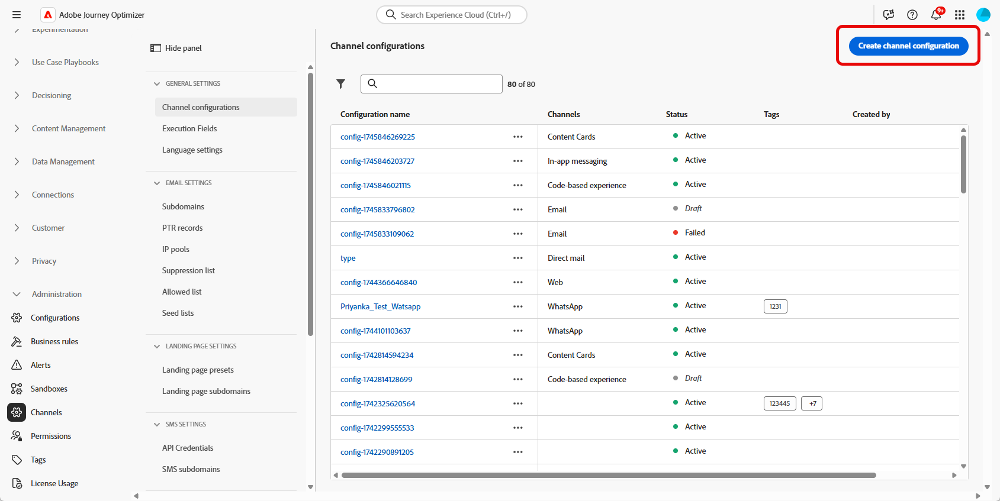
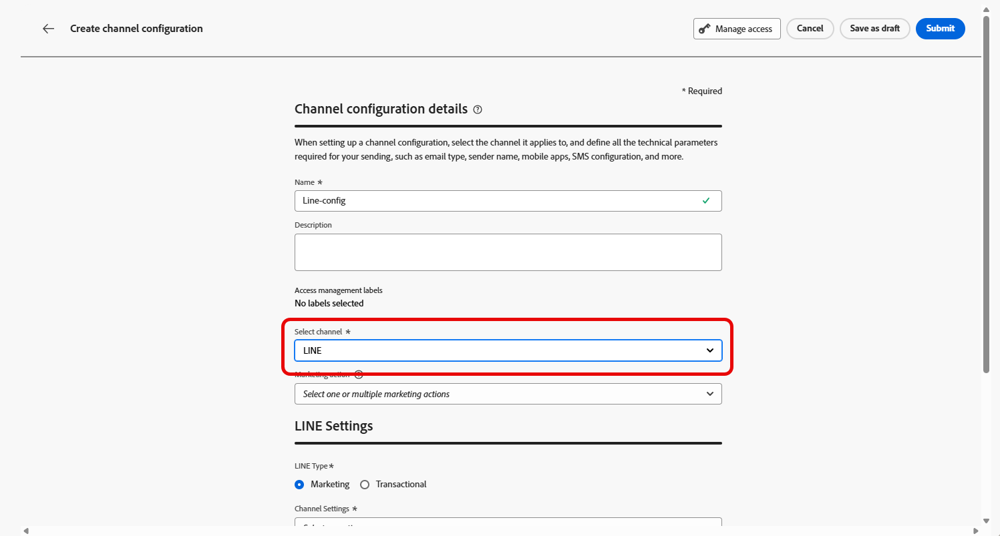

# 在Journey Optimizer中設定LINE頻道 {#line-configuration}

1. 存取&#x200B;**[!UICONTROL 頻道]** > **[!UICONTROL 一般設定]** > **[!UICONTROL 頻道設定]**&#x200B;功能表，然後按一下&#x200B;**[!UICONTROL 建立頻道設定]**。

   

1. 輸入設定的名稱和說明（選擇性），然後選取要設定的通道。

   >[!NOTE]
   >
   > 名稱必須以字母(A-Z)開頭。 它只能包含英數字元。 您也可以使用底線 `_`、點 `.` 和連字號 `-` 字元。

1. 若要將自訂或核心資料使用標籤指派給組態，您可以選取&#x200B;**[!UICONTROL 管理存取權]**。 [進一步瞭解物件層級存取控制(OLAC)](../administration/object-based-access.md)。

1. 選取&#x200B;**LINE**&#x200B;頻道。

   

1. 選取&#x200B;**[!UICONTROL 行銷動作]**，以使用此設定將同意原則與訊息相關聯。 系統會運用與行銷動作相關的所有同意政策，以尊重客戶的偏好設定。 [了解更多](../action/consent.md#surface-marketing-actions)

1. 選取設定的訊息型別：

   * **行銷**：針對促銷訊息，例如零售商店的每週促銷活動。 這些訊息需要使用者同意，且應符合LINE關於使用者選擇加入的原則。
   * **異動**：針對非商業訊息，例如訂單確認、密碼重設通知或傳遞更新。 這些訊息甚至可傳送給已取消訂閱行銷通訊的使用者，但嚴格限於特定交易內容。

1. 選取您的&#x200B;**[!UICONTROL 頻道設定]**。

   請聯絡您的Adobe代表以設定您的&#x200B;**[!UICONTROL 頻道設定]**。

   

1. 選取您要對映的&#x200B;**[!UICONTROL LINE使用者識別碼]**。 這是用來將訊息連結至LINE頻道中個別使用者的識別碼。

1. 輸入您的&#x200B;**[!UICONTROL 寄件者名稱]**，例如您的品牌名稱。

1. 提交變更。

您現在可以在建立LINE訊息時選取設定。
