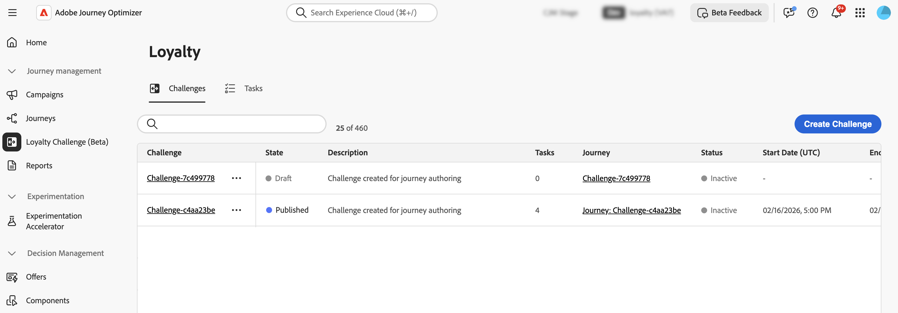
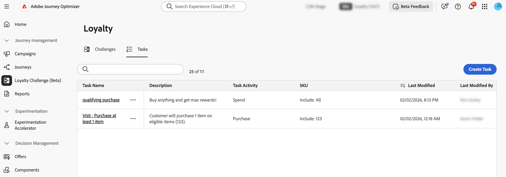

# 存取及管理挑戰與工作 {#access-loyalty-challenges}

>[!AVAILABILITY]
>
>此功能目前在&#x200B;**私人測試版**&#x200B;中，可能無法在您的環境中使用。 若要要求存取權，請聯絡您的Adobe代表。 深入瞭解[可用性標籤](../rn/releases.md#availability-labels)。

>[!BEGINSHADEBOX]

**忠誠度挑戰檔案：**

* [開始應對忠誠度挑戰](get-started.md)
* **存取及管理挑戰與工作** ◀︎ **您在這裡**
* [創造挑戰](create-challenges.md)
* [建立任務](create-tasks.md)

>[!ENDSHADEBOX]

## 存取及管理挑戰與工作

若要存取忠誠度挑戰，請導覽至Journey Optimizer，並在「**[!UICONTROL 歷程管理]**」區段下選取「**[!UICONTROL 忠誠度挑戰(Beta)]**」。 「忠誠度挑戰」介面提供一個集中位置，讓您檢視、管理及組織所有挑戰和任務。

介面提供兩個主要存貨的存取權：

* **挑戰**：檢視及管理所有忠誠度挑戰、監控其狀態，並執行快速動作，例如檢視、編輯、複製或刪除挑戰
* **任務**：瀏覽可用於多個挑戰的可重複使用任務，並獨立管理任務定義

## 挑戰詳細目錄 {#challenges-tab}

**[!UICONTROL 挑戰]**&#x200B;索引標籤會依上次修改日期顯示所有挑戰，最近修改的挑戰會先出現。

顯示的關鍵資訊：

* **[!UICONTROL 狀態]**：挑戰目前的狀態（草稿或已發佈）
* **[!UICONTROL 任務]**：挑戰中設定的任務數
* **[!UICONTROL 歷程]**：連結到與挑戰關聯的自動產生歷程
* **[!UICONTROL 狀態]**：相關歷程的目前狀態（草稿、即時、已停止等）
* **[!UICONTROL 開始/結束日期(UTC)]**：挑戰變成使用中且到期的時間

在「挑戰」標籤中，您可以對挑戰執行動作：

* **檢視挑戰**：選取挑戰名稱以開啟其詳細資訊頁面
* **複製挑戰**：選取圖示並選擇&#x200B;**[!UICONTROL 複製]**。 系統隨即建立副本，且所有工作、內容和訊息都會完整無缺。
* **刪除挑戰**：選取圖示並選擇&#x200B;**[!UICONTROL 刪除]**
* **編輯挑戰**：選取挑戰名稱以開啟其詳細資訊頁面並加以編輯。

  當您開啟已發佈的挑戰以進行編輯時，您首先需要將其恢復為「草稿」狀態。 直接對自動產生的歷程進行的任何自訂都將遺失。 進行變更後，再次儲存並發佈挑戰，並重新發佈關聯的歷程。

  >[!IMPORTANT]
  >
  >將已發佈的質詢還原為草稿無法復原。 在繼續之前，請先考慮對您作用中歷程的影響。

## 任務詳細目錄 {#tasks-tab}

**[!UICONTROL 任務]**&#x200B;索引標籤會顯示可用於多個挑戰的所有可重複使用任務。 建立或編輯任何挑戰時，可選取此處建立的任務。

顯示的關鍵資訊：

* **[!UICONTROL 描述]**：工作所需內容的簡短描述
* **[!UICONTROL 任務活動]**：活動型別（購買、支出）
* **[!UICONTROL SKU]**：符合資格及/或排除的專案
* **[!UICONTROL 用於挑戰]**：目前使用此任務的挑戰數

在「工作」標籤中，您可以對工作執行動作：

* **檢視/編輯任務**：選取任務名稱以檢視完整設定並編輯任務
* **複製任務**：選取圖示並選擇&#x200B;**[!UICONTROL 複製]**
* **刪除工作**：選取圖示並選擇&#x200B;**[!UICONTROL 刪除]**
