# 創造挑戰 {#create-challenges}

>[!BEGINSHADEBOX]

**忠誠度挑戰檔案：**

* [開始解決忠誠度挑戰](get-started.md) — 概述、工作流程、必要條件
* [存取及管理忠誠度挑戰](access-loyalty-challenges.md) — 詳細目錄、挑戰及工作管理
* **建立挑戰** ◀︎**您在這裡** — 建置並設定挑戰
* [建立任務](create-tasks.md) — 定義挑戰任務

>[!ENDSHADEBOX]

>[!AVAILABILITY]
>
>此功能目前在&#x200B;**私人測試版**&#x200B;中，可能無法在您的環境中使用。 若要要求存取權，請聯絡您的Adobe代表。 深入瞭解[可用性標籤](../rn/releases.md#availability-labels)。

## 建立挑戰 {#create-the-challenge}

1. 在Journey Optimizer中導覽至&#x200B;**[!UICONTROL 忠誠度挑戰(Beta)]**。

1. 選取&#x200B;**[!UICONTROL 挑戰]**&#x200B;標籤，並選取&#x200B;**[!UICONTROL 建立挑戰]**。

   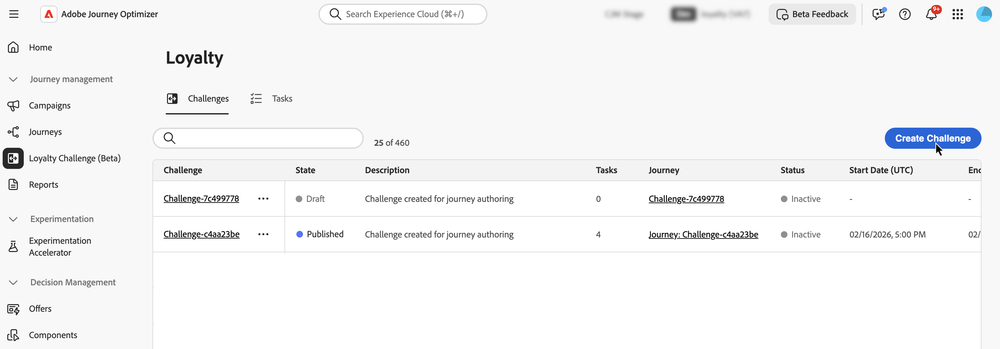

1. 選擇挑戰型別：

   * **[!UICONTROL 標準]**：客戶以任何順序完成任何指定數量的工作\
     *範例：完成5個可用工作中的3個*

   * **[!UICONTROL 連續執行]**：客戶連續多次完成相同的工作\
     *範例：連續7天購買*

   * **[!UICONTROL 循序]**：客戶以定義的順序完成工作\
     *範例： Purchase → Review → Share （必須依此順序完成）*

## 設定挑戰結構 {#structure}

在&#x200B;**[!UICONTROL 結構]**&#x200B;索引標籤中，定義挑戰的組織方式：其屬性、排程、要完成的任務以及要傳送的獎勵。

### 定義挑戰屬性並使用自訂中繼資料 {#properties}

1. 在&#x200B;**[!UICONTROL 挑戰內容]**&#x200B;窗格中，定義挑戰的全域設定：

   * **[!UICONTROL 名稱]**：輸入質詢的描述性名稱。 此名稱會出現在挑戰清單中。
   * **[!UICONTROL 說明]**：輸入說明挑戰目的和目標的說明。

   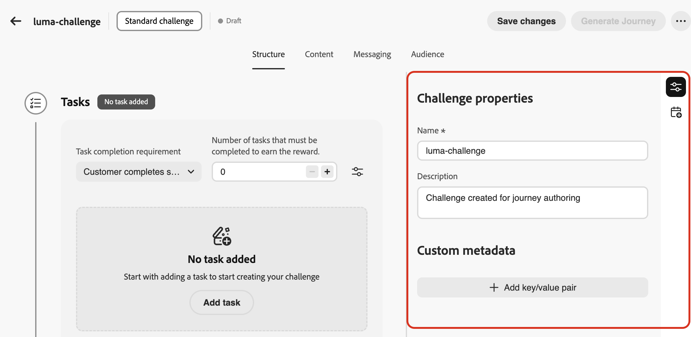

1. 使用&#x200B;**[!UICONTROL 自訂中繼資料]**&#x200B;區段，以使用索引鍵/值配對來新增自訂中繼資料。 此中繼資料可用於追蹤或與外部系統整合。

### 排程挑戰 {#schedule}

選取&#x200B;**[!UICONTROL 開啟排程]**&#x200B;圖示，設定您的挑戰執行時間：

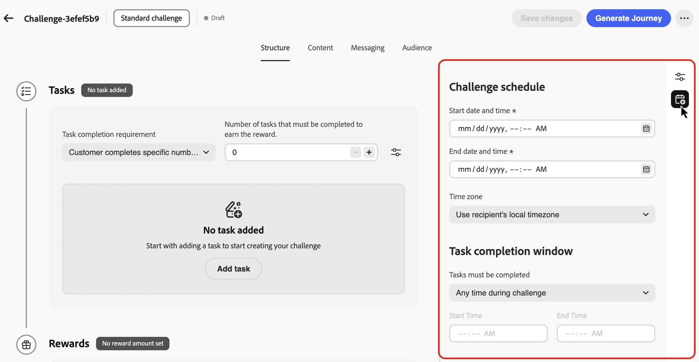

* **[!UICONTROL 開始日期和時間]**：設定客戶何時可提出挑戰。
* **[!UICONTROL 結束日期和時間]**：設定質詢過期且不再接受新完成的時間。
* **[!UICONTROL 時區]**：挑戰預設使用收件者的當地時區。
* **[!UICONTROL 任務必須完成]**：選擇客戶何時可以完成任務：

   * **[!UICONTROL 在挑戰期間的任何時間]**：客戶可以在挑戰開始與結束日期之間的任何時間完成任務。
   * **[!UICONTROL 在一天中的特定小時內]**：設定&#x200B;**[!UICONTROL 開始時間]**&#x200B;和&#x200B;**[!UICONTROL 結束時間]**，將工作完成限制在特定每日小時內。

挑戰排程現在已設定。 接下來，新增客戶需要完成的工作。

### 新增任務 {#add-tasks}

任務定義客戶要獲得獎勵必須完成的特定操作。 您可以設定任務型別（購買、支出）、數量、產品篩選器和其他屬性。

若要新增任務至您的挑戰，請遵循下列步驟：

1. 在&#x200B;**[!UICONTROL 工作]**&#x200B;區段中，選取&#x200B;**[!UICONTROL 新增工作]**。

   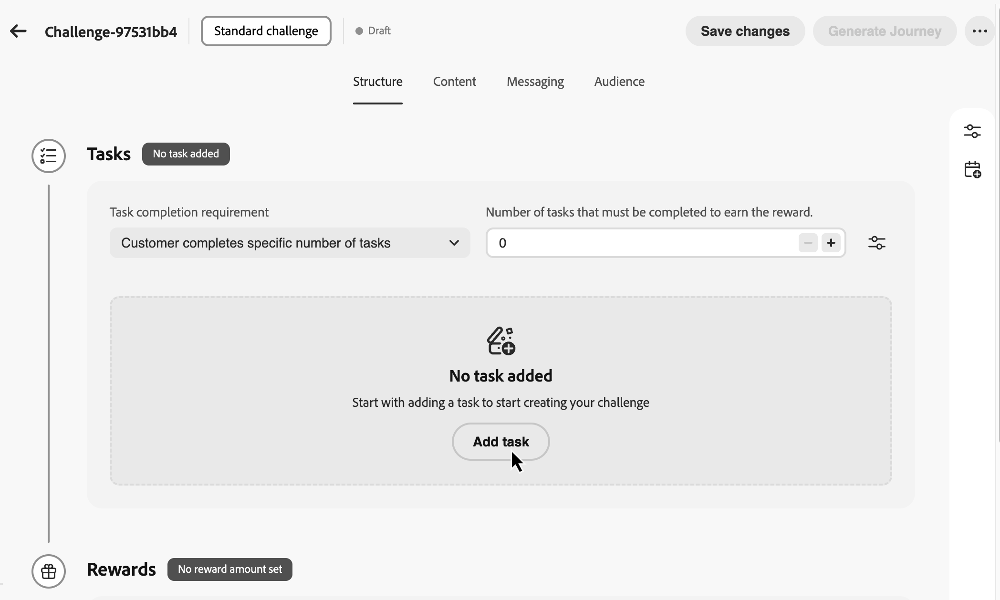

1. **[!UICONTROL 任務詳細目錄]**&#x200B;已開啟。 從清單中選取一或多個工作，然後選取&#x200B;**[!UICONTROL 新增]**。 若要建立新工作，請選取&#x200B;**[!UICONTROL 新增]**。 [瞭解如何建立及設定工作](create-tasks.md)。

1. 指定將挑戰視為已完成的時間。 可用的設定取決於挑戰型別：

   +++標準挑戰

   **[!UICONTROL 任務完成需求]** — 選擇下列專案：

   * **[!UICONTROL 客戶選擇1項工作完成]**：客戶可以選擇並完成任何單一工作來獲得獎勵
   * **[!UICONTROL 客戶完成特定數量的工作]**：客戶必須完成已定義的數量工作。 指定所需數字 — *範例：完成5個任務中的3個*

   +++

   +++Streak挑戰

   * **[!UICONTROL Streak型別]**：

      * **連續**：客戶必須連續幾天不中斷地完成工作 — *範例：星期一、星期二、星期三購買 — 錯過一天中斷連線*

      * **非連續**：客戶可以完成完成之間有間隔的工作 — *範例：30天內完成7次購買，允許中斷*

   * **[!UICONTROL Streak長度]**：指定任務必須完成的次數 — *範例：針對「7天購買連結」設定為7*

   +++

   +++循序挑戰

   **[!UICONTROL 任務完成需求]** — 選擇下列專案：

   * **[!UICONTROL 客戶選擇1項工作完成]**：客戶可以選擇並完成任何單一工作來獲得獎勵
   * **[!UICONTROL 客戶完成特定數量的工作]**：客戶必須依照您定義的確切順序完成已定義數量的工作。 遺失或略過任務會中斷順序。 指定所需數字（例如，完成5個任務中的3個）

   *範例：任務1 （購買）→任務2 （檢閱）→任務3 （共用） — 必須依此順序完成*

   +++

1. 依預設，標準和循序挑戰可讓客戶跨多個交易完成任務。 若要在單一交易中要求完成所有工作，請選取 **[!UICONTROL 設定]**&#x200B;圖示，並開啟下列選項。

   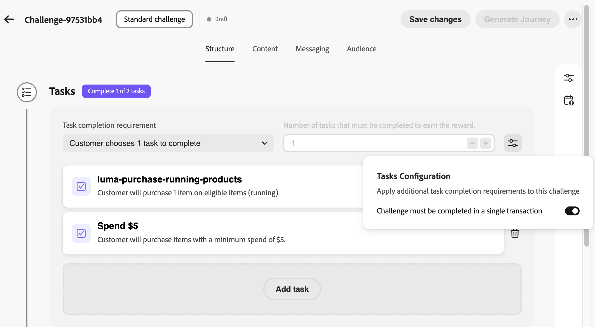

將任務新增至挑戰後，請設定客戶完成任務即可獲得的獎勵。

### 設定獎勵 {#rewards}

獎勵是客戶在完成挑戰時獲得的忠誠度點數或權益。 設定何時及如何提供獎勵。

1. 在&#x200B;**[!UICONTROL 獎勵傳遞]**&#x200B;下拉式清單中，選擇何時傳遞獎勵：

   * **[!UICONTROL 當挑戰完成時提供獎勵]**：當客戶完成整個挑戰時提供獎勵\
     *範例：完成全部5項工作後獲得100分*

   * **[!UICONTROL 當挑戰進度完成時，在任務完成里程碑提供獎勵]**：當客戶完成個別任務時，獎勵會遞增（僅適用於需要多個任務的挑戰）\
     *範例：在任務1後獎勵10分，在任務2後獎勵20分，在任務3後獎勵50分*

1. 選取您的獎勵提供者。 這是管理客戶點數和獎勵的忠誠度解決方案。

1. 根據您選取的傳送方式設定獎勵金額：

   +++完成挑戰時提供獎勵

   指定當客戶完成整個挑戰時所要給予的總獎勵金額。

   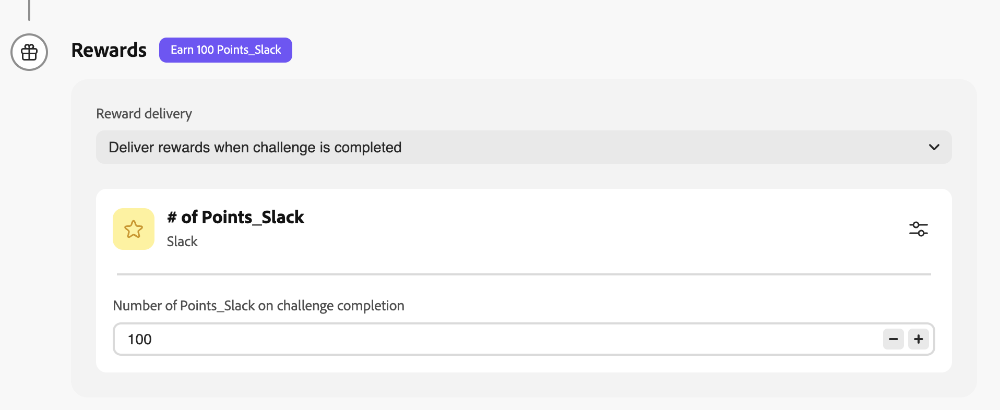

   **範例**：完成挑戰時，客戶可獲得100分。

   +++

   +++在任務完成里程碑時傳遞獎勵

   指定任務完成里程碑的獎勵金額。 此選項可讓您建立漸進式獎勵，當客戶完成挑戰時提高他們的積極性。

   對於您想要提供獎勵的任何工作，請切換獎勵選項，並指定當客戶完成該特定工作時要獎勵多少分。 您可以選擇僅獎勵特定任務完成 — 例如，如果您有10個任務，則可能僅獎勵任務1、5和10。

   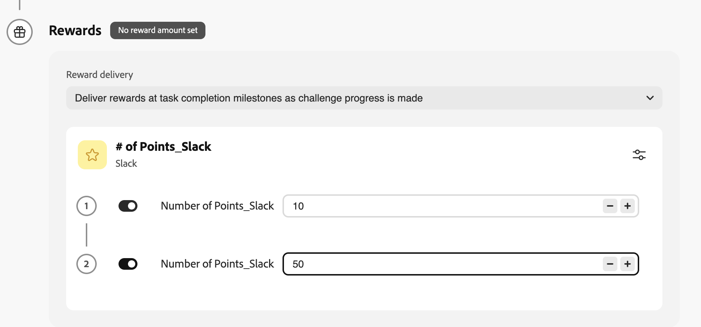

   **範例**：完成第一個任務時，客戶會獲得10分，完成第二個任務後會再獲得50分，挑戰完成時總計會獲得60分。

   >[!TIP]
   >
   >請考慮提高後續工作的獎勵值，以在整個挑戰中維持客戶的參與度。

   +++

在設定包含任務和獎勵的挑戰結構後，設計內容卡以向客戶顯示挑戰。

## 設定內容卡片 {#configure-content-cards}

內容卡以視覺化方式呈現您在客戶裝置上的挑戰，顯示挑戰資訊、進度和獎勵。 [進一步瞭解內容卡](../content-card/create-content-card.md)。

若要設定挑戰的內容卡：

1. 導覽至&#x200B;**[!UICONTROL Content]**&#x200B;標籤，然後輸入內容卡的&#x200B;**[!UICONTROL 名稱]**。

1. 選取&#x200B;**[!UICONTROL 通道設定]**。 管道設定包含所有用於傳送訊息的技術引數，例如標頭引數、子網域、行動應用程式等。 [進一步瞭解通道設定](../configuration/channel-surfaces.md)。

1. 選取&#x200B;**[!UICONTROL 編輯內容]**&#x200B;以設計您的內容卡。 [瞭解如何設計和個人化內容卡](../content-card/design-content-card.md)。

   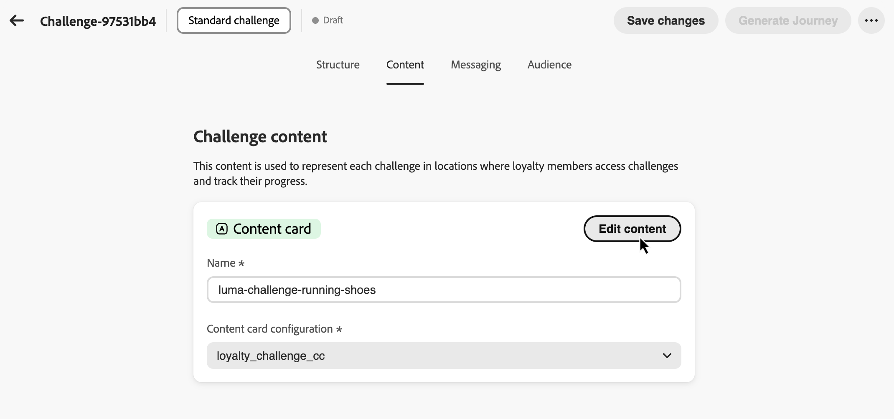

設定內容卡後，設定訊息以在挑戰生命週期中吸引客戶。

### 設定傳訊 {#configure-messaging}

設定多管道訊息，在挑戰生命週期的關鍵階段與客戶互動。 傳訊功能為選用，但建議儘量擴大客戶參與度。

1. 導覽至&#x200B;**[!UICONTROL 傳訊]**&#x200B;標籤，並為每個生命週期階段設定訊息：

   * **啟動**&#x200B;訊息：當挑戰開始時通知客戶
   * **進行中**&#x200B;訊息：讓客戶持續參與提醒和進度更新
   * **完成**&#x200B;訊息：慶祝成功並確認獎勵配置

1. 針對每個階段，選取&#x200B;**[!UICONTROL 新增[階段]訊息]** （其中[階段]代表Launch、進行中或完成）以建立該階段的訊息。

1. 選擇您想要的頻道： **[!UICONTROL 應用程式內]**、**[!UICONTROL 電子郵件]**&#x200B;或&#x200B;**[!UICONTROL 推播通知]**，並選取相關的頻道設定。

1. 選取圖示並選擇&#x200B;**[!UICONTROL 編輯]**&#x200B;來設計您的訊息內容。

   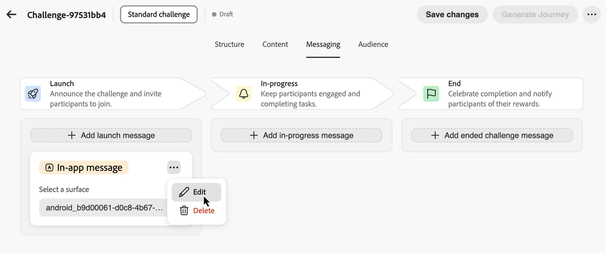

瞭解如何為特定通道建立訊息：

* [應用程式內訊息](../in-app/get-started-in-app.md)
* [電子郵件訊息](../email/get-started-email.md)
* [推播通知](../push/get-started-push.md)

完成訊息設定後，請定義哪些客戶有資格參與挑戰。

## 選取挑戰對象 {#audience}

定義哪些客戶可參與您的忠誠度挑戰。

1. 導覽至「**[!UICONTROL 對象]**」標籤，然後選取「**[!UICONTROL 選取對象]**」按鈕。

   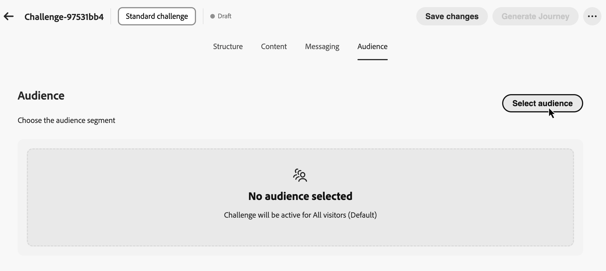

1. 從可用的Adobe Experience Platform對象清單中選取您的目標對象。 [瞭解如何使用對象](../audience/about-audiences.md)。

1. 選取&#x200B;**[!UICONTROL 新增對象]**。

您的挑戰現在已完整設定結構、內容、訊息和目標對象。 最後一個步驟是產生並發佈歷程。

## 產生並發佈歷程 {#review-and-publish}

產生將協調您的挑戰傳遞和客戶互動的歷程。 若要這麼做，請選取&#x200B;**[!UICONTROL 產生歷程]**。

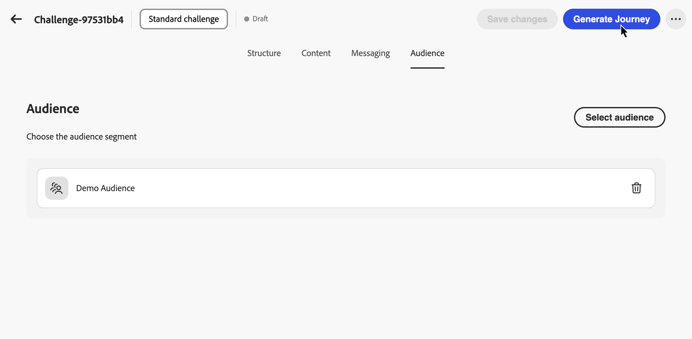

Journey Optimizer會自動建立草稿狀態的[歷程](../building-journeys/journey-gs.md)。 自動產生的歷程會以名稱格式「挑戰： [挑戰名稱]」出現在您的歷程詳細目錄中。

如有需要，可檢閱歷程設定，然後發佈歷程，讓客戶提出挑戰。 [瞭解如何發佈歷程](../building-journeys/publish-journey.md)。

歷程將在您指定的挑戰開始日期自動開始，並根據您的設定傳送內容和訊息。

>[!NOTE]
>
>可以自訂自動產生的歷程，以新增其他邏輯或訊息。 不過，直接對歷程進行的變更不會同步回挑戰設定。 如果您稍後編輯挑戰，則重新產生歷程時，所有歷程自訂都將遺失。
