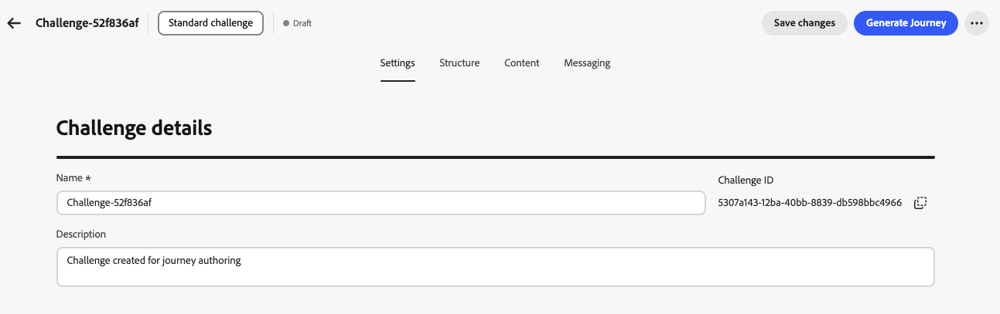
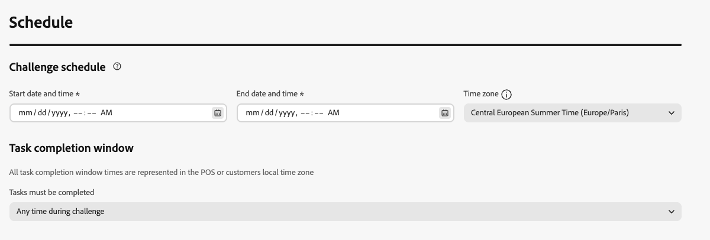
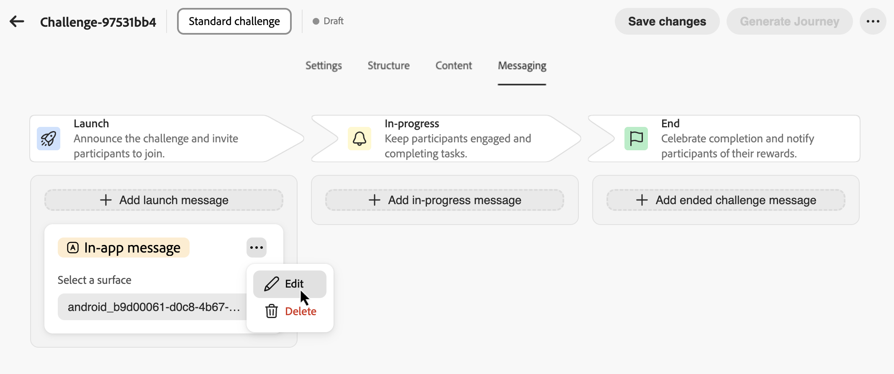

# 創造挑戰 {#create-challenges}

>[!BEGINSHADEBOX]

**目錄**

[開始應對忠誠度挑戰](get-started.md)

<table style="table-layout:fixed">
<tr style="border: 0;">
<td style="vertical-align:top;">

**建立和管理挑戰**

* [存取及管理挑戰與工作](access-loyalty-challenges.md)
* **建立挑戰** ◀︎**您在這裡**
* [建立任務](create-tasks.md)
* [監視忠誠度挑戰績效](loyalty-reporting.md)

</td>
<td style="vertical-align:top;">

**設定並整合**

* [設定忠誠度挑戰](loyalty-admin.md)
* [獎勵定義指南](reward-definition-guide.md)
* [事件轉換器指南](event-transformer-guide.md)
* [熟客資料與資料集](loyalty-data-and-datasets.md)
* [忠誠度挑戰API參考](https://developer.adobe.com/journey-optimizer-apis/references/loyalty-challenges){target="_blank"}

</td>
</tr>
</table>

>[!ENDSHADEBOX]

>[!AVAILABILITY]
>
>此功能目前在&#x200B;**私人測試版**&#x200B;中。 如需發行週期與可用性階段的完整詳細資訊，請參閱 [Journey Optimizer 發行週期](../rn/releases.md)。

本頁涵蓋建立忠誠度挑戰的完整流程，從選擇挑戰型別和設定設定、結構、內容和訊息，到產生和發佈將挑戰傳遞給客戶的歷程。

建立質疑涉及以下步驟：

1. **[建立挑戰](#create-the-challenge)** — 選取挑戰型別並開啟挑戰編輯器。
1. **[設定設定](#settings)** — 定義挑戰名稱、對象、排程、選擇加入規則和重複限制。
1. **[設定結構](#structure)** — 新增任務和獎勵（不適用於「自攜」資料挑戰）。
1. **[設定內容](#configure-content-cards)** *（選擇性）* — 定義使用內容卡或程式碼式體驗對成員顯示挑戰的方式。
1. **[設定訊息](#configure-messaging)** *（選擇性）* — 設定Launch、In-progress和End階段的通道訊息。
1. **[發佈挑戰](#launch)** — 讓挑戰可用於產生歷程。
1. **[產生並發佈歷程](#launch)** — 觸發自動產生的歷程，將挑戰傳遞給客戶。

## 建立挑戰 {#create-the-challenge}

1. 在Journey Optimizer中導覽至&#x200B;**[!UICONTROL 忠誠度挑戰(Beta)]**。

1. 選取&#x200B;**[!UICONTROL 挑戰]**&#x200B;標籤，並選取&#x200B;**[!UICONTROL 建立挑戰]**。

   

1. 選擇挑戰型別：

   * **[!UICONTROL 標準]**：客戶以任何順序完成任何指定數量的工作\
     *範例：完成5個可用工作中的3個*

   * **[!UICONTROL 連續執行]**：客戶連續多次完成相同的工作\
     *範例：連續7天購買*

   * **[!UICONTROL 循序]**：客戶以定義的順序完成工作\
     *範例： Purchase → Review → Share （必須依此順序完成）*

   * **[!UICONTROL 自備資料]**：若您想要從「忠誠度挑戰」資料整合中組合挑戰架構（例如工作與獎勵），請選取&#x200B;**[!UICONTROL 自備資料]**。 選取此型別時，**[!UICONTROL 結構]**&#x200B;索引標籤是唯讀的。 以與其他挑戰型別相同的方式設定&#x200B;**[!UICONTROL 設定]**、**[!UICONTROL 內容]**&#x200B;和&#x200B;**[!UICONTROL 傳訊]**。

     >[!AVAILABILITY]
     >
     >**[!UICONTROL 自備資料]**&#x200B;挑戰型別目前可供一組受限制的組織使用，並將在未來版本中更廣泛地提供。

   選取挑戰型別後，挑戰編輯器會開啟以下索引標籤： **[!UICONTROL 設定]**、**[!UICONTROL 結構]**、**[!UICONTROL 內容]**&#x200B;以及&#x200B;**[!UICONTROL 傳訊]**。 從&#x200B;**[!UICONTROL 設定]**&#x200B;開始，以定義挑戰詳細資料、對象、排程和規則。 然後針對除&#x200B;**[!UICONTROL 自備資料]**&#x200B;以外的所有型別設定&#x200B;**[!UICONTROL 結構]** （工作與獎勵）。

## 設定挑戰設定 {#settings}

在&#x200B;**[!UICONTROL 設定]**&#x200B;索引標籤中，設定挑戰層級屬性：誰可以參與、挑戰執行時、成員如何選擇加入並獲得進度，以及選擇性的中繼資料。

### 挑戰詳細資料 {#challenge-details}

>[!CONTEXTUALHELP]
>id="ajo_loyalty_challenge_properties"
>title="挑戰詳細資料"
>abstract="設定挑戰名稱和說明。 挑戰 ID 會在建立挑戰時自動指派，並可複製以供 API 或整合使用。"

1. 在&#x200B;**[!UICONTROL 挑戰詳細資料]**&#x200B;區段中，定義下列專案：

   * **[!UICONTROL 名稱]**：輸入質詢的描述性名稱。 此名稱會出現在挑戰清單中。
   * **[!UICONTROL 挑戰識別碼]**：建立挑戰時指派的唯一識別碼。 使用複製控制在API或外部系統中參照此ID。
   * **[!UICONTROL 說明]**：輸入說明挑戰目的和目標的說明。

   

### 客群 {#audience}

>[!CONTEXTUALHELP]
>id="ajo_loyalty_challenge_audience"
>title="客群"
>abstract="選擇哪些人可以參與挑戰。 新增 Adobe Experience Platform 客群，或將客群保持空白，使所有忠誠會員皆符合資格。 選擇性地要求完成其他挑戰來作為先決條件。"

定義誰可以參與您的忠誠度挑戰。

1. 在「**[!UICONTROL 對象]**」區段中，選取「**[!UICONTROL 新增對象]**」以將挑戰限制在特定Adobe Experience Platform對象。 [瞭解如何使用對象](../audience/about-audiences.md)。

   

1. 在&#x200B;**[!UICONTROL 挑戰必要條件]**&#x200B;下，選取&#x200B;**[!UICONTROL 要求完成挑戰]**，將資格限製為已完成一或多個選取挑戰的成員。

### 排程 {#schedule}

>[!CONTEXTUALHELP]
>id="ajo_loyalty_challenge_schedule"
>title="挑戰排程"
>abstract="使用開始和結束日期與時間以及時區，設定挑戰的上線時間。 在任務完成視窗中，選擇客戶可在挑戰期間完成任務的時間。"

設定您的挑戰執行時間：

1. 在&#x200B;**[!UICONTROL 排程]**&#x200B;區段中，設定：

   * **[!UICONTROL 開始日期和時間]**：客戶可以提出質詢的時間。
   * **[!UICONTROL 結束日期和時間]**：挑戰到期且不再接受新完成時。
   * **[!UICONTROL 時區]**：用於挑戰排程的時區。

   

1. 在&#x200B;**[!UICONTROL 任務完成視窗]**&#x200B;下，選擇客戶何時可以完成任務：

   * **[!UICONTROL 在挑戰期間的任何時間]**：客戶可以在挑戰開始與結束日期之間的任何時間完成任務。
   * **[!UICONTROL 在一天中的特定小時內]**：設定&#x200B;**[!UICONTROL 開始時間]**&#x200B;和&#x200B;**[!UICONTROL 結束時間]**，將工作完成限制在特定每日小時內。

### 規則 {#rules}

設定成員選擇加入的方式、任務進度計入挑戰的時間，以及完成挑戰的次數。

* **[!UICONTROL 選擇加入觸發程式]**：

  * **[!UICONTROL 選擇加入方法]**：選擇客戶是手動加入挑戰，還是透過事件觸發器加入。
  * **[!UICONTROL 事件]**：對於事件型選擇加入，請選取觸發選擇加入的事件。 管理員可以按一下按鈕來建立事件定義。 [瞭解如何設定事件定義](loyalty-admin.md#event-definitions)

* **[!UICONTROL 開始追蹤進度]**：

  * **[!UICONTROL 任務進度追蹤開始]**：選擇任務完成何時計入挑戰進度。 例如，選取&#x200B;**[!UICONTROL 當挑戰開始（在選擇加入之後）]**，所以進度會在成員選擇加入且挑戰為作用中之後開始。

    當成員看到挑戰時，您可以在追蹤進度時將其與分離。 例如，可能會出現挑戰卡片，並在任務完成前接受選擇加入，以開始計入稍後日期的進度。

  * **[!UICONTROL 開始]**：當您選擇自訂開始選項時，請設定進度追蹤開始的日期和時間。

* **[!UICONTROL 重複限制]**：

  * **[!UICONTROL 可以完成挑戰]**：選擇挑戰可以完成一次還是多次。 例如，**[!UICONTROL 一次]**&#x200B;或定義的完成數。

  * **[!UICONTROL 可以完成的次數]**：啟用重複時，請指定成員可以完成挑戰的次數。

* **[!UICONTROL 完成需求]** *（僅限標準挑戰）*：

  * **[!UICONTROL 在單一交易內完成]**：啟用時，客戶必須完成單一交易內的所有工作。 停用時，可以跨不同的交易完成工作。

### 自訂中繼資料 {#custom-metadata}

在&#x200B;**[!UICONTROL 自訂中繼資料]**&#x200B;區段中，選取&#x200B;**[!UICONTROL 新增索引鍵/值組]**&#x200B;以新增自訂中繼資料。 使用中繼資料來追蹤或與外部系統整合。

## 設定挑戰結構 {#structure}

在&#x200B;**[!UICONTROL 結構]**&#x200B;索引標籤中，定義客戶必須完成的工作以及他們獲得的獎勵。 此標籤不適用於&#x200B;**[!UICONTROL 自備資料]**&#x200B;挑戰。

### 新增任務 {#add-tasks}

>[!CONTEXTUALHELP]
>id="ajo_loyalty_challenge_tasks"
>title="任務"
>abstract="選取完成挑戰所需執行的任務。 接下來，設定挑戰完成的方式，可供使用的選項取決於您的挑戰類型 (標準、連續或循序)。"

任務定義客戶要獲得獎勵必須完成的特定操作。 您可以設定任務型別（購買、支出或自訂事件）、數量、產品篩選器和其他屬性。

若要新增任務至您的挑戰，請遵循下列步驟：

1. 在&#x200B;**[!UICONTROL 工作]**&#x200B;區段中，選取&#x200B;**[!UICONTROL 新增工作]**。

   

1. **[!UICONTROL 任務詳細目錄]**&#x200B;已開啟。 從清單中選取一或多個工作，然後選取&#x200B;**[!UICONTROL 新增]**。 若要建立新工作，請選取&#x200B;**[!UICONTROL 新增]**。 [瞭解如何建立及設定工作](create-tasks.md)。

1. 指定將挑戰視為已完成的時間。 可用的設定取決於挑戰型別：

   +++標準挑戰

   在&#x200B;**[!UICONTROL 工作完成需求]**&#x200B;下拉式清單中，選擇下列專案：

   * **[!UICONTROL 客戶選擇1項工作完成]** - *客戶可以選擇並完成任何單一工作以獲得獎勵*
   * **[!UICONTROL 客戶完成特定數量的工作]** - *客戶必須完成已定義的數量工作。 指定要完成的工作所需數目。*

   +++

   +++Streak挑戰

   在&#x200B;**[!UICONTROL Streak型別]**&#x200B;下拉式清單中，選擇下列專案：

   * **連續**：客戶必須在連續幾天不間斷地完成工作。 *範例：星期一、星期二、星期三的購買 — 錯過一天就中斷連線。*

   * **非連續**：客戶可以在完成之間有間隔的情況下完成工作。 *範例：在30天內完成7次購買，允許中斷。*

   在&#x200B;**[!UICONTROL 條紋長度]**&#x200B;欄位中，指定任務必須完成的次數。 *範例：針對「7天購買連結」設定為7。*

   +++

   +++循序挑戰

   在&#x200B;**[!UICONTROL 工作完成需求]**&#x200B;下拉式清單中，選擇下列專案：

   * **[!UICONTROL 客戶選擇1項工作完成]** - *客戶可以選擇並完成任何單一工作以獲得獎勵*
   * **[!UICONTROL 客戶完成特定數量的工作]** - *客戶必須依照您定義的確切順序完成已定義數量的工作。 遺失或略過任務會中斷順序。 指定要完成的工作所需數目*

   +++

將任務新增至挑戰後，請設定客戶完成任務即可獲得的獎勵。

### 設定獎勵 {#rewards}

>[!CONTEXTUALHELP]
>id="ajo_loyalty_challenge_rewards"
>title="獎勵"
>abstract="選擇客戶獲得點數的時間點：完成整個挑戰時，或者是在挑戰過程中達到任務里程碑時。 選取您的獎勵提供者 (管理點數和獎勵的忠誠度解決方案)，然後設定數量：完整完成後的單次總額，或各里程碑的每一項任務值，請僅針對您要支付的任務啟用獎勵。"

獎勵是客戶在完成挑戰時獲得的忠誠度點數或權益。

若要設定何時及如何提供獎勵：

1. 在&#x200B;**[!UICONTROL 獎勵傳遞]**&#x200B;下拉式功能表中，選擇何時傳遞獎勵：

   * **[!UICONTROL 當挑戰完成時提供獎勵]**：當客戶完成整個挑戰時提供獎勵\
     *範例：完成全部5項工作後獲得100分*

   * **[!UICONTROL 當挑戰進度完成時，在任務完成里程碑提供獎勵]**：當客戶完成個別任務時，獎勵會遞增（僅適用於需要多個任務的挑戰）\
     *範例：在任務1後獎勵10分，在任務2後獎勵20分，在任務3後獎勵50分*

1. 選取您的獎勵提供者。 這是管理客戶點數和獎勵的忠誠度解決方案。 在您編寫挑戰之前，會在&#x200B;**[!UICONTROL 忠誠度管理員]**&#x200B;功能表中建立獎勵提供者。 [瞭解如何設定獎勵提供者](loyalty-admin.md#reward-providers)

   

1. 根據您選取的傳送方式設定獎勵金額：

   +++完成挑戰時提供獎勵

   指定當客戶完成整個挑戰時所要給予的總獎勵金額。

   *在下列範例中，完成挑戰時，客戶會獲得100分。*

   

   +++

   +++在任務完成里程碑時傳遞獎勵

   指定任務完成里程碑的獎勵金額。 此選項可讓您建立漸進式獎勵，當客戶完成挑戰時提高他們的積極性。

   對於您想要提供獎勵的任何工作，請切換獎勵選項，並指定當客戶完成該特定工作時要獎勵多少分。 您可以選擇僅獎勵特定任務完成 — 例如，如果您有10個任務，則可能僅獎勵任務1、5和10。

   *在下列範例中，客戶完成第一個任務時會獲得10分，完成第二個任務後會再獲得50分。*

   

   +++

在設定包含任務和獎勵的挑戰結構後，您可以選擇設定如何向客戶呈現挑戰。 如果您不需要挑戰內容，請略過此步驟，直接繼續進行[設定訊息](#configure-messaging)。

## 設定挑戰內容（選填） {#configure-content-cards}

>[!CONTEXTUALHELP]
>id="ajo_loyalty_challenge_content"
>title="內容"
>abstract="設定如何在忠誠會員存取挑戰並追蹤其進度的位置呈現您的挑戰。 使用「新增」動作，選擇「內容」卡片以顯示卡片式體驗，或選擇程式碼式體驗，透過您自己的自訂實施來傳送內容。"

**[!UICONTROL Content]**&#x200B;標籤控制如何在忠誠會員存取挑戰並追蹤其進度的位置呈現挑戰。

設定挑戰內容：

1. 瀏覽至&#x200B;**[!UICONTROL 內容]**&#x200B;索引標籤，然後按一下&#x200B;**[!UICONTROL 新增動作]**。

1. 選擇動作型別：

   * **[!UICONTROL 內容卡]**：在客戶裝置上以卡片式體驗來顯示挑戰。 選取&#x200B;**[!UICONTROL 頻道設定]**，然後按一下&#x200B;**[!UICONTROL 編輯內容]**&#x200B;以設計和個人化卡片。 [進一步瞭解內容卡](../content-card/create-content-card.md)。
   * **[!UICONTROL 程式碼型體驗]**：使用Journey Optimizer的程式碼型通道，透過您自己的自訂實作提供挑戰內容。 選取&#x200B;**[!UICONTROL 頻道設定]**&#x200B;並按一下&#x200B;**[!UICONTROL 編輯內容]**&#x200B;以定義內容。 [進一步瞭解程式碼型體驗](../code-based/create-code-based.md)。

   

   您可以新增多個動作來代表不同表面的挑戰。

設定內容後，設定傳送訊息，以在整個挑戰生命週期中吸引客戶。

### 設定傳送訊息 {#configure-messaging}

>[!CONTEXTUALHELP]
>id="ajo_loyalty_challenge_messaging"
>title="傳送訊息"
>abstract="傳送訊息有助於推動挑戰生命週期內的參與。 在「訊息」標籤上，為每個階段新增訊息：啟動（宣佈挑戰並邀請參與者加入）、進行中（讓參與者參與並完成任務）以及結束（慶祝完成並通知參與者其獎勵）。 針對每個階段，按一下新增訊息按鈕、選擇頻道、選取頻道設定，然後選取「編輯」以設計訊息內容。"

設定多管道訊息，在挑戰生命週期的關鍵階段與客戶互動。 傳訊功能為選用，但建議儘量擴大客戶參與度。

導覽至&#x200B;**[!UICONTROL 傳訊]**&#x200B;標籤，並為每個生命週期階段設定訊息：

* **[!UICONTROL 啟動]**：宣佈挑戰並邀請參與者加入。
* **[!UICONTROL 進行中]**：讓參與者持續參與並完成工作。
* **[!UICONTROL 結束]**：慶祝完成並通知參與者其獎勵。

對於每個階段，按一下新增訊息按鈕（**[!UICONTROL 新增啟動訊息]**、**[!UICONTROL 新增進行中訊息]**&#x200B;或&#x200B;**[!UICONTROL 新增已結束的挑戰訊息]**）並選擇頻道。

選取相關的&#x200B;**[!UICONTROL 頻道設定]**&#x200B;並按一下&#x200B;**[!UICONTROL 編輯]**&#x200B;來設計您的訊息內容。

| 管道 | 說明 |
|---|---|
| **[!UICONTROL 應用程式內]** | 在您的行動或網頁應用程式中顯示訊息。 [關於應用程式內訊息](../in-app/get-started-in-app.md) · [設計應用程式內訊息](../in-app/design-in-app.md) |
| **[!UICONTROL 電子郵件]** | 傳送電子郵件通知。 [關於電子郵件](../email/get-started-email.md) · [設計電子郵件內容](../email/get-started-email-design.md) |
| **[!UICONTROL 推播通知]** | 傳送推播通知至行動裝置。 [關於推播通知](../push/get-started-push.md) · [設計推播通知](../push/design-push.md) |
| **[!UICONTROL 內容卡]** | 在應用程式或網頁介面中提供永續性卡片式訊息。 [關於內容卡](../content-card/get-started-content-card.md) · [設計內容卡](../content-card/design-content-card.md) |
| **[!UICONTROL 程式碼型體驗]** | 使用AJO的程式碼型通道，透過自訂實作傳遞內容。 [關於程式碼型體驗](../code-based/get-started-code-based.md) · [建立程式碼型體驗](../code-based/create-code-based.md) |
| **[!UICONTROL 自訂動作]** | 觸發外部系統或自訂端點。 [關於自訂動作](../action/about-custom-action-configuration.md) |

您的挑戰現在已完整設定其設定、結構、內容和訊息。 若要啟動它，您必須發佈挑戰及其相關歷程。

## 發起挑戰 {#launch}

您有兩個選項可以啟動您的挑戰：

* **[!UICONTROL 發佈挑戰]** （可在&#x200B;**[!UICONTROL ...]**&#x200B;功能表中取得） — 使用此選項發佈挑戰，而不產生歷程。 這可讓您在傳送前測試、預覽和模擬挑戰體驗。 在您產生並發佈歷程之前，客戶不會收到挑戰。

* **[!UICONTROL 產生歷程]** — 使用此選項可自動發佈挑戰，並建立將協調您的挑戰傳送給客戶的歷程。

### 發佈挑戰 {#publish-challenge}

1. 請檢閱您的挑戰設定，以確保所有必填欄位都已完成。

1. 按一下&#x200B;**[!UICONTROL 產生歷程]**&#x200B;按鈕旁的圖示，然後選取&#x200B;**[!UICONTROL 發佈]**。

   

   系統會將您重新導向至挑戰詳細目錄。 挑戰現在顯示為&#x200B;**[!UICONTROL 已發佈]**&#x200B;狀態。

   當您準備好將挑戰傳遞給客戶時，您可以產生關聯的歷程。 如需詳細資訊，請參閱[產生歷程](#generate-journey)。

### 產生歷程 {#generate-journey}

1. 請檢閱您的挑戰設定，以確保所有必填欄位都已完成。

1. 選取&#x200B;**[!UICONTROL 產生歷程]**&#x200B;以自動發佈挑戰，並建立將協調挑戰傳遞的歷程。

   

   確認訊息隨即顯示。 按一下&#x200B;**[!UICONTROL 開啟歷程]**&#x200B;直接導覽至產生的歷程，或按一下&#x200B;**[!UICONTROL 認可]**&#x200B;關閉歷程並於稍後存取歷程。

   >[!IMPORTANT]
   >
   >任何挑戰變更必須在「忠誠度挑戰」編輯器中進行，且需要您產生新歷程。 如果您變更挑戰，直接在現有挑戰歷程中完成的任何工作都將遺失。

1. 開啟產生的歷程並發佈。 歷程以&#x200B;**草稿**&#x200B;狀態顯示，名稱格式為&#x200B;*&quot;歷程： [挑戰名稱]&quot;*，可從下列位置存取：

   * 上一步的確認訊息 — 按一下&#x200B;**[!UICONTROL 開啟歷程]**。
   * **挑戰詳細目錄** — 使用挑戰旁邊的&#x200B;**[!UICONTROL 歷程]**&#x200B;資料行連結。
   * **歷程詳細目錄** — 依名稱尋找歷程。

   發佈後，歷程會在您指定的挑戰開始日期自動開始。 [瞭解如何發佈歷程](../building-journeys/publish-journey.md)。

   

1. 一旦您的挑戰上線，請在[忠誠度挑戰報告](loyalty-reporting.md)中監視方案KPI、挑戰結果和任務層級量度。 您也可以在[歷程報告](../reports/journey-global-report-cja.md)中監視訊息傳遞。
