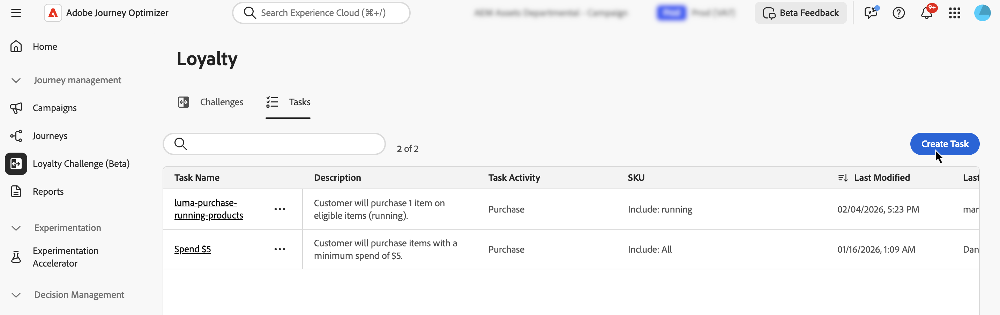
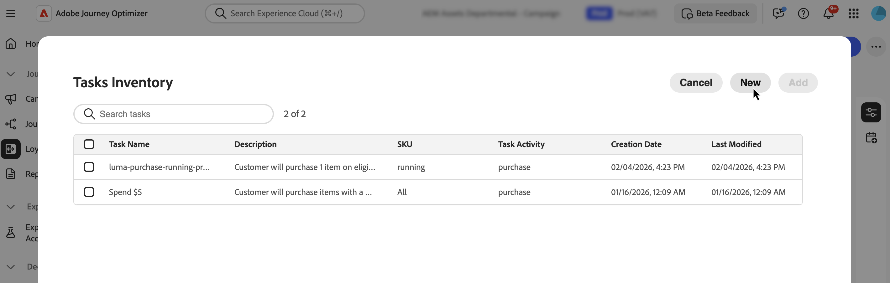
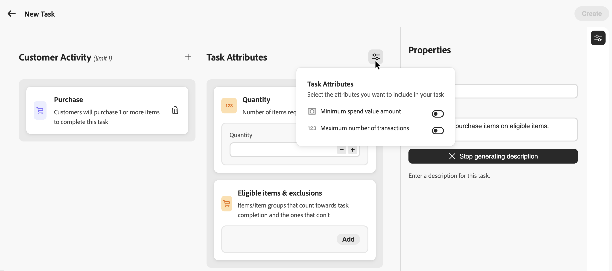
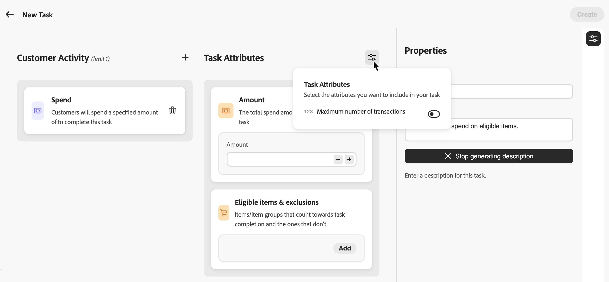
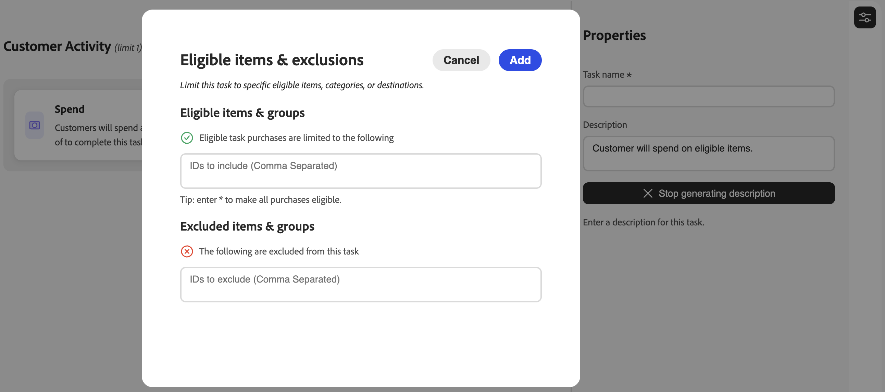
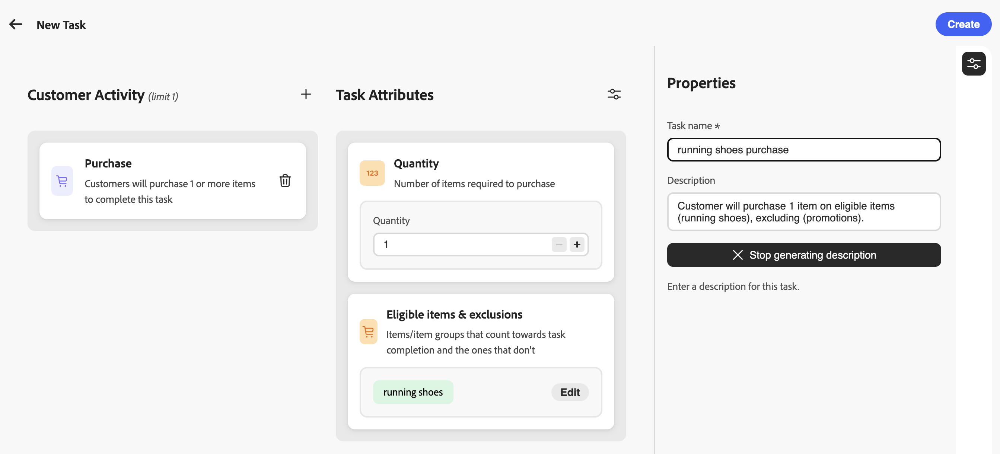

# 建立任務 {#create-tasks}

>[!BEGINSHADEBOX]

**忠誠度挑戰檔案：**

* [開始解決忠誠度挑戰](get-started.md) — 概述、工作流程、必要條件
* [存取及管理忠誠度挑戰](access-loyalty-challenges.md) — 詳細目錄、挑戰及工作管理
* [建立挑戰](create-challenges.md) — 建置並設定挑戰
* **建立任務** ◀︎ **您在這裡** — 定義挑戰任務

>[!ENDSHADEBOX]

>[!AVAILABILITY]
>
>此功能目前在&#x200B;**私人測試版**&#x200B;中，可能無法在您的環境中使用。 若要要求存取權，請聯絡您的Adobe代表。 深入瞭解[可用性標籤](../rn/releases.md#availability-labels)。

任務會定義客戶在忠誠度挑戰中必須完成的特定動作或里程碑，才能獲得獎勵。 您可以設定任務型別、數量和產品需求，以建立吸引人且個人化的忠誠度體驗。

每項任務都代表可測量的動作，有助於完成挑戰。 任務是可重複使用的元件，可以獨立建立，然後新增到一個或多個挑戰，或直接在挑戰中建立。

## 建立任務 {#create-task}

您可以從兩個進入點建立任務。 無論您從何處開始，設定程式都相同。

>[!BEGINTABS]

>[!TAB 來自任務詳細目錄]

選取&#x200B;**[!UICONTROL 工作]**&#x200B;索引標籤並選取&#x200B;**[!UICONTROL 建立工作]**。

從詳細目錄建立的任務會儲存起來，並可在多個挑戰中重複使用。

>[!TAB 來自挑戰]

開啟現有的挑戰或建立新的挑戰。 選取&#x200B;**[!UICONTROL 新增工作]**&#x200B;並按一下&#x200B;**[!UICONTROL 新增]**&#x200B;按鈕。

以這種方式建立的任務會自動新增到您的挑戰中，也會儲存到任務詳細目錄中以供在其他挑戰中重複使用。

>[!ENDTABS]

## 選擇客戶活動 {#choose-activity}

選取客戶必須執行的活動型別以完成此作業：

* **[!UICONTROL 購買]**：客戶必須購買一或多個專案才能完成此工作
* **[!UICONTROL 支出]**：客戶必須支出指定的金額才能完成此工作

若要選取活動型別，請按一下`+`圖示，然後選取最符合您結果目標的客戶活動。 每個活動型別都有特定的可設定屬性，可進一步定義及塑造任務需求。

## 定義屬性 {#define-attributes}

根據您選取的活動型別設定工作屬性：

>[!BEGINTABS]

>[!TAB 購買活動]

設定下列屬性：

* **[!UICONTROL 數量]**：輸入完成此任務必須購買的專案數
* **[!UICONTROL 符合資格的專案和排除]**：定義計入任務完成的專案或專案群組，以及不計入任務完成的專案或專案群組。深入瞭解[定義合格專案和排除專案](#eligible-items-exclusions)

**選用屬性** （透過引數圖示啟動）：

* **[!UICONTROL 最小支出值金額]**：設定最低購買金額需求
* **[!UICONTROL 最大交易數]**：限制可用於完成工作的交易數

>[!TAB 花費活動]

設定下列屬性：

* **[!UICONTROL 金額]**：輸入完成工作所需的總支出金額。
* **[!UICONTROL 交易數上限]**：指定允許符合支出需求的交易數。 如果您不想限制交易數目，可以從引數圖示停用此屬性。
* **[!UICONTROL 合格專案與排除]**： （選擇性）定義計入任務完成的專案或專案群組，以及不計入任務完成的專案或專案群組。深入瞭解[定義合格專案和排除專案](#eligible-items-exclusions)

>[!ENDTABS]

## 定義適用料號與排除專案 {#eligible-items-exclusions}

<!-- SCREENSHOT: Eligible items & exclusions popup showing the two sections: "Eligible task purchases are limited to the following" and "The following are excluded from this task" with text input fields -->

對於&#x200B;**購買**&#x200B;和&#x200B;**支出**&#x200B;活動，您可以使用&#x200B;**[!UICONTROL 合格專案與排除]**&#x200B;屬性來定義哪些專案和群組符合資格以及哪些專案與群組被排除。 這可讓您鎖定特定產品、類別或位置，以符合您的挑戰目標。

使用案例包括：將花費任務限制在特定產品類別，或排除禮品卡或促銷專案以計入任務完成。

* 若要定義符合資格的專案，請使用&#x200B;**[!UICONTROL 符合資格的任務購買僅限於下列]**&#x200B;個區段。 輸入特定專案ID、類別或目的地ID （以逗號分隔）。

  範例：`SKU001, SKU002, CategoryA`

  輸入`*`讓所有購買都符合條件（如果留空則為預設行為）。

* 若要從任務排除專案，請使用&#x200B;**[!UICONTROL 下列專案已從此任務]**&#x200B;區段中排除。 輸入不應計入任務完成的特定專案ID、類別或目的地ID。

  範例：`CLEARANCE01, GIFTCARD, SALE_CATEGORY`

  >[!NOTE]
  >
  >排除專案的優先順序高於適用專案。 如果專案同時符合合格專案和排除專案，則會將其從任務中排除。

## 定義任務屬性 {#define-task-properties}

在工作&#x200B;**[!UICONTROL 屬性]**&#x200B;窗格中，設定基本工作資訊：

* **[!UICONTROL 工作名稱]**：輸入工作的描述性名稱。 您和您的團隊可以看見此名稱，但根據您的內容卡設計，客戶可能不會看到此名稱。
* **[!UICONTROL 任務描述]**：描述會根據您為任務設定的活動型別和屬性自動產生。 您可以停用自動產生，並視需要輸入自訂說明。

在設定所有屬性和屬性之後，選取&#x200B;**[!UICONTROL 建立]**&#x200B;以儲存工作。 任務會儲存到您的任務詳細目錄，如果是從挑戰中建立的，則會自動新增到該挑戰。
