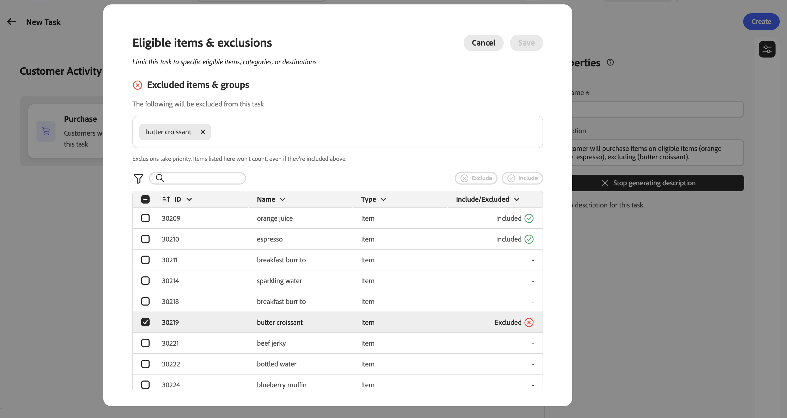

# 建立任務 {#create-tasks}

>[!BEGINSHADEBOX]

**目錄**

[開始應對忠誠度挑戰](get-started.md)

<table style="table-layout:fixed">
<tr style="border: 0;">
<td style="vertical-align:top;">

**建立和管理挑戰**

* [存取及管理挑戰與工作](access-loyalty-challenges.md)
* [創造挑戰](create-challenges.md)
* **建立任務** ◀}︎**您在這裡**
* [監視忠誠度挑戰績效](loyalty-reporting.md)

</td>
<td style="vertical-align:top;">

**設定並整合**

* [設定忠誠度挑戰](loyalty-admin.md)
* [熟客資料與資料集](loyalty-data-and-datasets.md)
* [忠誠度挑戰API參考](https://developer.adobe.com/journey-optimizer-apis/references/loyalty-challenges){target="_blank"}

</td>
</tr>
</table>

>[!ENDSHADEBOX]

>[!AVAILABILITY]
>
>此功能目前在&#x200B;**私人測試版**&#x200B;中。 如需發行週期與可用性階段的完整詳細資訊，請參閱 [Journey Optimizer 發行週期](../rn/releases.md)。

任務會定義客戶在忠誠度挑戰中必須完成的特定動作或里程碑，才能獲得獎勵。 您可以設定購買和支出任務，或是&#x200B;**[!UICONTROL 自訂事件]**&#x200B;任務，用於追蹤貴組織已擷取的Adobe Experience Platform體驗事件。

每項任務都代表可測量的動作，有助於完成挑戰。 任務是可重複使用的元件，可以獨立建立，然後新增到一個或多個挑戰，或直接在挑戰中建立。

## 建立任務 {#create-task}

>[!CONTEXTUALHELP]
>id="ajo_loyalty_task_create"
>title="建立任務"
>abstract="選取客戶活動 (購買、支出或自訂事件)，然後設定活動特定的屬性。 在「屬性」窗格中，設定任務名稱和說明。"

您可以從兩個進入點建立任務。 無論您從何處開始，設定程式都相同。

>[!BEGINTABS]

>[!TAB 來自任務詳細目錄]

選取&#x200B;**[!UICONTROL 工作]**&#x200B;索引標籤並選取&#x200B;**[!UICONTROL 建立工作]**。 從詳細目錄建立的任務會儲存起來，並可在多個挑戰中重複使用。

>[!TAB 來自挑戰]

開啟現有的挑戰或建立新的挑戰。 選取&#x200B;**[!UICONTROL 新增工作]**&#x200B;並按一下&#x200B;**[!UICONTROL 新增]**&#x200B;按鈕。 以這種方式建立的任務會自動新增到您的挑戰中，也會儲存到任務詳細目錄中以供在其他挑戰中重複使用。

>[!ENDTABS]

## 選擇客戶活動 {#choose-activity}

選取客戶必須執行的活動型別以完成此作業：

* **[!UICONTROL 購買]**：客戶必須購買一或多個專案才能完成此工作
* **[!UICONTROL 支出]**：客戶必須支出指定的金額才能完成此工作
* **[!UICONTROL 自訂事件]**：客戶必須執行Adobe Experience Platform體驗事件所代表的活動。 例如，飯店簽到、行動應用程式動作或稽核提交。 必須在Experience Platform中擷取基礎事件，並透過&#x200B;**[!UICONTROL 忠誠度管理員]**&#x200B;功能表中的事件定義進行對應。 [瞭解如何設定事件定義](loyalty-admin.md#event-definitions)

若要選取活動，請按一下&#x200B;**+**圖示，然後選取最符合您結果目標的客戶活動。每個活動型別都有特定的可設定屬性，可進一步定義及塑造任務需求。

## 定義任務屬性 {#define-attributes}

根據選取的活動型別設定工作屬性。 瀏覽下列標籤，檢視每種活動型別的可用屬性：

>[!BEGINTABS]

>[!TAB 購買活動]

**購買**&#x200B;活動的可用屬性：

* **[!UICONTROL 數量]**：輸入完成此任務必須購買的專案數。
* **[!UICONTROL 符合資格的專案和排除]**：定義計入任務完成的專案或專案群組，以及未計入的專案或專案群組，或選擇&#x200B;**[!UICONTROL 自帶資料]**&#x200B;以從外部資料中推動符合資格。 [了解更多](#eligible-items-exclusions)
* **[!UICONTROL 最小支出值金額]**：設定最低購買金額需求。
* **[!UICONTROL 最大交易數]**：限制可用於完成工作的交易數。

>[!TAB 花費活動]

**支出**&#x200B;活動的可用屬性：

* **[!UICONTROL 金額]**：輸入完成工作所需的總支出金額。
* **[!UICONTROL 符合資格的專案和排除]**：定義計入任務完成的專案或專案群組，以及不計入任務完成的專案或專案群組。 [進一步瞭解符合資格的專案和排除專案](#eligible-items-exclusions)
* **[!UICONTROL 交易數上限]**：指定允許符合支出需求的交易數。 您可以從引數圖示啟動此屬性。

>[!TAB 自訂事件活動]

**[!UICONTROL 自訂事件]**&#x200B;活動的可用屬性：

* **[!UICONTROL 自訂事件值]**：輸入客戶必須完成的自訂事件值。 請使用逗號來分隔每個值。 這些值必須符合&#x200B;**[!UICONTROL 忠誠度管理員]**&#x200B;功能表中設定的事件定義。 [瞭解如何設定事件定義](loyalty-admin.md#event-definitions)

>[!ENDTABS]

## 定義適用項目與排除項目 {#eligible-items-exclusions}

>[!CONTEXTUALHELP]
>id="ajo_loyalty_task_eligible_items_exclusion"
>title="適用項目與排除項目"
>abstract="針對&#x200B;**購買**&#x200B;和&#x200B;**支出**&#x200B;活動，請使用&#x200B;**[!UICONTROL 合格專案與排除]**&#x200B;屬性來選取哪些專案和群組計入任務完成，以及哪些專案與群組已排除。 從管理員設定的產品詳細目錄中搜尋料號或群組，然後視需要將其納入或排除。"

<!-- SCREENSHOT: Eligible items & exclusions picker showing the item and group table with Include and Exclude actions -->

針對&#x200B;**購買**&#x200B;和&#x200B;**支出**&#x200B;活動，您可以使用&#x200B;**[!UICONTROL 合格專案及排除專案]**&#x200B;區段來定義哪些專案和群組符合資格，哪些專案及群組被排除。 您可以藉此鎖定特定的目標產品、類別或位置，使其符合您的挑戰活動目標。

選取器中可用的專案和群組是由管理員使用者在&#x200B;**[!UICONTROL 忠誠度管理員]**&#x200B;功能表中定義。 管理員會上傳用於合格專案的產品詳細目錄，並設定全組織範圍的排除專案，這些排除專案會在行銷人員建立任務時自動套用。 [瞭解如何設定產品詳細目錄](loyalty-admin.md#product-inventory)和[排除專案](loyalty-admin.md#exclusions)

**[!UICONTROL 自訂事件]**&#x200B;工作未使用符合資格的專案和排除專案；完成是由您設定的&#x200B;**[!UICONTROL 自訂事件值]**&#x200B;所驅動。

例如，您可以將工作限制在特定產品類別中，或排除禮品卡或促銷專案，不計入工作的完成情況。

### 設定任務的合格專案

若要定義符合資格的專案，請從&#x200B;**[!UICONTROL 符合資格的專案和排除專案]**&#x200B;區段中選取&#x200B;**[!UICONTROL 新增]**。

在選取器中，選取應計入任務完成的專案或群組，然後選取&#x200B;**[!UICONTROL 包含]**。 內含的專案和群組會新增至合格清單。

如果未選取合格料號或群組，除非已設定排除專案，否則購買不會限於特定存貨集。

### 從任務排除專案

若要從任務中排除專案，請從&#x200B;**[!UICONTROL 合格的專案和排除專案]**&#x200B;區段中選取&#x200B;**[!UICONTROL 新增]**。

選取不應計入任務完成的專案或群組，然後選取&#x200B;**[!UICONTROL 排除]**。

系統會自動將全域排除清單中的專案新增為排除專案。 排除專案優先於包含專案：列為排除的專案不計算，即使它們也是包含群組的一部分。

### 自備資料以取得資格和排除專案 {#byod-personalization}

>[!AVAILABILITY]
>
>**[!UICONTROL 自攜資料]**&#x200B;選專案前可供受限制的組織使用，並將在未來版本中更廣泛地提供。

除了在Journey Optimizer中選取專案和群組之外，您也可以在執行階段使用&#x200B;**[!UICONTROL 自備資料]**&#x200B;選項，從外部忠誠度挑戰資料中提升資格。

選取&#x200B;**[!UICONTROL 自備資料]**&#x200B;時，會在執行階段從與您的「忠誠度挑戰」環境同步的資料中解析每位參與者的資格，而非專案ID清單。

若要使用此選項，請在&#x200B;**[!UICONTROL 合格專案與排除專案]**&#x200B;中選取個人化圖示，然後選擇&#x200B;**[!UICONTROL 自帶資料]**。

>[!IMPORTANT]
>
>指派此任務給挑戰時，請選取&#x200B;**[!UICONTROL 標準]**&#x200B;作為挑戰型別。 請勿在挑戰層級選取&#x200B;**[!UICONTROL 自備資料]**，因為這個選項是保留給完全資料導向的挑戰，而整個結構（包括工作與獎勵）都是由外部提供。

## 定義任務屬性 {#define-task-properties}

在工作&#x200B;**[!UICONTROL 屬性]**&#x200B;窗格中，設定基本工作資訊：

* **[!UICONTROL 工作名稱]**：輸入工作的描述性名稱。
* **[!UICONTROL 任務描述]**：描述會根據設定的活動和屬性自動產生。 若要輸入自訂說明，請關閉自動產生選項，然後在文字欄位中輸入說明。

在設定所有屬性和屬性之後，選取&#x200B;**[!UICONTROL 建立]**&#x200B;以儲存工作。 任務會儲存到您的任務詳細目錄，如果是從挑戰中建立的，則會自動新增到該挑戰。
