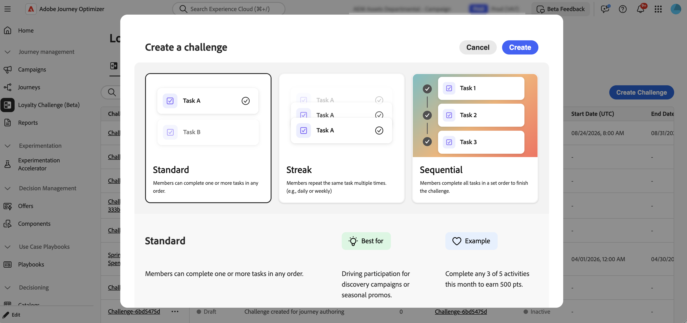
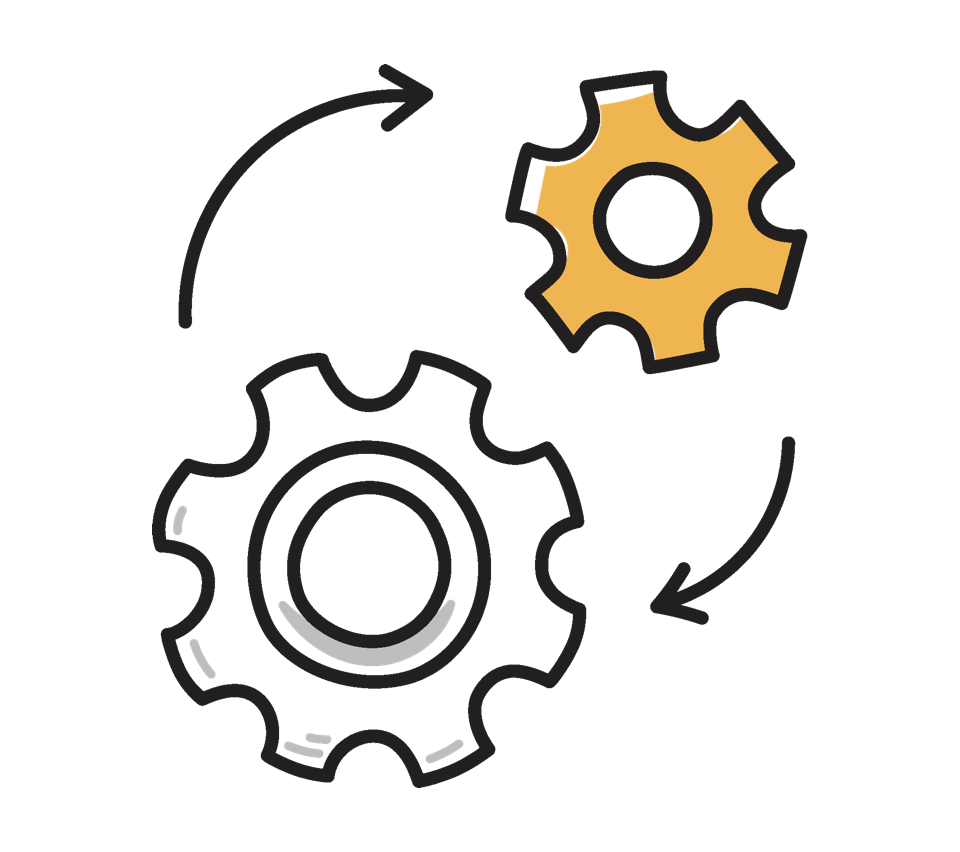

# 開始應對忠誠度挑戰 {#get-started-loyalty-challenges}

>[!BEGINSHADEBOX]

**忠誠度挑戰檔案：**

* **開始解決忠誠度挑戰** ◀︎ **您在這裡**
* [存取及管理挑戰與工作](access-loyalty-challenges.md)
* [創造挑戰](create-challenges.md)
* [建立任務](create-tasks.md)

>[!ENDSHADEBOX]

>[!AVAILABILITY]
>
>此功能目前在&#x200B;**私人測試版**&#x200B;中。 深入瞭解[可用性標籤](../rn/releases.md#availability-labels)。

## 概觀 {#overview}

忠誠度挑戰可讓您建立吸引人、遊戲化的忠誠度計畫，以推動客戶行為並深化品牌關係。 建立挑戰以獎勵客戶的特定行動，從購買和撰寫評論，到參與社群媒體和反向連結朋友。

透過忠誠度挑戰，您可以：

* **設計彈性的挑戰型別**：建立符合您業務目標的標準、連續或循序挑戰
* **策略性地設定獎勵**：在任務里程碑或完全完成時傳遞點數以維持參與
* **個人化體驗**：使用內容卡和多通道傳訊功能，建立沈浸式品牌體驗
* **緊密整合**：與您現有的忠誠度提供者連絡並運用Experience Platform資料
* **自動追蹤**：透過自動產生的歷程（無需自訂開發）監視客戶進度

您可以建立三種型別的挑戰體驗：

* **標準挑戰**：客戶以任何順序完成任何指定數量的工作。 當您想要彈性及多個完成路徑時，請使用此型別。\
  *範例：「夏季健康挑戰」 — 完成5項任務中的3項：購買健康產品、在社群媒體上分享、介紹朋友、撰寫評論或參加虛擬活動*

* **連續挑戰**：客戶連續多次完成相同的工作。 使用此型別鼓勵隨著時間推移一致的重複行為。\
  *範例：「咖啡愛好者週」 — 連續7天購買咖啡產品以取得免費飲品獎勵*

* **循序挑戰**：客戶以定義的順序完成任務。 使用此型別引導客戶完成特定歷程或上線流程。\
  *範例：「新成員歷程」 — 註冊電子郵件→進行第一次購買→撰寫產品評論→推薦朋友（以此確切順序完成）*

## 運作方式 {#how-it-works}

建立和啟動忠誠度挑戰會遵循此工作流程：

1. **設定資料擷取** — 設定Experience Platform來源聯結器（例如[毛細聯結器](https://experienceleague.adobe.com/en/docs/experience-platform/sources/home#loyalty)），以擷取追蹤客戶動作和進度的忠誠度事件資料。 此資料可支援挑戰追蹤和任務完成。

1. **建立挑戰** — 定義基本挑戰屬性，包括名稱、型別（標準、條紋或循序）和日期範圍。

1. **新增任務** — 定義客戶必須完成的特定動作，包括任務型別（購買、支出）、數量、產品篩選和獎勵。

1. **設計內容卡** — 使用顯示在客戶裝置上的Journey Optimizer內容卡，以視覺化方式呈現您的挑戰。 內容卡會顯示挑戰資訊、進度和獎勵。

1. **設定訊息** （選擇性） — 設定關鍵生命週期階段的多通道訊息（應用程式內、電子郵件、推播）：啟動、進行中及完成。

1. **選取目標對象** — 從Adobe Experience Platform選取對象，以定義哪些客戶可以參與您的挑戰。

1. **啟動挑戰** — 發佈挑戰，然後產生歷程。 Journey Optimizer會自動建立挑戰歷程。 發佈自動產生的歷程，讓客戶瞭解挑戰。

如需詳細逐步指示，請參閱[建立挑戰](create-challenges.md)。

## 先決條件 {#prerequisites}

使用忠誠度挑戰之前，請確定您擁有：

+++資料擷取設定

忠誠度挑戰需要透過Experience Platform來源聯結器擷取的資料來追蹤客戶進度和任務完成。

開始之前，請設定支援的來源聯結器。 目前，毛細管聯結器可供使用。 未來版本計畫推出其他聯結器。 [瞭解忠誠度來源聯結器](https://experienceleague.adobe.com/en/docs/experience-platform/sources/home#loyalty)。

+++

+++必要權限

若要使用忠誠度挑戰，您需要Journey Optimizer中的適當許可權。 必要的許可權包括：

* 未定
* 未定
* 未定

如果您無法存取功能或需要其他許可權，請聯絡管理員。

+++

+++目標客群

在建立挑戰之前，請先確定Adobe Experience Platform中已有您需要的目標對象。 在挑戰設定期間，您將選取定義哪些客戶有資格參與的受眾。 [瞭解如何使用對象](../audience/about-audiences.md)。

+++

## 後續步驟 {#next-steps}

<table style="table-layout:fixed">
<tr style="border: 0;">
  <td>
    
    

    <a href="access-loyalty-challenges.md"><strong>存取及管理挑戰與工作</strong></a>
    

    

    <em>瞭解如何存取詳細目錄及管理挑戰與工作</em>
    

  </td>
  <td>
    
    

    <a href="create-challenges.md"><strong>建立挑戰</strong></a>
    

    

    <em>瞭解如何建立及設定您的第一個忠誠度挑戰</em>
    

  </td>
  <td>
    
    

    <a href="create-tasks.md"><strong>建立任務</strong></a>
    

    

    <em>瞭解如何定義客戶為挑戰完成的工作</em>
    

  </td>
</tr>
</table>
