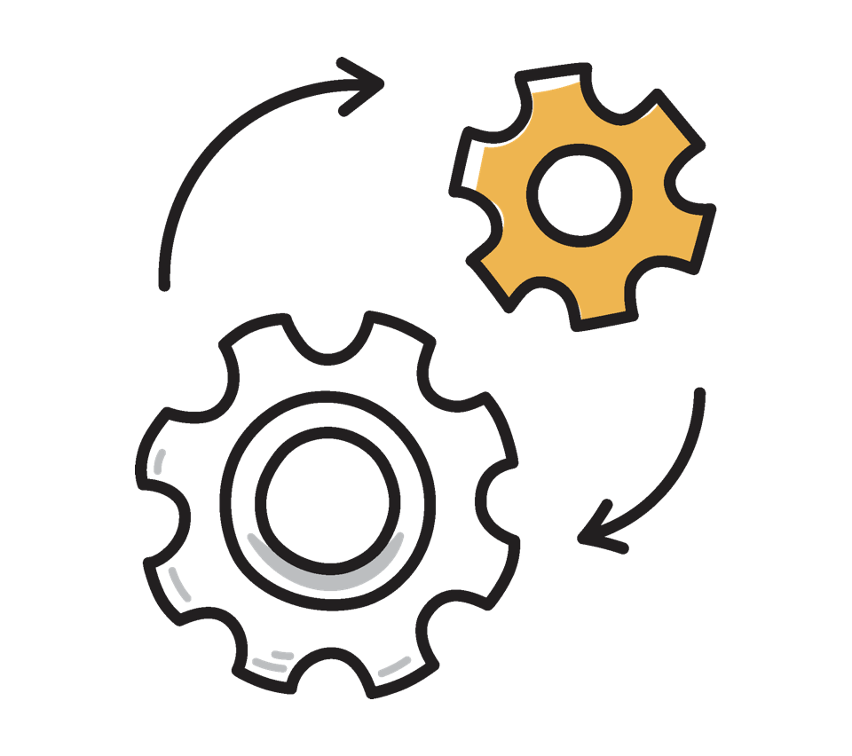

# 開始應對忠誠度挑戰 {#get-started-loyalty-challenges}

>[!CONTEXTUALHELP]
>id="ajo_loyalty_inventory"
>title="忠誠度挑戰"
>abstract="您可以透過忠誠度挑戰建立吸引人、遊戲化的忠誠度方案，推動客戶行為及深化品牌關係。 建置挑戰，獎勵客戶的特定動作，包括從購買和撰寫評論，到參與社交媒體和轉介朋友。"

>[!AVAILABILITY]
>
>Journey Optimizer Loyalty目前不適用於Healthcare Shield和Privacy and Security Shield客戶。 未來功能準備就緒時，Healthcare Shield和Privacy and Security Shield客戶的可用性將會更新。

## 概觀 {#overview}

您可以透過忠誠度挑戰建立吸引人、遊戲化的忠誠度方案，推動客戶行為及深化品牌關係。 建置挑戰，獎勵客戶的特定動作，包括從購買和撰寫評論，到參與社交媒體和轉介朋友。

透過忠誠度挑戰，您可以：

* **設計彈性的挑戰型別**：建立符合您業務目標的標準、連續或循序挑戰
* **策略性地設定獎勵**：在任務里程碑或完全完成時傳遞點數以維持參與
* **個人化體驗**：使用內容卡和多通道傳訊功能，建立沈浸式品牌體驗
* **緊密整合**：與您現有的忠誠度提供者連絡並運用Experience Platform資料
* **自動追蹤**：透過自動產生的歷程（無需自訂開發）監視客戶進度
* **測量效能**：使用內建的報告儀表板來追蹤方案KPI、挑戰結果和任務層級的量度

您可以建立下列型別的挑戰體驗：

* **標準挑戰**：客戶以任何順序完成任何指定數量的工作。 當您想要彈性及多個完成路徑時，請使用此型別。\
  *範例：「夏季健康挑戰」 — 完成5項任務中的3項：購買健康產品、在社群媒體上分享、介紹朋友、撰寫評論或參加虛擬活動*

* **連續挑戰**：客戶連續多次完成相同的工作。 使用此型別鼓勵隨著時間推移一致的重複行為。\
  *範例：「咖啡愛好者週」 — 連續7天購買咖啡產品以取得免費飲品獎勵*

* **循序挑戰**：客戶以定義的順序完成任務。 使用此型別引導客戶完成特定歷程或上線流程。\
  *範例：「新成員歷程」 — 註冊電子郵件→進行第一次購買→撰寫產品評論→推薦朋友（以此確切順序完成）*

* **自備資料挑戰** （可用性受限）：挑戰框架（任務和獎勵）是由您的「忠誠度挑戰」資料整合所組成。 您可以像處理任何其他挑戰型別一樣設定「設定」、「內容」和「傳訊」。

>[!TIP]
>您也可以使用[CX Co-worker Journey Skills](../start/ajo-coworker-skills.md#loyalty-challenge-management)中的&#x200B;**忠誠度挑戰管理**，以自然語言提示來建立和管理忠誠度挑戰，以加快挑戰建立的速度。

➡️ [觀看功能概觀](#video)

## 運作方式 {#how-it-works}

使用忠誠度挑戰涉及三個廣泛的階段：設定、執行和測量，通常在管理員和從業人員角色之間共用。

**1. 設定您的程式** *（管理員）*

在編寫挑戰之前，管理員會設定方案基礎：獎勵提供者、將客戶動作對應到任務完成的事件定義、產品詳細目錄和排除清單。 [瞭解如何設定忠誠度挑戰](loyalty-admin.md)。

**2. 作者和啟動挑戰** *（從業人員）*

行銷人員藉由選取型別（標準、條紋、循序或自備資料）、設定設定（對象、排程、規則）以及定義任務和獎勵來建立挑戰。 他們可以選擇使用&#x200B;**內容卡**&#x200B;或&#x200B;**程式碼型體驗**，在面向成員的介面上顯示挑戰，並在挑戰生命週期中設定關鍵時刻的頻道通知。 設定後，他們會發佈挑戰、產生自動建立的歷程並發佈，以讓挑戰上線。 [瞭解如何建立挑戰](create-challenges.md)。

**3. 監視效能** *（從業人員/分析人員）*

挑戰開始後，內建的報告儀表板會提供挑戰層級的量度：對象funnel績效、任務完成率、獎勵簽發和收入影響。 AI支援的深入分析引擎也會呈現上下文建議，以協助最佳化方案效能。 [瞭解忠誠度報告](loyalty-reporting.md)。

## 先決條件 {#prerequisites}

使用忠誠度挑戰之前，請確定您擁有：

+++必要權限

若要使用「忠誠度挑戰」，您必須被指派到「忠誠度」角色。 在Prod沙箱中，管理員、從業人員和分析人員可以使用預設角色。 對於非Prod沙箱，您的管理員必須建立具有所需忠誠度許可權的自訂角色。

如果您無法存取功能或需要其他許可權，請聯絡管理員。 [瞭解如何設定忠誠度挑戰許可權](loyalty-permissions.md)。

+++

+++設定熟客方案（管理員）

管理員會在&#x200B;**[!UICONTROL 忠誠度設定]**&#x200B;功能表中設定獎勵提供者、事件定義、產品詳細目錄、排除專案和全域設定。 僅能帶來挑戰的行銷人員不需要存取此選單。 [瞭解如何設定忠誠度挑戰](loyalty-admin.md)

如果左側導覽中看不到&#x200B;**[!UICONTROL 熟客方案設定]**&#x200B;功能表，請聯絡您的管理員。

+++

+++目標客群

在建立挑戰之前，請先確定Adobe Experience Platform中已有您需要的目標對象。 在挑戰設定期間，您將選取定義哪些客戶有資格參與的受眾。 [瞭解如何使用對象](../audience/about-audiences.md)。

+++

## 讓我們深入探討 {#lets-dive-deeper}

現在您已經知道什麼是忠誠度挑戰及其運作方式，您可以開始深入瞭解詳細資訊。 探索以下主題以存取介面、建立您的第一個挑戰，並定義您的客戶將完成的任務。

<table style="table-layout:fixed">
<tr style="border: 0;">
  <td>
    
    

    <a href="access-loyalty-challenges.md"><strong>存取及管理挑戰與任務</strong></a>
    

    

    <em>瞭解如何存取詳細目錄及管理挑戰與工作</em>
    

  </td>
  <td>
    
    

    <a href="create-challenges.md"><strong>建立挑戰</strong></a>
    

    

    <em>瞭解如何建立及設定您的第一個忠誠度挑戰</em>
    

  </td>
  <td>
    
    

    <a href="create-tasks.md"><strong>建立任務</strong></a>
    

    

    <em>瞭解如何定義客戶為挑戰完成的工作</em>
    

  </td>
  <td>
    
    

    <a href="loyalty-reporting.md"><strong>監控效能</strong></a>
    

    

    <em>使用內建儀表板追蹤計畫KPI、挑戰結果和任務量度</em>
    

  </td>
  <!--
    <a href="loyalty-admin.md"><strong>Configure the loyalty program</strong></a>
  <td>
    <a href="loyalty-admin.md">
    <em>Set up reward providers, event definitions, and org settings for fulfillment</em>
    </a>
    

  -->
    <a href="loyalty-admin.md"><strong>設定忠誠度挑戰</strong></a>
    

    

    <em>設定獎勵提供者、事件定義和組織設定</em>
    

  </td>
</tr>
</table>

## 開發人員資源 {#developer-resources}

忠誠度挑戰公開REST API，可讓您以程式設計方式管理挑戰並追蹤個人檔案參與率：

* **[忠誠度挑戰中繼資料API](https://developer.adobe.com/journey-optimizer-apis/references/loyalty-challenges){target="_blank"}** — 建立、擷取、更新、發佈、封存和重複挑戰。
* **[忠誠度挑戰狀態API](https://developer.adobe.com/journey-optimizer-apis/references/loyalty-challenges-state){target="_blank"}** — 查詢並更新個別設定檔的挑戰參與狀態。

如需驗證和必要的標頭，請參閱[驗證教學課程](https://developer.adobe.com/journey-optimizer-apis/references/authentication){target="_blank"}。

## 作法影片 {#video}

**剛開始面對忠誠度挑戰？** 觀看此概觀，瞭解功能和優點：

>[!VIDEO](https://video.tv.adobe.com/v/3496460?captions=chi_hant&quality=12)

