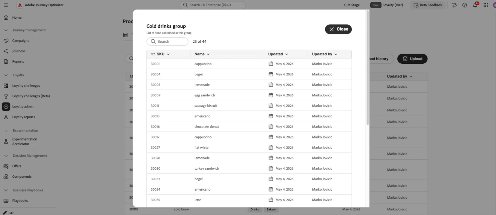

# 設定熟客方案 {#loyalty-admin}

>[!BEGINSHADEBOX]

**忠誠度挑戰檔案：**

* [開始應對忠誠度挑戰](get-started.md)
* [存取及管理挑戰與工作](access-loyalty-challenges.md)
* [創造挑戰](create-challenges.md)
* [建立任務](create-tasks.md)
* [監視忠誠度挑戰績效](loyalty-reporting.md)
* **設定熟客方案** ◀︎ **您在這裡**
* [忠誠度挑戰API參考](https://developer.adobe.com/journey-optimizer-apis/references/loyalty-challenges){target="_blank"}

>[!ENDSHADEBOX]

>[!AVAILABILITY]
>
>此功能目前在&#x200B;**私人測試版**&#x200B;中。 如需[!DNL Journey Optimizer]中發行週期與可用性階段的完整詳細資訊，請參閱[發行週期](../rn/releases.md)。

## 概觀 {#access-loyalty-admin}

使用[!DNL Journey Optimizer]中的熟客方案設定來連線到您的外部熟客系統。 行銷人員使用&#x200B;**[!UICONTROL 忠誠度挑戰(Beta)]**&#x200B;來設計挑戰、工作、內容和訊息。 熟客方案設定是獨立的僅限管理員區域，用於獎勵履行、事件對應、產品詳細目錄和排除。

>[!NOTE]
>
>熟客方案設定適用於管理員。 除了忠誠度挑戰所需的許可權之外，您還需要管理員層級的許可權來存取您的[!DNL Journey Optimizer]執行個體。 請聯絡您的Adobe管理員以請求存取權。

若要開啟設定介面，請瀏覽至&#x200B;**[!UICONTROL 忠誠度]**&#x200B;並選取&#x200B;**[!UICONTROL 忠誠管理員]**。 介面會整理為標籤：

* **全域設定** — 設定Experience Platform身分名稱空間。 [瞭解如何設定全域設定](#global-settings)
* **獎勵提供者** — 連線完成獎勵的外部API，包括獎勵型別、代理和驗證。 [瞭解如何設定獎勵提供者](#reward-providers)
* **事件定義** — 將傳入體驗事件對應到您可以在&#x200B;**[!UICONTROL 自訂事件]**&#x200B;工作中使用的活動。 [瞭解如何設定事件定義](#event-definitions)
* **產品詳細目錄** — 上傳專案對群組的對應，以便您可以在任務適用性規則中使用產品群組。 [瞭解如何設定產品詳細目錄](#product-inventory)
* **排除專案** — 上傳行銷人員設定任務時適用的組織範圍專案和群組排除專案。 [瞭解如何設定排除專案](#exclusions)

## 全域設定 {#global-settings}

>[!CONTEXTUALHELP]
>id="ajo_loyalty_admin_global_settings"
>title="全域設定"
>abstract="選取熟客方案的Adobe Experience Platform身分名稱空間。"

開啟&#x200B;**[!UICONTROL 全域設定]**&#x200B;標籤。 目前，此標籤中可用的主要設定是在&#x200B;**[!UICONTROL 名稱空間]**&#x200B;下拉式清單中，選取忠誠計畫使用的Adobe Experience Platform身分名稱空間。

➡️ [瞭解如何使用身分識別名稱空間](https://experienceleague.adobe.com/zh-hant/docs/experience-platform/identity/features/namespaces){target="_blank"}

## 獎勵提供者 {#reward-providers}

**獎勵提供者**&#x200B;會告訴[!DNL Journey Optimizer]當挑戰進度已記錄或挑戰完成時（例如，將忠誠點數或開始點數歸於會員帳戶的API），要傳送履行電話的位置。
* **[!UICONTROL 獎勵定義]** — 此提供者可以發行的獎勵型別（例如，星星或英里）。
* **[!UICONTROL 獎賞代理]** — 會透過而非直接透過您的端點路由呼叫的中繼Proxy。
* **[!UICONTROL 驗證權杖產生器]** — [!DNL Journey Optimizer]在呼叫您的API之前，會使用機制來取得存取權杖。

若要建立獎勵提供者，請遵循下列步驟：

1. 開啟&#x200B;**[!UICONTROL 獎勵提供者]**&#x200B;索引標籤，然後選取&#x200B;**[!UICONTROL 建立獎勵提供者]**。

   

1. 輸入&#x200B;**[!UICONTROL 名稱]**&#x200B;和&#x200B;**[!UICONTROL 描述]**。

1. 在&#x200B;**[!UICONTROL URL]**&#x200B;欄位中，輸入接收履行請求的API URL。

1. 視需要為您的API新增&#x200B;**[!UICONTROL 標題]** （例如API金鑰或內容型別）。

1. 設定以下與您的獎勵提供者關聯的資源。 展開每個區段以取得詳細資訊：

   +++獎勵定義

   由您的提供者支援的每項獎勵各有一個專案（例如，方案積分或星星、貨幣信用）。 對於每個定義：

   * 提供名稱和說明。
   * 指定定義是否為&#x200B;**[!UICONTROL 已啟用]**。
   * 開啟&#x200B;**![!UICONTROL Default]**&#x200B;選項，將一個定義標示為此提供者的預設值。
   * 指定隨履行呼叫傳送的&#x200B;**裝載**。

   

   +++

   +++獎勵Proxy

   透過中繼伺服器路由履行呼叫，而非直接路由至端點。

   * 提供名稱和說明。
   * 輸入&#x200B;**[!UICONTROL 主機]**，**[!UICONTROL 連線埠]**&#x200B;資訊。
   * 指定代理伺服器是否為&#x200B;**[!UICONTROL 已啟用]**。
   * 新增Proxy **[!UICONTROL 認證]**。

   

   +++

   +++驗證權杖產生器

   如果您的API需要持有人權杖以進行驗證。

   * 輸入名稱和說明。
   * 在「驗證型別」欄位中，輸入驗證型別（例如「持有者」）。
   * 選取要使用的HTTP方法（例如POST）。
   * 輸入權杖端點URL。 並在回應中新增&#x200B;**[!UICONTROL Token金鑰]** （例如`access_token`）。
   * 指定驗證權杖產生器是否為&#x200B;**[!UICONTROL 已啟用]**。
   * 視需要新增權杖端點所需的標頭。

   [!DNL Journey Optimizer]在呼叫您的獎勵API之前，使用此設定來取得新的Token。

   

   +++

1. 選取&#x200B;**[!UICONTROL 建立獎勵提供者]**。 提供者和所有已設定的資源會一起儲存。

儲存後，提供者會出現在獎勵提供者清單中。 行銷人員在設定挑戰獎勵時，可選取此提供者。 [瞭解如何設定挑戰獎勵](create-challenges.md#rewards)

若要編輯現有的獎勵提供者，請開啟&#x200B;**[!UICONTROL 獎勵提供者]**&#x200B;標籤、選取提供者，並更新適當的欄位。 更新子資源（獎勵定義、代理、驗證權杖產生器）時，會儲存這些資源的變更。

>[!NOTE]
>
>**[!UICONTROL 攜帶您自己的資料]**&#x200B;挑戰透過您自己的資料整合完成獎勵。 在此設定的獎勵提供者不適用於這些挑戰。 [瞭解如何建立您自己的資料挑戰](create-challenges.md#create-the-challenge)

## 事件定義 {#event-definitions}

**[!UICONTROL 事件定義]**&#x200B;將您系統中的體驗事件（例如購買、飯店簽到）對應到「忠誠度挑戰」可以執行的活動，最明顯的是&#x200B;**[!UICONTROL 自訂事件]**&#x200B;任務。 事件到達時，[!DNL Journey Optimizer]會使用這些定義來決定是否處理這些事件。 不符合任何定義的事件會被忽略。

若要建立事件定義，請遵循下列步驟：

1. 開啟&#x200B;**[!UICONTROL 事件定義]**&#x200B;標籤，並建立新定義。

   

1. 輸入事件的&#x200B;**[!UICONTROL 名稱]** （例如，`Coffee purchase`） — 這是行銷人員在設定&#x200B;**[!UICONTROL 自訂事件]**&#x200B;任務時看到的名稱。

1. 指定[!DNL Journey Optimizer]如何辨識傳入裝載中的事件。 提供&#x200B;**[!UICONTROL 識別碼路徑]**、**[!UICONTROL XDM結構描述識別碼]**，或兩者皆提供：

   * **[!UICONTROL 識別碼路徑]** — 識別事件或成員的欄位路徑（例如，`data.memberId`）。 依承載中的值比對事件時，請使用此選項。
   * **[!UICONTROL 識別碼值]** — 識別碼路徑上的值必須存在，才能符合此定義。
   * **[!UICONTROL XDM結構描述ID]** — 此事件型別的Experience Platform XDM結構描述識別碼。 在根據已知結構描述擷取事件時，請使用此選項。

1. 當品牌以自己的JSON格式傳送事件時，請將字串貼到&#x200B;**[!UICONTROL 結構描述]**&#x200B;和&#x200B;**[!UICONTROL 轉換器]**&#x200B;中，讓[!DNL Journey Optimizer]可以識別資料、剖析資料，並決定是否追蹤資料。

   * **[!UICONTROL 結構描述]** — 傳入承載的驗證字串。
   * **[!UICONTROL Transformer]** — 轉換運算式（例如JSONata），可將您的裝載對應至「忠誠度挑戰」所預期的格式。

1. 儲存事件定義。 它出現在&#x200B;**[!UICONTROL 事件定義]**&#x200B;清單中。 您現在可以在挑戰中使用它。 [瞭解如何建立挑戰](create-challenges.md)

## 產品詳細目錄 {#product-inventory}

**[!UICONTROL 產品詳細目錄]**&#x200B;索引標籤可讓您將目錄專案分組，這樣您便可在任務中鎖定這些專案，而不需列出每個專案ID。 您上傳&#x200B;**CSV檔案**，該檔案會將每個專案識別碼對應至一或多個&#x200B;**產品群組** （同一個專案可以出現在多個群組中）。 匯入後，當您設定任務適用性時，這些群組即可使用。 [瞭解如何建立任務](create-tasks.md)

若要上傳產品詳細目錄檔案，請遵循下列步驟：

1. 準備CSV檔案，將每個專案識別碼對應至一或多個產品群組。 展開以下區段以檢視範例。

   +++產品詳細目錄CSV範例

   

   +++

1. 開啟&#x200B;**[!UICONTROL 產品詳細目錄]**&#x200B;標籤。

1. 按一下「**[!UICONTROL 上傳]**」按鈕，然後選取您的CSV檔案。

   

1. 檢閱詳細目錄清單中的匯入檔案。 清單會為每個專案顯示一列。 在&#x200B;**欄中包含的**&#x200B;群組中，您會看到專案所屬的每個產品群組。 每個群組都顯示為藥丸（如果專案屬於多個群組，則為多個藥丸）。

   

1. 若要檢視產品群組中的每個專案，請在任何列的&#x200B;**欄中所包含的**&#x200B;群組中，選取該群組的藥丸。 群組詳細資訊檢視會列出群組中的所有專案，而不只是您選取資料列上的專案。

   

1. 使用&#x200B;**[!UICONTROL 上傳記錄]**&#x200B;檢視先前上傳的CSV檔案。

## 排除 {#exclusions}

**[!UICONTROL 排除專案]**&#x200B;索引標籤可讓您定義忠誠計畫中所排除的目錄專案和群組，而不需列出每項任務中的每個專案ID。 您上傳&#x200B;**CSV檔案**，將每個專案識別碼對應至一或多個&#x200B;**排除群組** （同一個專案可以出現在多個群組中）。 匯入後，這些專案和群組可在任務產生器中使用：排除的專案會自動標示且無法包含在任務中；排除群組只能新增到任務的排除清單中，不能新增到包含清單中。 [瞭解如何定義任務上的合格專案和排除專案](create-tasks.md#eligible-items-exclusions)

若要上傳產品排除專案檔案，請遵循下列步驟：

1. 準備CSV檔案，將每個專案識別碼對應至一或多個排除群組。 展開以下區段以檢視範例。

   +++排除專案CSV範例

   

   +++

1. 開啟&#x200B;**[!UICONTROL 排除專案]**&#x200B;標籤。

1. 按一下「**[!UICONTROL 上傳]**」按鈕，然後選取您的CSV檔案。

   

1. 檢閱排除清單中的匯入檔案。 清單會為每個專案顯示一列。 在&#x200B;**欄中包含的**&#x200B;群組中，您會看到專案所屬的每個排除群組。 每個群組都顯示為藥丸（如果專案屬於多個群組，則為多個藥丸）。

1. 若要檢視排除群組中的每個專案，請在任何列的&#x200B;**欄中所包含的**&#x200B;群組中，選取該群組的藥丸。 群組詳細資訊檢視會列出群組中的所有專案，而不只是您選取資料列上的專案。

1. 使用&#x200B;**[!UICONTROL 上傳記錄]**&#x200B;檢視先前上傳的CSV檔案。
