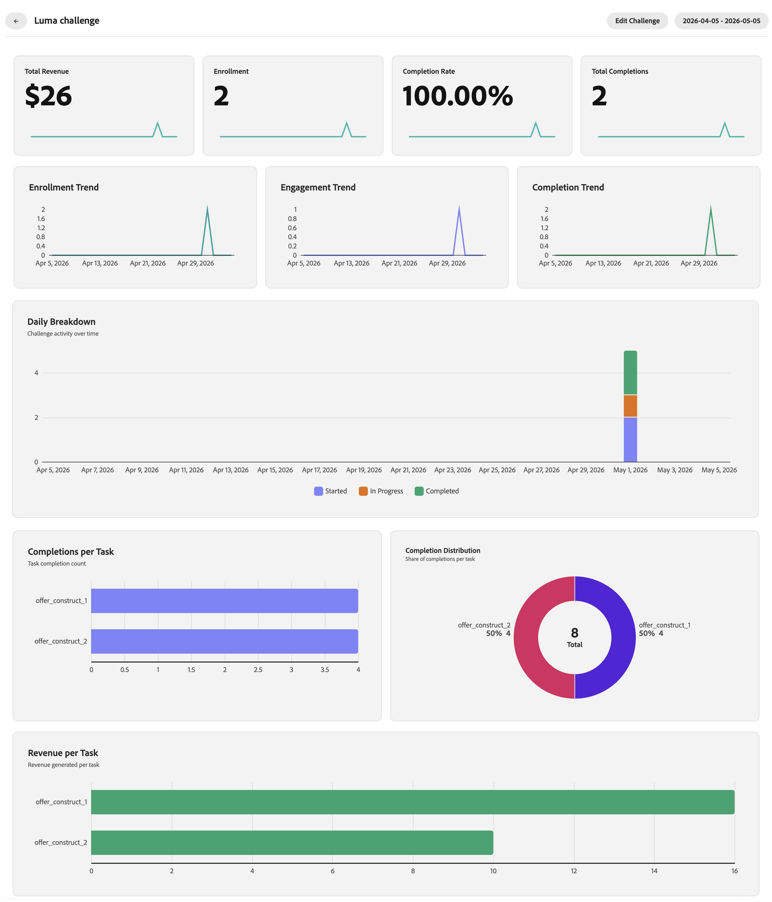

# 監視忠誠度挑戰績效 {#loyalty-reporting}

>[!BEGINSHADEBOX]

**忠誠度挑戰檔案：**

* [開始應對忠誠度挑戰](get-started.md)
* [存取及管理挑戰與工作](access-loyalty-challenges.md)
* [創造挑戰](create-challenges.md)
* [建立任務](create-tasks.md)
* **監視忠誠度挑戰績效** ◀︎ **您在這裡**
* [忠誠度挑戰API參考](https://developer.adobe.com/journey-optimizer-apis/references/loyalty-challenges){target="_blank"}

>[!ENDSHADEBOX]

>[!AVAILABILITY]
>
>此功能目前在&#x200B;**私人測試版**&#x200B;中。 如需發行週期與可用性階段的完整詳細資訊，請參閱 [Journey Optimizer 發行週期](../rn/releases.md)。

忠誠度挑戰報告提供挑戰層級的儀表板，讓您能夠追蹤關鍵量度，例如對象funnel績效、任務完成率、獎勵簽發和收入影響。 所有資料都來自Adobe Customer Journey Analytics，並以自訂、專門建置的介面呈現。

<!--
A direct **Analyze in CJA** button will be added to the reporting interface before the feature reaches general availability.
-->

## 存取忠誠度報告 {#access-reports}

若要開啟忠誠度報告儀表板，請導覽至Journey Optimizer中的&#x200B;**[!UICONTROL 忠誠度挑戰(Beta)]**，然後從左側導覽中選取&#x200B;**[!UICONTROL 忠誠度報告]**。

報告介面提供三種檢視，每種檢視提供不同層級的詳細資訊。 **[總覽](#overview)**&#x200B;會顯示您所有使用中挑戰的摘要。 下方有兩個索引標籤，可讓您在更精細的檢視之間切換：

* **[挑戰](#challenges-view)**：具深入研究功能的每個挑戰細分，
* **[任務](#tasks-view)**：收入和完成度量的任務層級檢視。

您可以使用頁面頂端的日期選擇器調整所有檢視的日期範圍。 標準日期預設集也可供使用。

## 概觀 {#overview}

**總覽**&#x200B;頁面會顯示所選期間所有作用中挑戰的彙總量度。

頁面頂端會顯示下列測量結果：

**熟客方案會員** — 在選取期間有效的熟客方案會員數目。
**挑戰註冊** — 所有挑戰的新挑戰註冊總數。
**收入** — 期間內與挑戰活動相連結的總收入。
**平均完成率** — 完成至少一項挑戰的已註冊客戶百分比。

在這些量度底下，**每日挑戰參與度**&#x200B;時間表會顯示挑戰參與度在這段期間如何演化，並繪製三個系列：

* **已開始**&#x200B;挑戰的客戶，
* 移至&#x200B;**進行中**&#x200B;狀態的客戶，
* **已完成**&#x200B;個質詢的客戶。

## 挑戰檢視 {#challenges-view}

**挑戰**&#x200B;索引標籤會依個別挑戰劃分效能。 每個挑戰都以索引鍵欄列出，例如，型別、狀態、註冊、完成等。 清單會依上次修改日期排序，一次顯示十個挑戰。 使用底部的&#x200B;**下一步**&#x200B;按鈕以進一步瀏覽。

從清單中選取任何挑戰，以開啟其詳細資料檢視。 此報表包含數個量度區塊，例如總收入、註冊、完成率和趨勢圖，以及每日劃分。

+++挑戰報告範例

+++

## 任務檢視 {#tasks-view}

**任務**&#x200B;索引標籤提供任務效能的跨挑戰檢視。 您可以依收入切換熱門工作，並依完成切換熱門工作，以聚焦於與您最相關的量度。

此索引標籤也依收入標示前6項工作，讓您快速檢視哪些工作可帶來最大價值。

在雷達圖下方，任務清單會顯示每個任務及其關鍵欄，例如，完成、收入及每個任務所屬的挑戰。 此清單依收入排序，一次顯示十項工作。 使用&#x200B;**下一步**&#x200B;按鈕進一步瀏覽。

