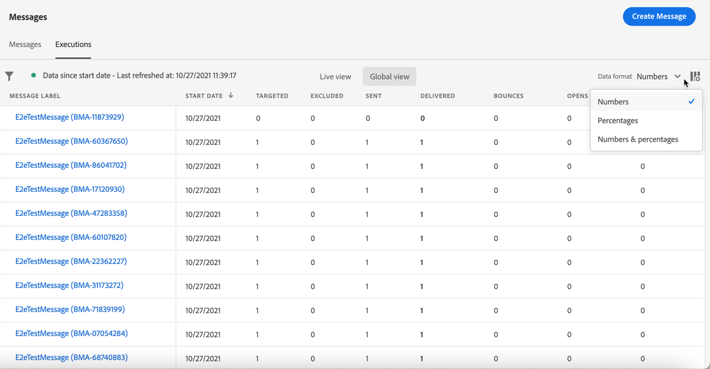

# 訊息監視 {#monitor-message-execution}

為確保您的訊息成功執行、傳送及傳送， [!DNL Journey Optimizer] 提供可監控目前發佈及觸發之訊息的功能。 您可以了解訊息在各歷程中的表現 <!--and APIs--> 即時從 **[!UICONTROL Executions]** 清單。

若要存取此清單，請從 **[!DNL Journey Optimizer]** 首頁，選擇 **[!UICONTROL Messages]**，然後按一下 **[!UICONTROL Executions]** 標籤。

此索引標籤提供兩個檢視： **[!UICONTROL Live view]** 和 **[!UICONTROL Global view]**.

* 此 **[!UICONTROL Live view]** 索引標籤提供 **所有已執行訊息的即時概述** 由一或多個 [歷程](building-journeys/journey.md) **過去24小時**.

   

   此清單每60秒自動重新整理一次。 如果過去24小時內特定訊息未執行，則所有欄會為該訊息顯示空值(0)。

* 此 **[!UICONTROL Global view]** 索引標籤提供 **所有已執行訊息的概觀** 由一或多個 [歷程](building-journeys/journey.md) **自消息開始日期起**.

   

   此清單每90分鐘自動重新整理一次。 資料會自每個訊息開始日期起隨時間匯總。

如果訊息已發佈，但尚未由歷程觸發，則不會列在任何標籤中。 僅列出下列元素：
* 已觸發但尚未啟動的訊息（擱置中）。
* 已觸發且目前執行（進行中）的訊息。

<!--For multichannel messages, one row per channel is displayed for each message. STILL VALID? looks like NOT-->

>[!NOTE]
>
>如果訊息已用於數個歷程，則每個執行的每個歷程會顯示一列。

<!---->

<!--If a message has been used in several journeys, the **[!UICONTROL Source]** column displays **[!UICONTROL Multiple]**.-->

依預設，訊息會從最近的執行日期開始顯示。 按一下 **[!UICONTROL Filters]** 圖示，以根據通道、開始日期和/或結束日期來搜尋訊息。

此 <!--**[!UICONTROL Quick action]**-->第二欄可開啟對應的 [訊息](create-message.md) 和 [即時報表](reports/live-report.md) 如果您在 **[!UICONTROL Live view]**，或 [全域報表](reports/global-report.md) 如果您在 **[!UICONTROL Global view]**.

對於每個訊息執行，會顯示許多指標：

* **[!UICONTROL Message label]**:您定義的訊息標題 [建立訊息](create-message.md). 自動產生的執行ID會以括弧顯示。

   <!--**[!UICONTROL Execution ID]**: Automatically generated identifier.
  **[!UICONTROL Source]**: Name of the journey leveraging that message.-->

* **[!UICONTROL Journey - Version - Action]**:運用訊息的歷程名稱、歷程版本，以及運用歷程中訊息的動作標籤。

* **[!UICONTROL Status]**:消息執行狀態。 <!--List all the possible statuses? For now only Live status? The user cannot stop or cancel the execution. TBC by Fred-->

* **[!UICONTROL Start date]**:從歷程執行訊息的日期和時間。

* **[!UICONTROL Targeted]**:每個訊息執行的目標設定檔數。

* **[!UICONTROL Excluded]**:因排除規則而從初始目標中排除的設定檔數。

* **[!UICONTROL Sent]**:已傳送的訊息數。

* **[!UICONTROL Delivered]**:在收件者的信箱（電子郵件）或裝置（推送）中成功傳送而未產生退信或任何其他傳送錯誤的訊息數目。

* **[!UICONTROL Bounces]**:因傳送失敗而無法傳送的訊息數。 [進一步了解跳出數](suppression-list.md).

* **[!UICONTROL Opens]**:已開啟的郵件數。

* **[!UICONTROL Clicks]**:電子郵件中連結的點按次數。

   >[!NOTE]
   >
   >推播通知不存在點按次數：使用者按一下推播通知時，會開啟應用程式，而此應用程式只能視為開啟。

* **[!UICONTROL Errors]**:因技術故障而無法傳送的訊息數。

* **[!UICONTROL Spam complaints]**:收件者標示為垃圾訊息的郵件數。 進一步了解 [傳遞能力最佳實務指南](https://experienceleague.adobe.com/docs/deliverability-learn/deliverability-best-practice-guide/metrics-for-deliverability/complaints.html#metrics-for-deliverability){target=&quot;_blank&quot;}。

您可以選擇要在表格中顯示哪些欄。 若要這麼做，請按一下 **[!UICONTROL Customize table]** 圖示並選取您要顯示的欄。

在 **全域檢視** 只有，您才可以選擇以數字、百分比或兩者顯示資料。 按一下 **資料格式** 下拉式清單，在三個選項之間切換。

按一下每個超連結將開啟相應的消息摘要視圖。 [進一步了解訊息](create-message.md).
