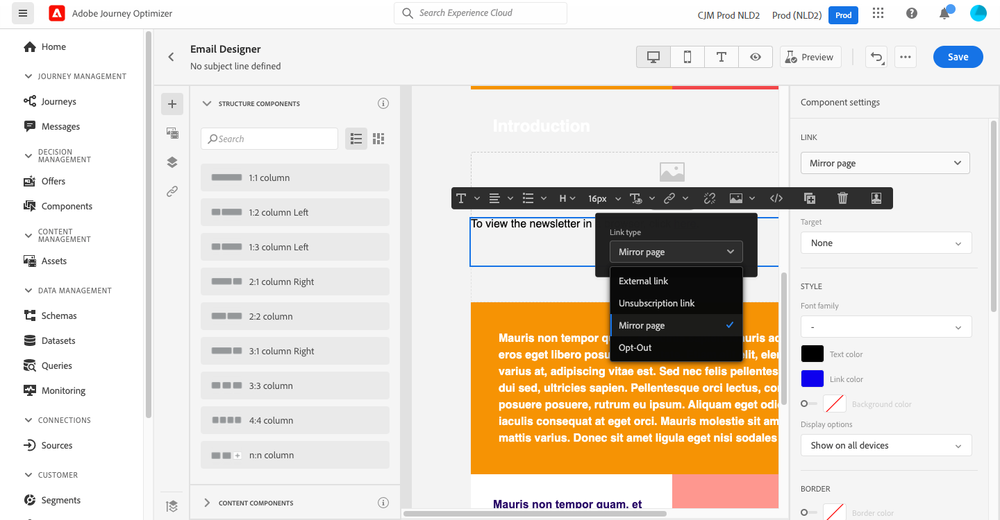

# 新增連結及追蹤訊息 {#tracking}

使用[!DNL Journey Optimizer]來新增內容的連結並追蹤傳送的訊息，以監控收件者的行為。

## 啟用追蹤 {#enable-tracking}

當[建立您的訊息](create-message.md)時，您可以檢查&#x200B;**[!UICONTROL Open Tracking for email]**&#x200B;和/或&#x200B;**[!UICONTROL Click Tracking for email]**&#x200B;選項，以啟用電子郵件層級的追蹤。

>[!NOTE]
>
>預設會啟用這兩個選項。

這可讓您透過以下方式追蹤收件者的行為：
* **[!UICONTROL Open Tracking for email]**:已開啟的訊息。
* **[!UICONTROL Click Tracking for email]**:點按電子郵件中的連結。

## 插入連結 {#insert-links}

設計訊息時，您可以新增連結至內容。

>[!NOTE]
>
>當[追蹤啟用](#enable-tracking)時，會追蹤包含在訊息內容中的所有連結。

若要將連結插入電子郵件內容，請遵循下列步驟：

1. 選取元素，然後從內容工具列按一下&#x200B;**[!UICONTROL Insert link]**。

   

1. 選擇要建立的連結類型：

   * **[!UICONTROL External link]**:插入外部URL的連結。

   * **[!UICONTROL Unsubscription link]**:插入連結以取消訂閱以免接收來自您品牌的通訊。進一步瞭解[本章節](consent.md#opt-out-management)中的選擇退出管理。

   * **[!UICONTROL Mirror page]**:插入連結以在網頁瀏覽器中顯示電子郵件內容。進一步了解[本節](#mirror-page)。

   * **[!UICONTROL Opt-out]**:插入連結，讓使用者無需確認選擇退出即可快速取消訂閱您的通訊內容。進一步了解[本節](#one-click-opt-out-link)。

   

1. 您可以個人化您的連結。 在[此區段](personalization/personalization-syntax.md)中深入了解個人化URL。

1. 儲存您的變更。

1. 建立連結後，您仍可從右側的&#x200B;**[!UICONTROL Component settings]**&#x200B;窗格修改該連結。

   * 按一下鉛筆圖示即可編輯連結。
   * 您可以核取對應的選項，選擇是否將連結加底線。

   

## 連結至鏡像頁面 {#mirror-page}

鏡像頁面是可透過網頁瀏覽器線上存取的HTML頁面。 其內容與您的電子郵件內容相同。

若要將連結新增至電子郵件中的鏡像頁面，請[插入連結](#insert-links)並選取&#x200B;**[!UICONTROL Mirror page]**&#x200B;作為連結類型。

鏡像頁面會自動建立。

>[!NOTE]
>
>您無法編輯自動產生的連結。

傳送電子郵件後，當收件者按一下鏡像頁面連結時，電子郵件的內容會顯示在其預設的網頁瀏覽器中。

>[!NOTE]
>
>在傳送至測試設定檔的[proof](preview.md#send-proofs)中，鏡像頁面的連結未作用中。 它只會在最終訊息中啟動。

鏡像頁面的保留期為60天。 延遲後，鏡像頁面將不再可用。

## 一鍵式選擇退出連結 {#one-click-opt-out-link}

若要讓您的收件者能夠快速取消訂閱，不讓收件者收到來自您品牌的通訊，您可以在電子郵件內容中插入一鍵式選擇退出連結。 此容量可防止使用者重新導向至需要確認選擇的登陸頁面，進而加速取消訂閱程式。

若要在電子郵件中新增選擇退出連結，請遵循下列步驟。

1. [插入連](#insert-links) 結並選 **[!UICONTROL Opt-out]** 取作為連結類型。

   

1. 選擇如何應用選擇退出：在通道、身分或訂閱層級。

   

   * **[!UICONTROL Channel]**:選擇退出會套用至目前通道之設定檔目標（即電子郵件地址）的未來訊息。如果有數個目標與某個設定檔相關聯，則選擇退出會套用至該管道設定檔中的所有目標（即電子郵件地址）。
   * **[!UICONTROL Identity]**:選擇退出會套用至未來傳送給目前訊息所使用之特定目標（即電子郵件地址）的訊息。
   * **[!UICONTROL Subscription]**:選擇退出會套用至與特定訂閱清單相關聯的未來訊息。只有當當前消息與訂閱清單關聯時，才能選擇此選項。

1. 輸入登錄頁面的URL，在取消訂閱後，系統會將使用者重新導向。 此頁面僅供確認選擇退出是否成功使用。

   

1. 按一下「**[!UICONTROL Save]**」。

傳送訊息後，如果收件者按一下選擇退出連結，就會立即選擇退出。

## 管理追蹤 {#manage-tracking}

[電子郵件設計工具](create-email-content.md)可讓您管理追蹤的URL，例如編輯每個連結的追蹤類型。

1. 按一下左窗格中的&#x200B;**[!UICONTROL Links]**&#x200B;圖示，以顯示要追蹤之內容的所有URL清單。

   此清單可讓您集中檢視，並找出電子郵件內容中的每個URL。

1. 若要編輯連結，請按一下對應的鉛筆圖示。

   

1. 您可以視需要修改&#x200B;**[!UICONTROL Tracking Type]**:

   

   對於每個追蹤的URL，您可以將追蹤模式設為下列其中一個值：

   * **[!UICONTROL Tracked]**:在此URL上啟用追蹤。
   * **[!UICONTROL Opt out]**:將此URL視為選擇退出或取消訂閱URL。
   * **[!UICONTROL Mirror page]**:將此URL視為鏡像頁面URL。
   * **[!UICONTROL Never]**:切勿啟用此URL的追蹤。  <!--This information is saved: if the URL appears again in a future message, its tracking is automatically deactivated.-->

[Executions頁簽](message-monitoring.md)中列出已開啟的消息數和已點擊的連結數。

[電子郵件即時報表](reports/email-live-report.md)和[電子郵件全域報表](reports/email-global-report.md)中提供關於開啟和點按次數的報表。

