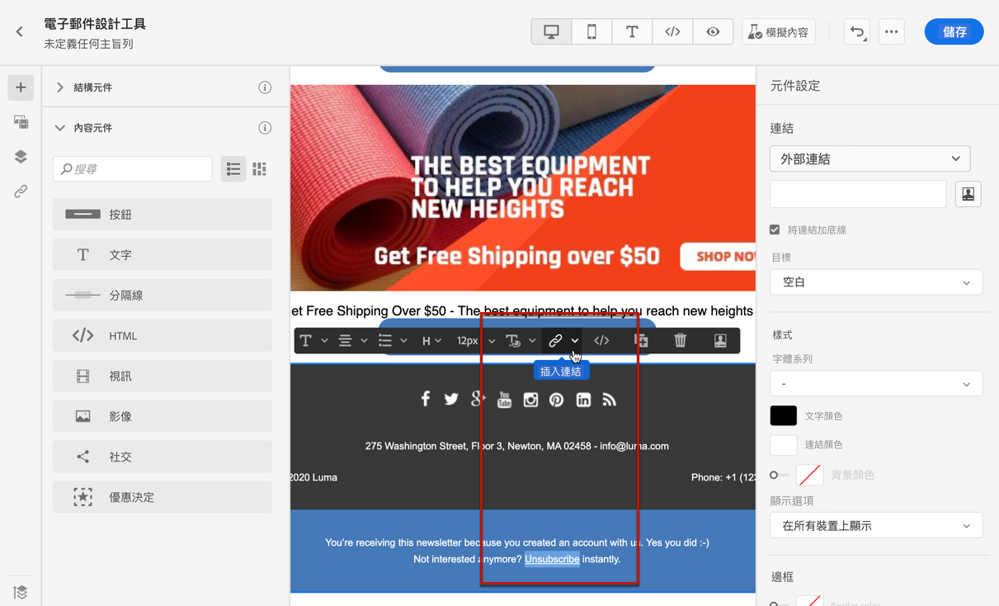
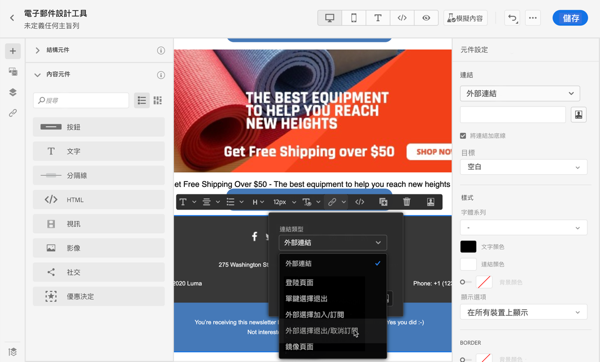
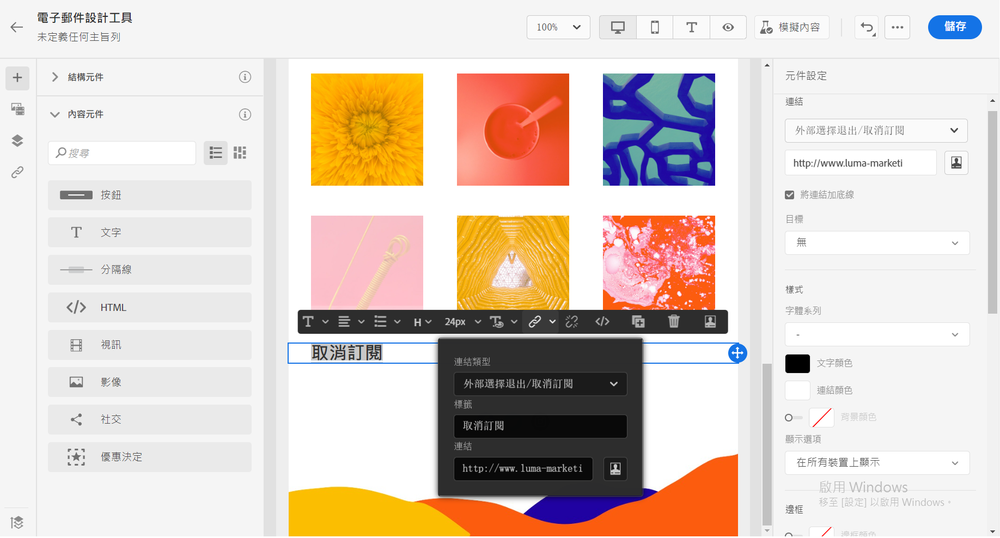
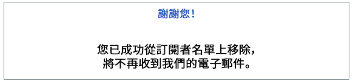
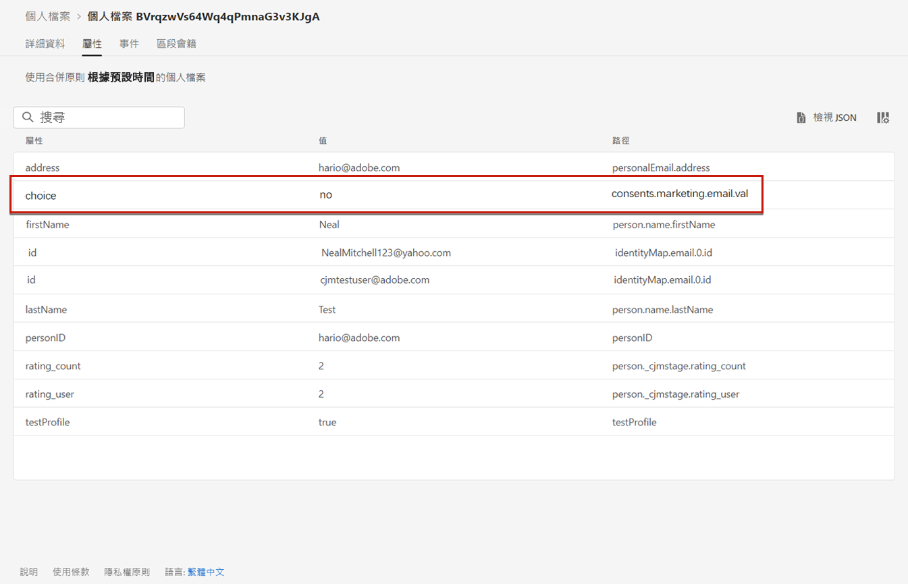

# 管理選擇退出 {#consent}

使用 [!DNL Journey Optimizer] 追蹤收件者的通訊同意，並透過管理其偏好和訂閱來瞭解他們想要如何與您的品牌互動。

GDPR 等法規規定，您必須符合特定要求，才能使用資料主體的資訊。 此外，資料主體應能隨時修改其同意書。

**為什麼這很重要？**

* 若未遵守這些法規，您的品牌將面臨法律風險。
* 它可協助您避免傳送未經請求的通訊給您的收件者，這可能會使他們將您的訊息標示為垃圾訊息，並損害您的聲譽。

在 [Experience Platform 文件](https://experienceleague.adobe.com/docs/experience-platform/privacy/home.html?lang=zh-Hant){target=&quot;_blank&quot;} 中進一步瞭解隱私權管理和相關法規。

## 選擇退出管理 {#opt-out-management}

法律規定必須讓收件者提供能夠取消訂閱來自品牌的通訊。 進一步了解 [Experience Platform 文件](https://experienceleague.adobe.com/docs/experience-platform/privacy/regulations/overview.html?lang=zh-Hant){target=&quot;_blank&quot;} 中的適用法規。

因此，您必須在每封寄送給收件者的電子郵件中一律包含&#x200B;**取消訂閱連結**：

* 按一下此連結後，收件者會被導向至包含確認選擇退出按鈕的登陸頁面。
* 按一下選擇退出按鈕後，將會發出 Adobe I/O 呼叫，以使用此資訊更新設定檔資料。 [進一步瞭解此功能](#consent-service-api)。

### 新增取消訂閱連結 {#add-unsubscribe-link}

若要新增取消訂閱連結，請遵循下列步驟：

1. 建立您的取消訂閱登陸頁面。

1. 在選擇的協力廠商系統進行託管。

1. 於[!DNL Journey Optimizer][建立訊息](create-message.md)。

1. 選擇內容中的文字，並使用內容相關工具列插入連結。

   

1. 從&#x200B;**[!UICONTROL Link type]**&#x200B;下拉式清單中選取 **[!UICONTROL Unsubscription link]**。

   

1. 在&#x200B;**[!UICONTROL Link]**&#x200B;欄位貼上登陸頁面的連結。

   

1. 按一下「**[!UICONTROL Save]**」。

1. 儲存您的內容並[發佈您的訊息](publish-manage-message.md)。

   >[!NOTE]
   >
   >您的協力廠商登陸頁面 URL 將包含三個參數，這些參數將用來透過 Adobe I/O 呼叫更新設定檔的偏好設定。 [在本節中瞭解更多](#consent-service-api)。

1. 透過[歷程](../building-journeys/journey.md)傳送含有登陸頁面連結的訊息。

1. 收到訊息後，如果收件者按一下取消訂閱連結，就會顯示您的登陸頁面。

   

1. 如果收件者按一下登陸頁面中的選擇退出按鈕 (這裡是&#x200B;**取消訂閱**&#x200B;按鈕)，則透過 [Adobe I/O 呼叫](#opt-out-api)更新設定檔資料。

   然後，選擇退出的收件者會被重新導向至確認訊息畫面，表示成功選擇退出。

   

   因此，除非再次訂閱，否則此使用者將不會收到您品牌的通訊。

若要檢查對應的設定檔選擇是否已更新，請前往 Experience Platform，並透過選取識別名稱空間和對應的識別值來存取設定檔。 在 [Experience Platform 文件](https://experienceleague.adobe.com/docs/experience-platform/profile/ui/user-guide.html?lang=zh-Hant){target=&quot;_blank&quot;}中進一步瞭解。



在 **[!UICONTROL Attributes]** 標籤中，您可以看到 **[!UICONTROL choice]** 的值已變更為 **[!UICONTROL no]**。

### 選擇退出 API 呼叫 {#opt-out-api}

當收件者按一下取消訂閱連結選擇退出後，就會呼叫 Adobe I/OAPI 以更新對應的設定檔偏好設定。

此 Adobe I/OPOST 呼叫如下：

端點：platform.adobe.io/journey/imp/consent/preferences

查詢參數：

* **params**：包含加密的裝載
* **sig**：簽名
* **pid**：加密的設定檔 ID

這些參數可從傳送給收件者的取消訂閱連結取得，亦即將為指定收件者開啟您第三方登陸頁面的 URL：


頁首需求：

* x-api-key
* x-gw-ims-org-id
* x-sandbox-name
* 授權 (來自您技術帳戶的使用者權杖)

請求內文：

```
{
   "marketing": [
       {
            "type": "email",           
            "choice": "no",          
            "scope": "channel"       
        }
    ],
 
}
```

[!DNL Journey Optimizer] 將使用這些參數更新相應配置檔案的選擇。

## 一鍵選擇退出 {#one-click-opt-out}

由於許多客戶都在尋找更輕鬆的取消訂閱流程，您也可以在電子郵件內容中加入一鍵選擇退出的連結。 此連結可讓您的收件者快速取消訂閱您的通訊內容，無需重新導向至需要確認選擇退出的登陸頁面。

在 [本節](message-tracking.md#one-click-opt-out-link)瞭解如何在您的訊息內容加入選擇退出的連結。

一旦經由[歷程](../building-journeys/journey.md)傳送您的訊息後，如果收件者按一下選擇退出的連結，則會立即選擇退出其設定檔。

## 標題中的取消訂閱連結 {#unsubscribe-email}

如果收件者的電子郵件用戶端支援在電子郵件標題中顯示取消訂閱連結，則隨 [!DNL Journey Optimizer] 傳送的電子郵件會自動包含此連結。

例如，取消訂閱連結在 Gmail 中顯示如下：


根據電子郵件用戶端，從標題按一下取消訂閱連結將產生下列其中一項影響：

* 對應的設定檔會立即退出，而此選項會在 Experience Platform 中更新。 在 [Experience Platform 文件](https://experienceleague.adobe.com/docs/experience-platform/profile/ui/user-guide.html#getting-started){target=&quot;_blank&quot;}中進一步瞭解 。

* 其效果與從電子郵件內容按一下取消訂閱連結相同：收件者會重新導向至包含按鈕的登陸頁面，以確認選擇退出。 進一步瞭解[本章節](#opt-out-management)中的選擇退出管理。

## 推播選擇退出管理 {#push-opt-out-management}

推播收件者可以透過裝置本身取消訂閱。

例如，在下載或使用您的應用程式時，他們可以選擇停止通知。 同樣地，他們也可以透過行動裝置作業系統變更通知設定。
