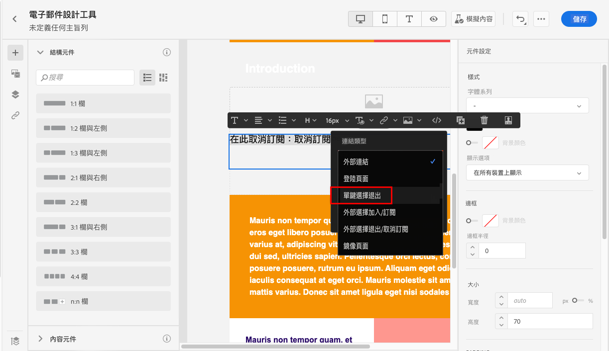
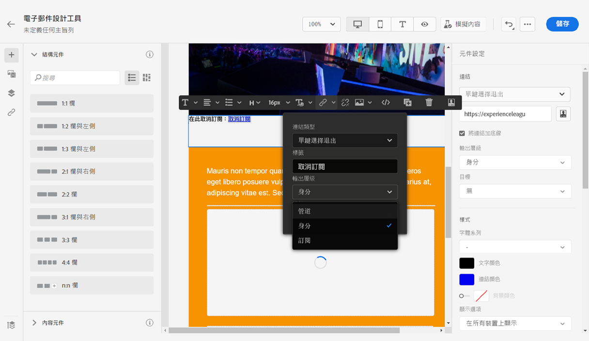
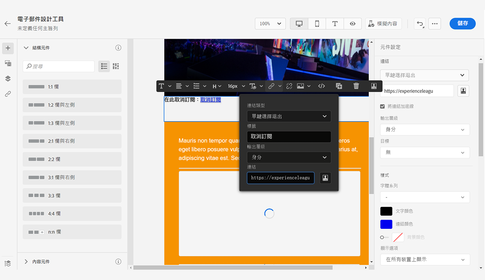

# 管理同意 {#consent}

使用 [!DNL Journey Optimizer] 追蹤收件者的通訊同意，並透過管理其偏好和訂閱來瞭解他們想要如何與您的品牌互動。

GDPR 等法規規定，您必須符合特定要求，才能使用資料主體的資訊。 此外，資料主體應能隨時修改其同意書。

**為什麼這很重要？**

* 若未遵守這些法規，您的品牌將面臨法律風險。
* 它可協助您避免傳送未經請求的通訊給您的收件者，這可能會使他們將您的訊息標示為垃圾訊息，並損害您的聲譽。

在 [Experience Platform 文件](https://experienceleague.adobe.com/docs/experience-platform/privacy/home.html?lang=zh-Hant){target=&quot;_blank&quot;} 中進一步瞭解隱私權管理和相關法規。

>[!NOTE]
>
>在 [!DNL Journey Optimizer]，同意由 Experience Platform [同意綱要](https://experienceleague.adobe.com/docs/experience-platform/xdm/field-groups/profile/consents.html?lang=zh-Hant)處理 {target=&quot;_blank&quot;}。 在預設情況下，「同意」欄位值為空，視為同意接受通訊。 您可以在上線時修改此預設值，成為[此處](https://experienceleague.adobe.com/docs/experience-platform/xdm/data-types/consents.html?lang=zh-Hant#choice-values) {target=&quot;_blank&quot;} 可能列出的一個值。

## 電子郵件選擇退出管理 {#opt-out-management}

法律規定必須讓收件者提供能夠取消訂閱來自品牌的通訊。 進一步了解 [Experience Platform 文件](https://experienceleague.adobe.com/docs/experience-platform/privacy/regulations/overview.html?lang=zh-Hant){target=&quot;_blank&quot;} 中的適用法規。

因此，您必須在每封傳送給收件者的電子郵件中一律包含&#x200B;**取消訂閱連結**：

* 按一下此連結後，收件者會被導向登陸頁面，其中包含確認選擇退出按鈕。
* 在確認其選擇後，將利用此資訊更新設定檔的資料。

### 外部選擇退出 {#opt-out-external-lp}

為此，您可將指向外部登陸頁面的連結插入電子郵件，以便使用者能夠取消訂閱從品牌接收的通訊。

#### 新增取消訂閱連結 {#add-unsubscribe-link}

您首先需要在訊息中加入取消訂閱連結。 請依照下列步驟執行此操作：

1. 建立您的取消訂閱登陸頁面。

1. 在選擇的協力廠商系統進行託管。

1. 在 [!DNL Journey Optimizer] [建立訊息](create-message.md)。

1. 選擇內容中的文字，並使用內容相關工具列[插入連結](message-tracking.md#insert-links)。

   

1. 從 **[!UICONTROL Link type]** 下拉式清單中選取 **[!UICONTROL External Opt-out/Unsubscription]**。

   

1. 在 **[!UICONTROL Link]** 欄位貼上第三方登陸頁面的連結。

   

1. 按一下「**[!UICONTROL Save]**」。

1. 儲存您的內容並[發佈您的訊息](publish-manage-message.md)。

#### 實施選擇退出的 API 呼叫 {#opt-out-api}

要在收件者從登陸頁面提交選擇時選擇退出，您必須實施 **Subscription API 呼叫**，透過 Adobe I/O 更新對應設定檔的偏好設定。

此 Adobe I/O POST 呼叫如下：

端點：platform.adobe.io/journey/imp/consent/preferences

查詢參數：

* **params**：包含加密的裝載
* **sig**：簽名
* **pid**：加密的設定檔 ID

這三個參數將包括在傳送給收件者的第三方登陸頁面 URL 中：


頁首需求：

* x-api-key
* x-gw-ims-org-id
* x-sandbox-name
* 授權 (來自您技術帳戶的使用者權杖)

請求內文：

```
{
   "marketing": [
       {
            "type": "email",           
            "choice": "no",          
            "scope": "channel"       
        }
    ],
 
}
```

[!DNL Journey Optimizer] 將透過 Adobe I/O 呼叫利用這些參數更新對應設定檔的選擇。

#### 傳送包含取消訂閱連結的訊息 {#send-message-unsubscribe-link}

設定好取消訂閱的登陸頁面連結並實施 API 呼叫後，您便可傳送訊息。

1. 透過[歷程](../building-journeys/journey.md)傳送包含連結的訊息。

1. 收到訊息後，如果收件者按一下取消訂閱連結，就會顯示您的登陸頁面。

   

1. 如果收件者提交表單 (在此為按一下登陸頁面中的&#x200B;**取消訂閱**&#x200B;按鈕)，會透過 [Adobe I/O 呼叫](#opt-out-api)更新設定檔資料。

1. 然後，選擇退出的收件者會被重新導向至確認訊息畫面，表示成功選擇退出。

   

   因此，除非再次訂閱，否則此使用者將不會收到您品牌的通訊。

1. 若要檢查對應的設定檔選擇是否已更新，請前往 Experience Platform，並透過選取識別名稱空間和對應的識別值來存取設定檔。 在 [Experience Platform 文件](https://experienceleague.adobe.com/docs/experience-platform/profile/ui/user-guide.html?lang=zh-Hant){target=&quot;_blank&quot;}中進一步瞭解。

   

   在 **[!UICONTROL Attributes]** 標籤中，您可以看到 **[!UICONTROL choice]** 的值已變更為 **[!UICONTROL no]**。

### 一鍵選擇退出 {#one-click-opt-out}

由於許多客戶都在尋找更輕鬆的取消訂閱流程，您也可以在電子郵件內容中加入一鍵選擇退出的連結。 此連結可讓您的收件者快速取消訂閱您的通訊內容，無需重新導向至需要確認選擇退出的登陸頁面，加速取消訂閱的流程。

要在電子郵件加入選擇退出連結，請遵照以下步驟。

1. [插入連結](message-tracking.md#insert-links)並選擇 **[!UICONTROL One click Opt-out]** 作為連結類型。

   

1. 選擇要如何套用選擇退出：在頻道、身分或訂閱項目層級。

   

   * **[!UICONTROL Channel]**：選擇退出適用於未來的訊息，傳送到目前頻道的設定檔目標（即電子郵件地址）。 如果設定檔連結數個目標，選擇退出將套用於該頻道設定檔的所有目標 (即電子郵件地址)。
   * **[!UICONTROL Identity]**：選擇退出適用於未來的訊息，傳送給目前郵件使用的特定目標 (即電子郵件地址)。
   * **[!UICONTROL Subscription]**：選擇退出適用於未來的訊息，連結特定訂閱項目清單。 僅當目前的訊息連結訂閱項目清單時，才能選擇此選項。

1. 輸入登陸頁面 URL，一旦取消訂閱，將重新導向使用者。 此頁僅用於確認選擇退出成功。

   

   您可以個人化連結。 進一步瞭解[本章節](../personalization/personalization-syntax.md)的個人化 URL。

1. 儲存您的變更。

經由[歷程](../building-journeys/journey.md)傳送您的訊息後，如果收件者按一下選擇退出的連結，則會立即選擇退出其設定檔。

### 訊息標題中的取消訂閱連結 {#unsubscribe-email}

如果收件者的電子郵件用戶端支援在電子郵件標題中顯示取消訂閱連結，則隨 [!DNL Journey Optimizer] 傳送的電子郵件會自動包含此連結。

例如，取消訂閱連結在 Gmail 中顯示如下：


根據電子郵件用戶端，從標題按一下取消訂閱連結將產生下列其中一項影響：

* 對應的設定檔會立即退出，而此選項會在 Experience Platform 中更新。 在 [Experience Platform 文件](https://experienceleague.adobe.com/docs/experience-platform/profile/ui/user-guide.html#getting-started){target=&quot;_blank&quot;}中進一步瞭解 。

* 其效果與從電子郵件內容按一下取消訂閱連結相同：收件者會重新導向至包含按鈕的登陸頁面，以確認選擇退出。 進一步瞭解[本章節](#opt-out-management)中的選擇退出管理。

## 推播選擇退出管理 {#push-opt-out-management}

推播收件者可以透過裝置本身取消訂閱。

例如，在下載或使用您的應用程式時，他們可以選擇停止通知。 同樣地，他們也可以透過行動裝置作業系統變更通知設定。
