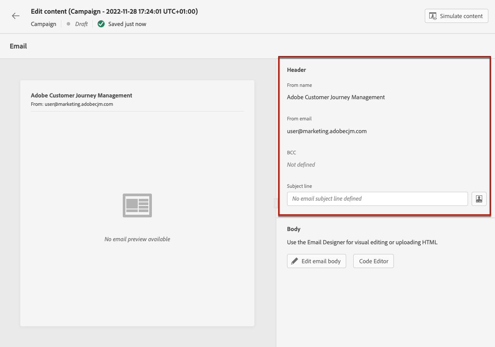

# 建立電子郵件 {#create-email-bis}

若要建立電子郵件，請遵循下列步驟。

## 1.在歷程或行銷活動中建立電子郵件

新增 **[!UICONTROL 電子郵件]** 動作至歷程或行銷活動，並根據您的案例遵循下列步驟。

>[!BEGINTABS]

>[!TAB 新增電子郵件至歷程]

1. 開啟您的歷程，然後拖放 **[!UICONTROL 電子郵件]** 活動 **[!UICONTROL 動作]** 區段。

1. 提供訊息的基本資訊（標籤、說明、類別）。

1. 選擇 [電子郵件表面] 來使用。

   

如需如何設定歷程的詳細資訊，請參閱 [本頁](../building-journeys/journey-gs.md).

>[!TAB 新增電子郵件至行銷活動]

1. 建立新的排程或API觸發促銷活動，然後選取 **[!UICONTROL 電子郵件]** 作為您的動作。

1. 選擇 [電子郵件表面] 來使用。

   

1. 按一下&#x200B;**[!UICONTROL 建立]**。

1. 完成建立電子郵件促銷活動的步驟。

   

<!--
From the **[!UICONTROL Action]** section, specify if you want to track how your recipients react to your delivery: you can track email opens, and/or clicks on links and buttons in your email.

-->

如需如何設定促銷活動的詳細資訊，請參閱 [本頁](../campaigns/get-started-with-campaigns.md).

>[!ENDTABS]

## 定義您的電子郵件內容

1. 在歷程或行銷活動設定畫面中，按一下 **[!UICONTROL 編輯內容]** 按鈕來設定電子郵件內容。 [了解更多]

   

1. 在 **[!UICONTROL 標題]** 區段 **[!UICONTROL 編輯內容]** 螢幕， **[!UICONTROL 從名稱]**, **[!UICONTROL 從電子郵件]** 和 **[!UICONTROL 密件副本]** 欄位來自您選取的電子郵件表面。 [了解更多] <!--check if same for journey-->

   

1. 您可以新增主旨行。 直接在對應欄位中輸入純文字，或使用 [運算式編輯器](../personalization/personalization-build-expressions.md) 個人化您的主旨行。

1. 按一下 **[!UICONTROL 編輯電子郵件內文]** 按鈕，開始使用 [!DNL Journey Optimizer] 電子郵件設計工具。 [了解更多]

   

   您也可以按一下 **[!UICONTROL 代碼編輯器]** 按鈕，使用顯示的彈出窗口以純HTML編寫您自己的內容。

   

   >[!NOTE]
   >
   >如果您已透過電子郵件設計工具建立或匯入內容，此內容將以HTML顯示。

## 預覽您的電子郵件

定義訊息內容後，您可以預覽訊息內容以控制電子郵件的呈現，並使用測試設定檔檢查個人化設定。 [了解更多]

您也必須檢查編輯器上方區段的警報。  其中有些是簡單警告，但有些警告可能會阻止您使用訊息。 [了解更多](alerts.md)。

## 驗證您的電子郵件內容

當您的電子郵件準備就緒時，請完成 [歷程](../building-journeys/journey-gs.md) 或 [行銷活動](../campaigns/create-campaign.md) 和啟動以傳送訊息。

>[!NOTE]
>
>若要透過電子郵件開啟和/或互動來追蹤收件者的行為，請確定 **[!UICONTROL 追蹤]** 區段會在歷程的 [電子郵件活動](../building-journeys/journeys-message.md) 或在電子郵件中 [行銷活動](../campaigns/create-campaign.md).

您也必須檢查編輯器上方區段的警報。  其中有些是簡單警告，但有些警告可能會阻止您使用訊息。 [了解更多](alerts.md)

