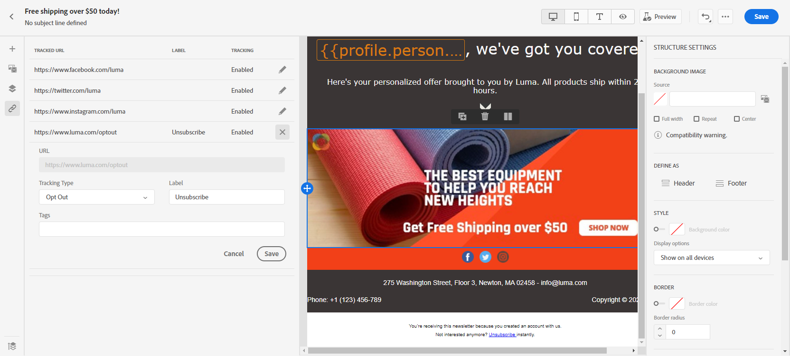

# 在用戶介面中設計您的電子郵件內容 {#create-email-content}

一旦你 [已建立郵件](create-message.md)，您可以開始建立電子郵件內容。

➡️ [在影片中探索此功能](#video)

1. 從新建立的郵件中，選擇 **[!UICONTROL Email designer]** 的 **[!UICONTROL Body]** 的子菜單。

   

1. 在「電子郵件設計器」首頁中，從以下選項中選擇設計電子郵件的方式：

   * 選擇 **[!UICONTROL Design from scratch]** 使用電子郵件設計器功能建立電子郵件內容。 [了解更多](#design-scratch)

   * 選擇 **[!UICONTROL Start from template]** 從內置模板清單建立電子郵件。 請注意，不能建立其他模板。

   * 選擇 **[!UICONTROL Code your own]** 輸入或貼上HTML原始代碼。 [了解更多](existing-content.md#import-raw-html-code)。

   * 選擇 **[!UICONTROL Import HTML]** 導入HTML檔案或.zip資料夾。 [了解更多](existing-content.md#import-html-content-from-file)。

   

## 從頭開始設計 {#design-scratch}

>[!CONTEXTUALHELP]
>id="ac_structure_components"
>title="關於結構元件"
>abstract="結構元件定義電子郵件的佈局。"

>[!CONTEXTUALHELP]
>id="ac_edition_columns"
>title="定義電子郵件列"
>abstract="電子郵件設計器允許您通過定義列結構輕鬆定義電子郵件的佈局。"

電子郵件設計器允許您輕鬆定義電子郵件的結構。 通過使用簡單的拖放操作添加和移動結構元素，您可以在幾秒鐘內設計電子郵件的形狀。

要開始使用電子郵件設計器構建電子郵件內容，請執行以下步驟：

1. 選擇 **[!UICONTROL Design from scratch]** 選項，通過拖放開始設計電子郵件內容 **[!UICONTROL Structure components]** 定義電子郵件的佈局。

   >[!NOTE]
   >
   >請注意，列堆棧與所有電子郵件程式不相容。 不支援時，將不堆疊列。
   >
   >一旦放入電子郵件中，您就不能移動或刪除元件，除非其中已經放有內容元件或片段。

   

1. 添加多個 **[!UICONTROL Structure components]** 按需要。

   選擇 **[!UICONTROL n:n column]** 定義所選列數（介於3和10之間）的元件。 也可以通過移動每列底部的箭頭來定義每列的寬度。

   >[!NOTE]
   >
   >每個列大小不能低於結構元件總寬度的10%。 無法刪除非空的列。

1. 從 **[!UICONTROL Content components]** 下拉框，可以添加 **[!UICONTROL Content components]** 在結構元件中。 [瞭解有關內容元件的詳細資訊](content-components.md)。

   

1. 每個元件可進一步用 **[!UICONTROL Component settings]** 的子菜單。 例如，可以更改元件的文本樣式、填充或邊距。 [瞭解有關對齊和填充的詳細資訊](#adjusting-vertical-alignment-and-padding)。

   

1. 從 **[!UICONTROL Assets picker]**，您可以直接添加儲存在 **[!UICONTROL Assets library]** 郵件。 [瞭解有關資產管理的更多資訊](assets-essentials.md)。

   按兩下包含您的資產的資料夾，然後拖放要添加到電子郵件中的資產。

   

1. 添加個性化欄位以自定義配置檔案資料中的內容。 [瞭解有關內容個性化的更多資訊](../personalization/personalize.md)。

   

1. 在 **[!UICONTROL Links]** 頁籤，檢查要跟蹤的所有內容URL的清單。 您可以修改 **[!UICONTROL Tracking Type]**。 **[!UICONTROL Label]** 和 **[!UICONTROL Tags]** 如果需要。

   

   >[!NOTE]
   >
   >瞭解有關連結和郵件跟蹤的詳細資訊 [此頁](message-tracking.md)。

1. 如果需要，您可以切換到代碼編輯器，通過按一下 **[!UICONTROL Switch to code editor]** 的子菜單。 有關代碼編輯器的詳細資訊，請參閱 [此頁](existing-content.md#import-raw-html-code)。

   >[!NOTE]
   >
   >切換到代碼編輯器後，您將無法使用此電子郵件的可視設計器。

   

1. 按一下 **[!UICONTROL Show preview]** 檢查您的電子郵件呈現。 您可以選擇案頭或移動視圖。

   有關如何預覽電子郵件的詳細資訊，請參閱 [此頁](preview.md)。

   

1. 當您的電子郵件準備好後，按一下 **[!UICONTROL Save & Close]**。

您的電子郵件內容現在可以用在郵件中。 [瞭解如何發送消息](publish-manage-message.md)。

## 建立電子郵件的文本版本 {#generate-text-version}

建議建立電子郵件正文的文本版本，該版本在無法顯示HTML內容時使用。

預設情況下，電子郵件設計器將建立 **[!UICONTROL Plain text]** 電子郵件的版本，包括個性化欄位。 此版本將自動生成並與內容的HTML版本同步。

如果您希望為純文字檔案版本使用其他內容，請執行以下步驟：

1. 從您的電子郵件中，選擇 **[!UICONTROL Plain text]** 頁籤。

   

1. 使用 **[!UICONTROL Sync with HTML]** 切換以禁用同步。

   

1. 按一下複選標籤以確認您的選擇。

   

1. 然後，可根據需要編輯純文字檔案版本。

>[!CAUTION]
>
>* 在 **[!UICONTROL Plain text]** 視圖不會反映在HTML視圖中。
>
>* 如果重新啟用 **[!UICONTROL Sync with HTML]** 選項更新純文字檔案內容後，您所做的更改將丟失，並替換為從HTML版本生成的文本內容。

## 添加前標 {#preheader}

>[!CONTEXTUALHELP]
>id="ac_edition_preheader"
>title="添加前標"
>abstract="前標是一個簡短的摘要文本，在查看來自電子郵件客戶端的電子郵件時，它跟在主題行後。 在許多情況下，它提供了電子郵件的簡短摘要，並且通常是一句長。"

前標是一個簡短的摘要文本，在查看來自電子郵件客戶端的電子郵件時，它跟在主題行後。 在許多情況下，它提供了電子郵件的簡短摘要，並且通常是一句長。

>[!NOTE]
>
>並非所有電子郵件客戶端都支援預標頭。 不支援時，不顯示前標。

要定義電子郵件前標，請執行以下步驟：

1. 在電子郵件設計器中添加 **[!UICONTROL Structure components]** 開始設計電子郵件。

   

1. 從 **[!UICONTROL Body settings]** 右窗格，按一下 **編輯** 的 **[!UICONTROL Preheader]** 的子菜單。

   

1. 添加前標。 您可以通過按一下 **[!UICONTROL Add personalization]** 表徵圖

   

1. 從 **[!UICONTROL Edit Personalization]** 窗口 **[!UICONTROL Content block]**。 **[!UICONTROL Dynamic content]** 或 **[!UICONTROL Personalization fields]**。

1. 按一下 **[!UICONTROL Validate]** 來檢查個性化語法。

   

1. 按一下「**[!UICONTROL Save]**」。

您的前標現在已配置為您的電子郵件。

## 背景設定 {#about-backgrounds}

>[!CONTEXTUALHELP]
>id="ac_edition_backgroundimage"
>title="背景設定"
>abstract="您可以個性化內容的背景顏色或背景影像。 請注意，並非所有電子郵件客戶端都支援背景影像。"

在使用電子郵件設計器設定背景時，Adobe建議使用以下內容：

1. 如果設計需要，請將背景色應用於電子郵件正文。
1. 在大多數情況下，在列級別設定背景顏色。
1. 由於影像或文本元件難以管理，請盡量不要使用背景顏色。

下面是您可以使用的可用背景設定。

* 設定 **[!UICONTROL Background color]** 整封郵件。 確保在可從左側元件面板訪問的導航樹中選擇主體設定。

* 通過選擇 **[!UICONTROL Viewport background color]**。 此選項允許您從背景顏色中選擇其他設定。

* 為每個結構元件設定不同的背景顏色。 在導航樹中選擇一個結構，該結構可從左側的調色板訪問，以僅將特定背景顏色應用於該結構。

   請確保未設定視區背景顏色，因為它可能隱藏結構背景顏色。

* 設定 **[!UICONTROL Background image]** 的子菜單。

   >[!NOTE]
   >
   >某些電子郵件程式不支援背景影像。 不支援時，將改用行背景顏色。 確保在無法顯示影像時選擇適當的後退背景顏色。

* 在列級別設定背景顏色。

   >[!NOTE]
   >
   >這是最常見的使用案例。 Adobe建議在列級別設定背景顏色，因為這樣在編輯整個電子郵件內容時就更加靈活。

   也可以在列級別設定背景影像，但很少使用。

## 調整垂直對齊和填充 {#adjusting-vertical-alignment-and-padding}

在本示例中，我們將調整由三列組成的結構元件內的填充和垂直對齊。

1. 直接在電子郵件中選擇結構元件，或使用 **[!UICONTROL Navigation tree]** 的下界。

   

1. 在工具欄中，按一下 **[!UICONTROL Select a column]** 選擇要編輯的。 也可以從結構樹中選取它。

   該列的可編輯參數顯示在 **[!UICONTROL Column settings]** 的子菜單。

   

1. 下 **[!UICONTROL Vertical alignment]**&#x200B;選中 **[!UICONTROL Bottom]**。

   內容元件將移到列的底部。

   

1. 下 **[!UICONTROL Padding]**，定義列內的頂部填充。 按一下鎖定表徵圖以用底部填充中斷同步。

   定義該列的左邊距和右邊距。

   

1. 同樣，繼續調整其他列的對齊和填充。

1. 儲存您的變更。

## 定義連結的樣式 {#about-styling-links}

您可以在電子郵件設計器中為連結加下划線並選擇其顏色和目標。

1. 文本中 **[!UICONTROL Content component]** 在插入連結的位置，選擇連結。

1. 在 **[!UICONTROL Component settings]** 菜單，選中 **[!UICONTROL Underline link]** 為連結的標籤文本加下划線。

   

1. 選擇您的受眾將如何與 **[!UICONTROL Target]** 下拉：

   * **[!UICONTROL None]**:在按一下連結的同一幀中開啟該連結（預設）。
   * **[!UICONTROL Blank]**:在新窗口或頁籤中開啟連結。
   * **[!UICONTROL Self]**:在按一下連結的同一幀中開啟該連結。
   * **[!UICONTROL Parent]**:開啟父框架中的連結。
   * **[!UICONTROL Top]**:在窗口的整個正文中開啟連結。

   

1. 要更改連結的顏色，請按一下 **[!UICONTROL Link color]**。

   

1. 選擇所需的顏色。

1. 儲存您的變更。

## 添加內聯樣式屬性 {#adding-inline-styling-attributes}

在「電子郵件設計器」介面中，選擇某個元素並在側面板上顯示其設定時，可以自定義該特定元素的內嵌屬性及其值。

1. 在內容中選擇元素。
1. 在側面板上，查找 **[!UICONTROL Styles Inline]** 的子菜單。

1. 修改現有屬性的值，或使用 **+** 按鈕 您可以添加符合CSS的任何屬性和值。

樣式隨後應用於所選元素。 如果子元素沒有定義特定的樣式屬性，則父元素的樣式將繼承。

## How-to視頻 {#video}

瞭解如何使用消息編輯器建立電子郵件內容。

>[!VIDEO](https://video.tv.adobe.com/v/334150?quality=12)
