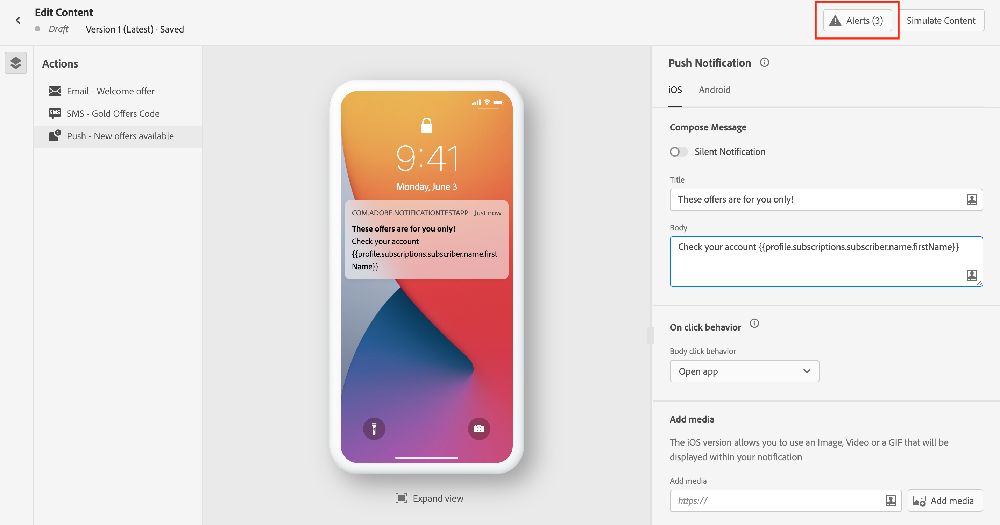

# 建立推播通知 {#create-push-notification}

>[!CONTEXTUALHELP]
>id="ajo_message_push"
>title="推送訊息建立"
>abstract="新增您的推送訊息，並開始使用運算式編輯器進行個人化。"

推播通知可協助您隨時與您的行動應用程式使用者聯絡，尤其是當使用者目前未使用您的應用程式時。 推播通知可協助您達成各種使用案例，例如提供服務的更新、要求使用者採取動作、提醒使用者留意新交易等。 裝置平台需要選擇加入，才能讓使用者收到或檢視您的通知。 使用者選擇加入的時間，最早可在應用程式於安裝後首次啟動後收到，或在後續的工作階段或工作流程中收到（如適用）。

[!DNL Journey Optimizer] 支援推播通知，並協助您以領先業界的吞吐率傳送高度相關的通知。 推播通知可能包括個人化和歷程型內容，以運用您的品牌對Adobe Experience Cloud的資料深入分析。

可建立推播通知：

* 在 **歷程**:在歷程中新增推送活動並定義基本設定後，請使用 **[!UICONTROL 動作：推播]** 右窗格，以建立推播通知的內容。

   如需如何設定歷程的詳細資訊，請參閱 [頁面](../building-journeys/journey-gs.md).

* 在 **行銷活動**:建立促銷活動後，請選取「推播通知」作為您的動作並定義基本設定。

   如需如何設定促銷活動的詳細資訊，請參閱 [頁面](../campaigns/create-campaign.md#configure).

使用專用標籤來定義的推播通知設定 **iOS** 和 **Android** 作業系統。

如果這是您第一次建立推播通知，請確定已設定推播通道。 [了解更多](../configuration/push-gs.md)。

>[!NOTE]
>
>此 **[!UICONTROL 撰寫訊息]** 區段對兩者都很常見 **[!UICONTROL iOS]** 和 **[!UICONTROL Android]** 標籤。 本節中的任何變更都會套用至這兩項設定。

## 標題與內文 {#push-title-body}

若要撰寫訊息，請按一下 **[!UICONTROL 標題]** 和 **[!UICONTROL 主體]** 欄位。 使用運算式編輯器來定義內容、個人化資料和新增動態內容。 深入了解 [個人化](../personalization/personalize.md) 和 [動態內容](../personalization/get-started-dynamic-content.md) 在運算式編輯器中。

使用裝置預覽區段來視覺化推播通知在iOS和Android裝置上的顯示方式。

## 點按行為 {#on-click-behavior}

>[!CONTEXTUALHELP]
>id="ajo-message-push-onclick"
>title="關於點按行為"
>abstract="選取收件者點按推播通知內文時的行為。"

您可以選取使用者點按推播通知內文時的行為。

* 若要開啟應用程式，請選取 **[!UICONTROL 開啟應用程式]** 選項。 與通知相關聯的應用程式會在 [通道表面](../configuration/channel-surfaces.md) （即訊息預設集）。
* 若要將使用者重新導向至應用程式內的特定內容片段，請選取 **[!UICONTROL Deeplink]** 選項。  特定內容可以是特定檢視、頁面的特定區段或特定索引標籤。 選取選項後，在相關聯欄位中輸入深層連結。
* 若要將使用者重新導向至外部URL，請使用 **[!UICONTROL 網頁URL]** 選項。 選取選項後，在相關聯欄位中輸入URL。

## 新增媒體 {#add-media-push}

在iOS版的推播通知中，您可以新增將顯示在通知中的影像、影片或GIF。

在Android版本中，您只能新增影像圖示和影像以用於展開通知。

有兩個選項可供使用。 您可以：

* 使用 **[!UICONTROL 新增媒體]** 按鈕，以在中選取資產 **[!DNL Adobe Experience Manager Assets Essentials]**.

   了解如何使用 **[!DNL Adobe Experience Manager Assets Essentials]** in [本頁](../design/assets-essentials.md).

* 或在 **[!UICONTROL 新增媒體]** 欄位。 在此情況下，您可以將個人化新增至URL。

新增後，媒體會顯示在通知內文的右側。

## 添加按鈕 {#add-buttons-push}

新增按鈕至推播內容以建立可操作的通知。

如果設備螢幕已鎖定，則不顯示以下按鈕：只有 **標題** 和 **訊息** 中顯示。 如果其設備已解鎖，則收件者將看到按鈕。

在iOS版本中，最多可新增四個按鈕。 在Android版本中，最多可以新增三個按鈕。

>[!NOTE]
>
>若為iOS，請使用 **[!UICONTROL iOS類別]** 欄位，將動作與通知類別關聯。

1. 使用 **[!UICONTROL 添加按鈕]** 若要定義設定：標籤和關聯動作。 可能的動作與 [點按行為](#on-click-behavior).

1. 使用 **[!UICONTROL 展開檢視]** 圖示來預覽您個人化的按鈕。

## 傳送靜默通知 {#silent-notification}

>[!CONTEXTUALHELP]
>id="ajo_message_push_silent_notification"
>title="關於靜默通知"
>abstract="在不干擾使用者的情況下傳送通知，通知不會顯示在通知中心或通知列中。"

靜默推播通知（或背景通知）是傳遞至應用程式的隱藏指示。 例如，它用於通知您的應用程式新內容的可用性或在後台啟動下載。

選取 **[!UICONTROL 靜默通知]** 選項以無訊息地通知應用程式：在這種情況下，通知會直接轉送到應用程式。 設備螢幕上不顯示警報。

使用 **[!UICONTROL 自訂資料]** 區段來新增索引鍵值配對。

## 自訂資料

在 **[!UICONTROL 自訂資料]** 區段中，您可以根據行動應用程式設定，將自訂變數新增至裝載。 如需如何在Adobe Experience Platform和AdobeLaunch中設定推播通知的詳細資訊，請參閱 [本節](../configuration/push-gs.md)

## 進階選項 {#advanced-options-push}

您可以設定 **[!UICONTROL 進階選項]** 的URL。 可用參數列於下列：

| 參數 | 說明 |
|---------|---------|
| **[!UICONTROL 可折疊]** (iOS / Android) | 可折疊的訊息是一種訊息，如果已過時，可以用新訊息取代。 可折疊訊息的常見使用案例是指示行動應用程式從伺服器同步資料的訊息。 例如，運動應用程式會以最新分數更新使用者。 只有最新的訊息才相關。 另一方面，使用不可折疊的訊息，非常重要的訊息對用戶端應用程式很重要，需要傳送。 |
| **[!UICONTROL 自訂音效]** (iOS / Android) | 接收通知時由移動終端播放的聲音。 音效必須整合在應用程式中。 |
| **[!UICONTROL 徽章]** (iOS / Android) | 徽章可用來直接在應用程式圖示上顯示新未讀取資訊的數量。 當使用者開啟或從應用程式讀取新內容時，徽章值就會消失。在裝置上收到通知時，它可以重新整理或新增相關應用程式的徽章值。 例如，如果您要儲存客戶的未讀文章數量，您可以運用個人化功能，為每個客戶傳送不重複的未讀文章徽章值。 如需更多個人化資訊，請參閱 [本節](../personalization/personalize.md). |
| **[!UICONTROL 通知群組]**  (僅限iOS) | 將通知群組與推播通知建立關聯。 從iOS 12開始，通知群組可讓您將訊息執行緒和通知主題併入執行緒ID。 例如，品牌可能會在一個群組ID下傳送行銷通知，同時在一或多個不同ID下保留更多操作類型通知。 為了說明這一點，您可以有groupID:123 「查看新的sweaters春季系列」和groupID:456 「您的套件已傳送」通知群組。 在此範例中，所有傳送通知都會整合在群組ID下：456。 |
| **[!UICONTROL 通知通道]** （僅限Android） | 將通知通道與推播通知相關聯。 從Android 8.0（API層級26）開始，必須將所有通知指派給管道才能顯示。 有關詳細資訊，請參閱 [Android開發人員檔案](https://developer.android.com/guide/topics/ui/notifiers/notifications#ManageChannels). |
| **[!UICONTROL 新增內容可用性標幟]** (僅限iOS) | 傳送推播裝載中的可用內容標幟，以確保應用程式在收到推播通知時立即喚醒，這表示應用程式將能夠存取裝載資料。  即使應用程式在背景執行，且不需要任何使用者互動（例如點選推播通知），這仍然有效。 不過，如果應用程式未執行，則不適用。 如需詳細資訊，請參閱 [Apple開發人員檔案](https://developer.apple.com/library/content/documentation/NetworkingInternet/Conceptual/RemoteNotificationsPG/CreatingtheNotificationPayload.html)。 |
| **[!UICONTROL 新增可變內容標幟]** (僅限iOS) | 在推播裝載中傳送可變內容標幟，並允許iOS SDK中提供的通知服務應用程式擴充功能修改推播通知內容。 有關詳細資訊，請參閱 [Apple 開發人員文件](https://developer.apple.com/library/content/documentation/NetworkingInternet/Conceptual/RemoteNotificationsPG/ModifyingNotifications.html)。 接著，您就可以運用行動應用程式擴充功能，進一步修改來自 [!DNL Journey Optimizer]. 例如，用戶可以利用此選項解密資料、更改通知的正文或標題文本、向通知添加線程標識符等。 |
| **[!UICONTROL 通知可見性]** （僅限Android） | 定義推播通知的可見性。  <b>私人</b> 會在所有鎖屏上顯示通知，但在安全的鎖屏上隱藏敏感或隱私資訊。  <b>公開</b> 會在所有鎖屏上全部顯示通知。  <b>機密</b> 不會在安全鎖屏上顯示通知的任何部分。  有關詳細資訊，請參閱 [Android開發人員檔案](https://developer.android.com/reference/android/app/Notification). |
| **[!UICONTROL 通知優先順序]** （僅限Android） | 將推播通知的重要性從「低」定義為「最大」。 這決定了傳送推播通知時「侵入」的程度。 有關詳細資訊，請參閱 [Android開發人員檔案](https://developer.android.com/guide/topics/ui/notifiers/notifications#importance) |
| **[!UICONTROL 傳送優先順序]** （僅限Android） | 設定推播通知的高優先順序或一般優先順序。 如需訊息優先順序的詳細資訊，請參閱 [Google 開發人員檔案](https://firebase.google.com/docs/cloud-messaging/concept-options#setting-the-priority-of-a-message)。 |

## 驗證推播通知{#push-preview}

定義訊息內容後，您就可以使用測試設定檔來預覽和測試。 如果您已插入 [個人化內容](../personalization/personalize.md)，您可以運用測試設定檔資料，檢查訊息中此內容的顯示方式。

若要將推播通知在行動裝置上的顯示方式視覺化，請按一下 **[!UICONTROL 模擬內容]** 標籤。 深入了解內容模擬，位於 [本節](../design/preview.md).

您也必須檢查編輯器上方區段的警報。  其中有些是簡單警告，但有些警告可能會阻止您使用訊息。 請參閱[此章節](alerts.md)深入瞭解。

**相關主題**

<!--
* [Understand push notification flow](push-gs.md)
-->

* [設定推播通道](../configuration/push-gs.md)
* [建立新訊息。](get-started-content.md)
* [在歷程中新增訊息](../building-journeys/journeys-message.md)
