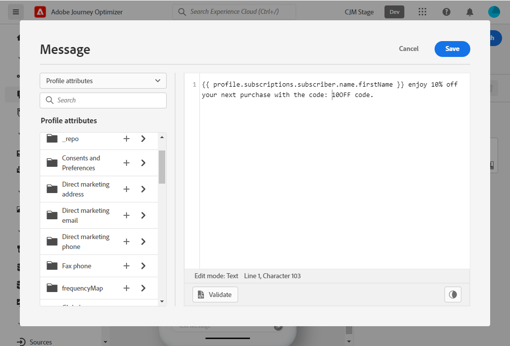

# 建立 SMS 訊息 {#create-sms}

>[!CAUTION]
>
> SMS通道的使用目前僅在提前訪問選定用戶時可用。 如果您想利用此功能，請與Adobe客戶經理聯繫。

一旦 [已建立消息](create-message.md)，使用 **[!UICONTROL SMS]** 的子菜單。

要開始個性化您的SMS消息，請執行以下步驟：

1. 按一下 **[!UICONTROL Add text message]** 欄位以開啟表達式編輯器。

   

1. 使用表達式編輯器定義內容和個性化資料。 在中的表達式編輯器中瞭解有關個性化的詳細資訊 [此部分](../personalization/personalize.md)

   >[!NOTE]
   >
   > SMS消息的長度限制為160個字元。

   

1. 按一下 **[!UICONTROL Save]** 當您的個性化郵件準備就緒時。

1. 按一下 **[!UICONTROL Preview]** 顯示移動設備上的SMS消息顯示方式。 如需詳細資訊，請參閱[本章節](preview.md)。

1. 一旦您的消息準備就緒，您就可以發佈它，使其可以與 **[!UICONTROL Publish]** 按鈕 此操作將發佈消息的新版本，該新版本將用於您的旅途中的下一次執行。

您的SMS消息現在可以在旅途中使用。 [瞭解如何建立旅程](../building-journeys/journey-gs.md)。

**相關主題**

* [設定簡訊頻道](../configuration/sms-configuration.md)
* [建立新郵件](create-message.md)
* [在歷程中新增訊息](../building-journeys/journeys-message.md)
