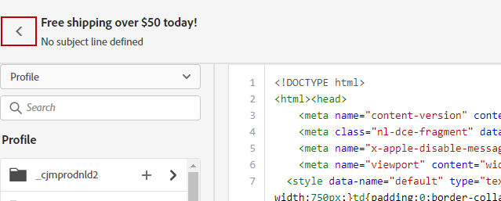

# 匯入或編碼您的電子郵件內容 {#existing-content}

Journey Optimizer允許您導入現有HTML內容以設計電子郵件。 此內容可以是原始HTML代碼或現有HTML檔案或zip資料夾中的內容。

要對HTML內容進行編碼或導入現有內容，請執行以下步驟：

1. [建立訊息](create-message.md)

1. 開啟 **[!UICONTROL Email Designer]** 從 **[!UICONTROL Edit Content]** 的子菜單。

   

1. 選取「**[!UICONTROL Code your own]**」或「**[!UICONTROL Import HTML]**」。有關後續步驟，請參閱以下各節。

## 編碼您自己的 {#import-raw-html-code}

使用 **[!UICONTROL Code your own]** 模式，可導入原始HTML和/或對電子郵件內容進行代碼。 此方法需要HTML技能。

>[!CAUTION]
>
> 來自 [Adobe Experience Manager Assets Essentials](assets-essentials.md) 無法在使用此方法時引用。 HTML代碼中引用的映像必須儲存到公共位置。

1. 在「電子郵件設計器」首頁中，選擇 **[!UICONTROL Code your own]**。

   

1. 輸入或貼上原始HTML代碼。

1. 使用左窗格 [!DNL Journey Optimizer] 個性化功能。 如需詳細資訊，請參閱[本章節](../personalization/personalize.md)。

   

1. 如果要開啟電子郵件設計器以從新設計開始電子郵件，請選擇 **[!UICONTROL Change your design]** 的子菜單。

   

1. 按一下 **[!UICONTROL Preview]** 按鈕，使用test配置檔案檢查消息設計和個性化。 如需詳細資訊，請參閱[本章節](preview.md)。

   

1. 代碼準備好後，按一下 **[!UICONTROL Save]** 然後返回消息建立螢幕以完成消息。

   

## 導入HTML {#import-html-content-from-file}

您可以在電子郵件設計器中導入HTML內容。 此內容可以是：

* 安 **HTML檔案** 併入式樣式表，
* A **.zip資料夾** HTML檔案、樣式表(.css)和影像。

   >[!NOTE]
   >
   >.zip檔案結構沒有約束。 但是，引用必須相對且與.zip資料夾的樹結構相匹配。

要導入包含HTML內容的檔案，請執行以下步驟：

1. 在「電子郵件設計器」首頁中，選擇 **[!UICONTROL Import HTML]**。

   

1. 拖放包含HTML內容的HTML或.zip檔案。

1. 上載HTML內容後，您可以利用電子郵件設計器功能編輯和預覽您的電子郵件。 [在本節中瞭解更多](create-email-content.md)。

   
