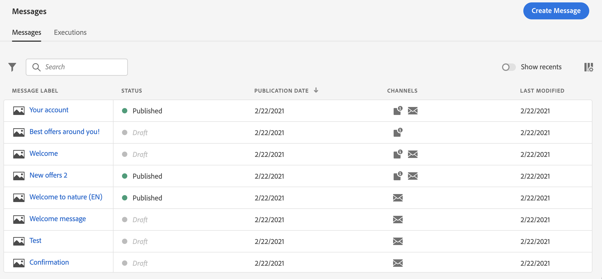

# 開始使用訊息 {#get-started-contents-messages}

使用 [!DNL Journey Optimizer] 在單一位置運用多種資源 (如資產和內容)，並建立和發佈個人化推播通知和電子郵件訊息。

* 運用[!DNL Journey Optimizer] **電子郵件設計功能**&#x200B;建立或匯入回應式電子郵件。

* 運用 **Adobe Experience Manager Assets Essentials** 建立您自己的資產資料庫，並豐富您的電子郵件。

* 根據客戶的設定檔屬性建立&#x200B;**個人化推播和電子郵件訊息**，以增強客戶體驗。

* 根據這些內容&#x200B;**建立推播和電子郵件訊息** ，然後發佈。

## 存取訊息 {#access-messages}

可從左側導覽的 **[!UICONTROL Messages]** 捷徑取得訊息。 所有訊息均按發佈日期 (已發佈的訊息) 或建立日期 (訊息草稿) 依序列出。

>[!NOTE]
>
>使用者可以根據其產品設定檔存取、建立、編輯和/或發佈訊息。 [在此章節](../administration/permissions.md)瞭解有關使用者權限的詳細資訊。

* 利用 **[!UICONTROL Show recents]** 切換在您過去 5 天內存取的訊息加入直接連結。

   

* 利用篩選圖示顯示草稿、已發佈或正在發佈的訊息。 您還可以搜尋訊息標籤，如下所示：

   

* 您可以利用快速操作功能表的專用圖示來封存未使用的訊息以便清理訊息清單。

   

   利用篩選圖示顯示所有封存的訊息，然後按一下 **[!UICONTROL Unarchive]** 圖示，從已封存的訊息清單刪除項目。

   >[!NOTE]
   >
   >無法開啟封存的訊息。 必須先取消封存。

## 建立新訊息。 {#create-new-message}

若要建立新訊息，請遵照以下步驟：

1. 存取訊息清單，然後按一下 **[!UICONTROL Create Message]**。

1. 定義訊息屬性。

   

   * 輸入 **[!UICONTROL Title]** (強制) 及 **[!UICONTROL Description]**。

   * 選擇 **[!UICONTROL Message category]**：行銷或異動。

   * 選取要用於訊息的通道：電子郵件、推播通知和/或簡訊。 必須至少選擇一個通道才能建立訊息。
   >[!NOTE]
   >
   >您可以按一下 **[!UICONTROL Frequency rule]** 連結，檢視將套用於選取的類別和頻道的頻率規則。 瞭解更多 [頻率規則](../configuration/frequency-rules.md) 的內容。

   * 選擇 **[!UICONTROL Preset]** 用於訊息。

      預設集包含所需的所有參數，以便根據您的品牌傳送電子郵件和/或推播通知。 瞭解更多關於 [預設集](../configuration/message-presets.md) 的內容。
   >[!CAUTION]
   >
   >您必須為所選類別和頻道選擇有效的訊息預設集。

   請注意，您可以隨時利用訊息介面的 **[!UICONTROL Properties]** 按鈕來存取及修改訊息標題、說明及預設集。

1. 按一下 **[!UICONTROL Create]** 確認建立訊息。 您的訊息將加入訊息清單，呈現 **[!UICONTROL Draft]** 狀態。

   每個選定通道都可使用一個標籤。 利用這些標籤為每個通道設定內容。 選擇標籤並在右側按一下 **[!UICONTROL Delete channel]** 按鈕您便可移除標籤。

   

   <!--
   >[!NOTE]
   >
   >If you enabled the **[!UICONTROL BCC email]** option in the preset, the BCC email address will display under the sender email. [Learn more](../configuration/email-settings.md#bcc-email)
   -->

   您現在可以建立訊息內容並調整設定。 有關電子郵件及推播通知設定的詳細資訊，請參見以下章節：

   * [建立電子郵件](create-email.md)
   * [建立推播通知](create-push.md)
   * [建立 SMS 訊息](create-sms.md)

   >[!NOTE]
   >   
   >可以透過表達式編輯器利用設定檔的資料個人化您的訊息。 如需個人化的詳細資訊，請參閱[此章節](../personalization/personalize.md)。

1. 利用左側預覽區段控制訊息的呈現，並利用測試設定檔來檢查個人化設定。 如需詳細資訊，請參閱[本章節](../design/preview.md)。

   

1. 檢查編輯器上半區段的警示。  其中一些是簡單的警告，但其他警告可能會阻止您發佈訊息。 請參閱[此章節](alerts.md)深入瞭解。

1. 您現在可以按一下 **[!UICONTROL Publish]** 按鈕，或者將其儲存為草稿稍後再發佈。 有關如何發佈訊息的詳細資訊，請參閱[此章節](publish-manage-message.md)。

## 複製訊息 {#duplicate-message}

若要從現有訊息建立訊息，請遵照以下步驟。

1. 開啟要複製的訊息。

1. 利用訊息介面的 **[!UICONTROL Duplicate]** 按鈕。

   

   所有設定與組態都將複製到新訊息中。

1. 您可以在確認複製之前重新命名訊息。

   

1. 一旦建立新訊息後，視窗底部會顯示一則確認訊息。

也可利用快速操作功能的專用圖示從訊息清單複製訊息。

適用同樣的確認過程。

