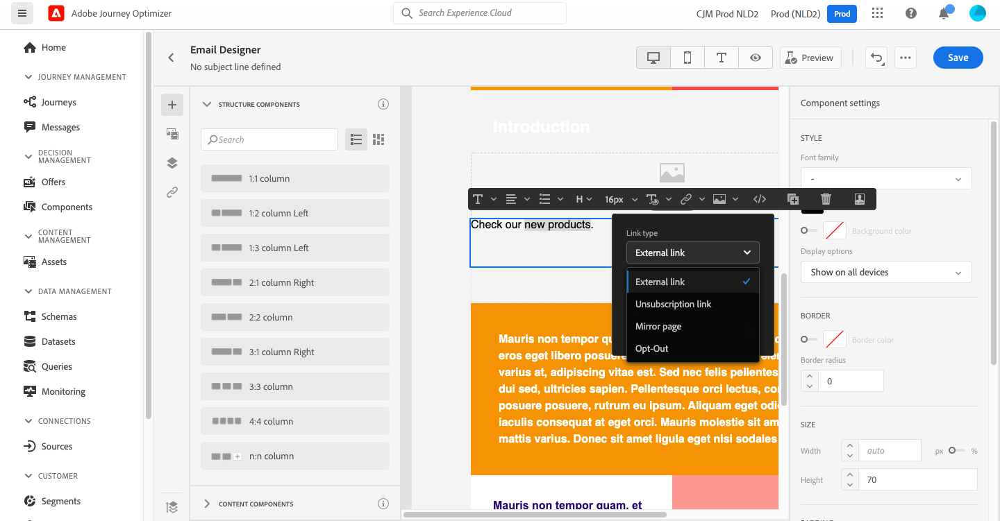

# 新增連結及追蹤訊息 {#tracking}

使用 [!DNL Journey Optimizer] 添加內容連結並跟蹤發送的郵件以監視收件人的行為。

## 啟用跟蹤 {#enable-tracking}

您可以通過檢查 **[!UICONTROL Open Tracking for email]** 和/或 **[!UICONTROL Click Tracking for email]** 選項 [建立留言](create-message.md)。

>[!NOTE]
>
>預設情況下，兩個選項都處於啟用狀態。

這將允許您通過以下方式跟蹤收件人的行為：

* **[!UICONTROL Open Tracking for email]**:已開啟的郵件。
* **[!UICONTROL Click Tracking for email]**:按一下電子郵件中的連結。

## 插入連結 {#insert-links}

設計消息時，可以向內容添加連結。

>[!NOTE]
>
>當 [已啟用跟蹤](#enable-tracking)，將跟蹤消息內容中包含的所有連結。

要將連結插入電子郵件內容，請執行以下步驟：

1. 選擇元素並按一下 **[!UICONTROL Insert link]** 的子菜單。

   

1. 選擇要建立的連結類型：

   * **[!UICONTROL External link]**:插入指向外部URL的連結。

   * **[!UICONTROL Landing page]**:插入到登錄頁的連結。 請參閱[本節](../landing-pages/get-started-lp.md)以進一步瞭解

   * **[!UICONTROL One click Opt-out]**:插入連結，使用戶能夠快速取消訂閱您的通信，而無需確認退出。 瞭解詳情 [此部分](consent.md#one-click-opt-out)。

   * **[!UICONTROL External Opt-in/Subscription]**:插入一個連結以接受來自您品牌的通信。

   * **[!UICONTROL External Opt-out/Unsubscription]**:插入連結以取消訂閱從您的品牌接收通信。 進一步瞭解[本章節](consent.md#opt-out-management)中的選擇退出管理。

   * **[!UICONTROL Mirror page]**:插入連結以在Web瀏覽器中顯示電子郵件內容。 瞭解詳情 [此部分](#mirror-page)。

   

1. 您可以個性化連結。 瞭解有關中的個性化URL的詳細資訊 [此部分](../personalization/personalization-syntax.md#perso-urls)。

1. 儲存您的變更。

1. 建立連結後，您仍可以從 **[!UICONTROL Component settings]** 的子菜單。

   * 可以編輯連結並更改其類型。
   * 您可以通過選中相應選項來選擇是否為連結加下划線。

   

## 連結到鏡像頁 {#mirror-page}

鏡像頁是通過Web瀏覽器線上訪問的HTML頁。 其內容與您的電子郵件內容相同。

要在電子郵件中添加鏡像頁的連結， [插入連結](#insert-links) 選擇 **[!UICONTROL Mirror page]** 作為連結的類型。

鏡像頁面將自動建立。

>[!NOTE]
>
>無法編輯自動生成的連結。

發送電子郵件後，當收件人按一下鏡像頁面連結時，電子郵件的內容將顯示在其預設的Web瀏覽器中。

>[!NOTE]
>
>在 [證明](preview.md#send-proofs) 發送到test配置檔案時，指向鏡像頁面的連結不處於活動狀態。 僅在最後消息中激活。

鏡像頁的保留期為60天。 延遲後，鏡像頁將不再可用。

## 管理跟蹤 {#manage-tracking}

的 [電子郵件設計器](create-email-content.md) 允許您管理跟蹤的URL，例如編輯每個連結的跟蹤類型。

1. 按一下 **[!UICONTROL Links]** 表徵圖，顯示要跟蹤的內容的所有URL的清單。

   此清單使您能夠有一個集中的視圖並查找電子郵件內容中的每個URL。

1. 要編輯連結，請按一下相應的鉛筆表徵圖。

   

1. 可以修改 **[!UICONTROL Tracking Type]** 如需：

   

   對於每個跟蹤的URL，可以將跟蹤模式設定為以下值之一：

   * **[!UICONTROL Tracked]**:在此URL上激活跟蹤。
   * **[!UICONTROL Opt out]**:將此URL視為選擇退出或取消訂閱的URL。
   * **[!UICONTROL Mirror page]**:認為此URL是鏡像頁URL。
   * **[!UICONTROL Never]**:從不激活此URL的跟蹤。 <!--This information is saved: if the URL appears again in a future message, its tracking is automatically deactivated.-->

已開啟的消息數和已按一下的連結數列在 [「執行」頁籤](message-monitoring.md)。

有關開放和點擊的報告，請參見 [電子郵件即時報告](../reports/email-live-report.md) 在 [電子郵件全局報告](../reports/email-global-report.md)。
