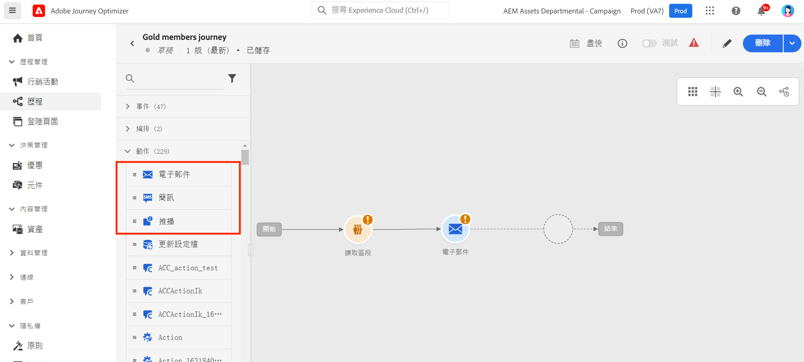
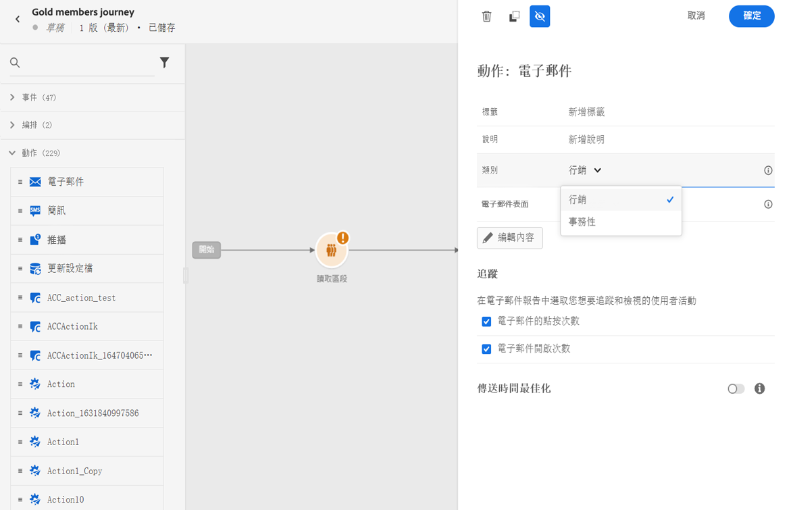
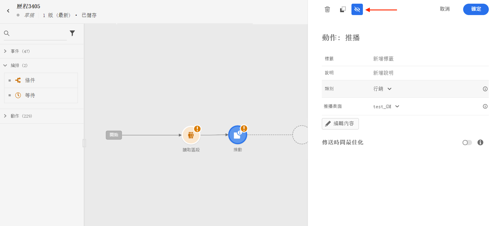
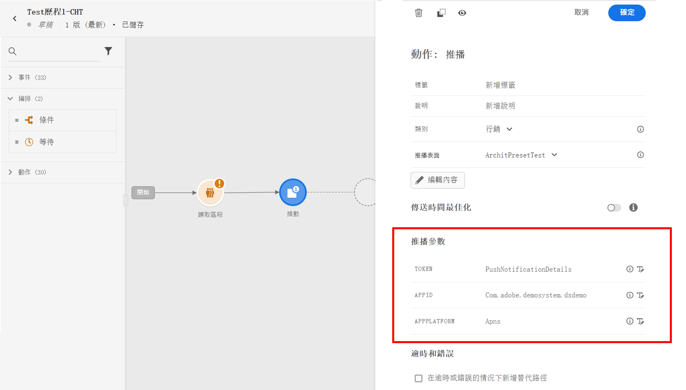
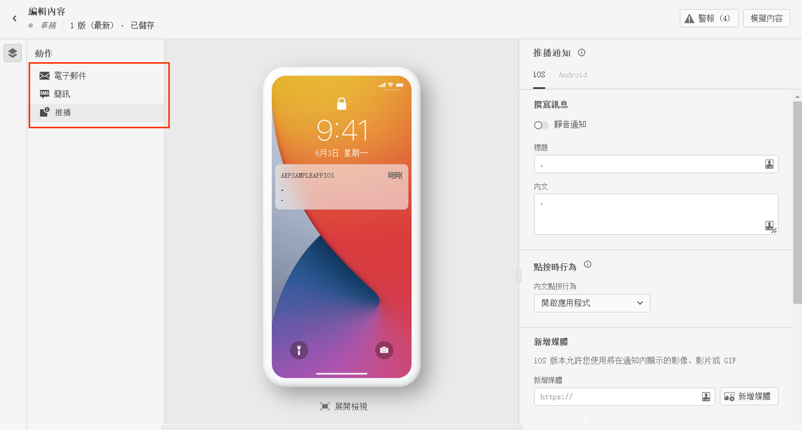
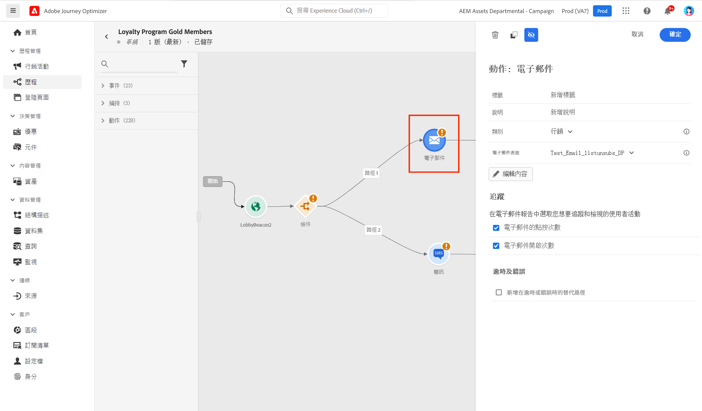
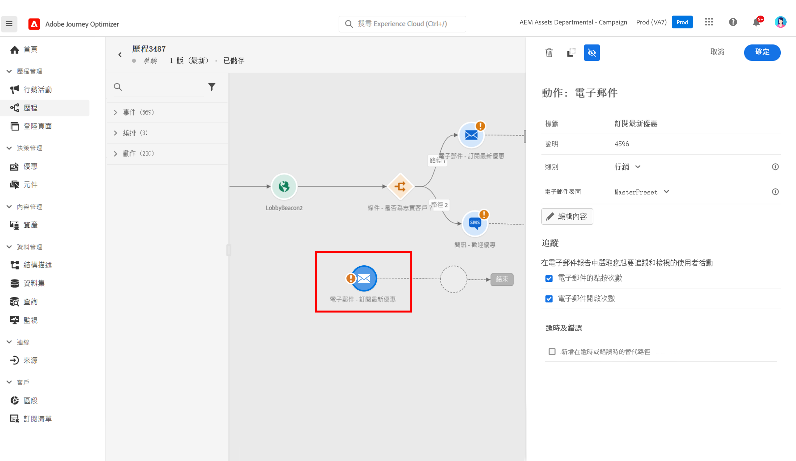
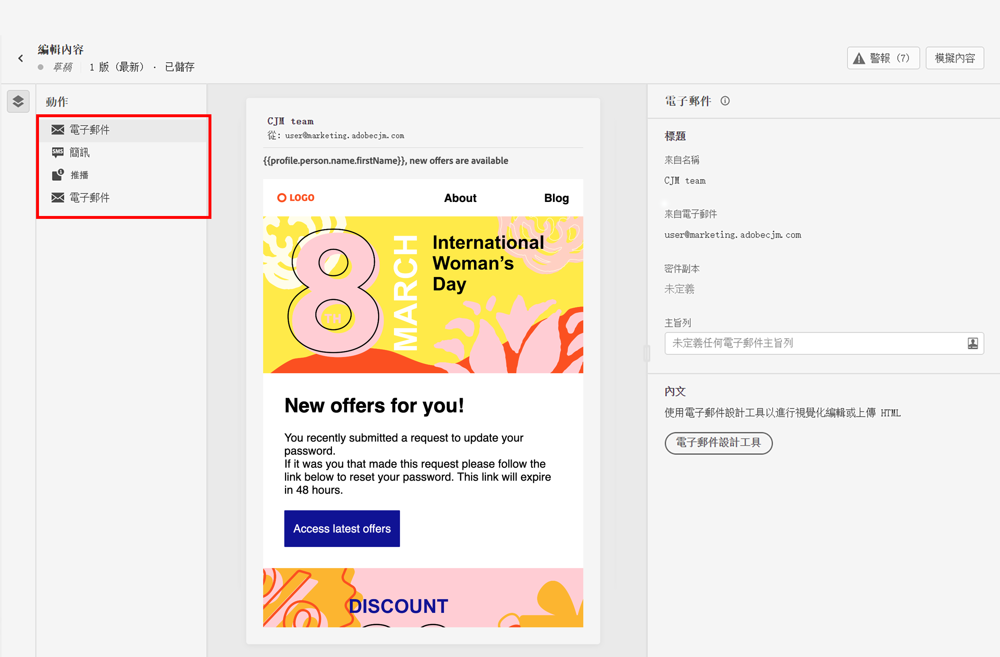
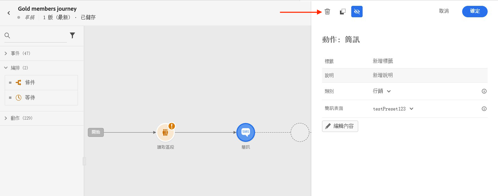

# 在旅程中添加消息{#messages-in-journeys}

>[!CONTEXTUALHELP]
>id="ajo_message_category"
>title="訊息類別"
>abstract="針對商業性訊息，請選擇「行銷」；針對非商業性訊息，請選擇「交易」，如訂單確認、密碼重設通知或傳遞資訊"

>[!CONTEXTUALHELP]
>id="ajo_message_surface"
>title="頻道介面"
>abstract="頻道介面是該頻道的執行個體，具備所有設定，可透過行銷活動或歷程成功傳遞行動。 它由系統管理員定義。"

在您的旅程中，使用渠道操作來設計並個性化您要發送給受眾的消息。 當您向旅程中添加電子郵件、SMS或「推送」操作時，將建立觸發發送。 當聯繫人到達該頻道操作時，Adobe Journey Optimizer會自動發送消息。

>[!NOTE]
>您還可以建立市場活動以發送計畫消息。 請參閱[本節](../campaigns/get-started-with-campaigns.md).

要在行程中添加消息，請在行程中添加推送、簡訊或電子郵件活動。

1. 利用[事件](../building-journeys/general-events.md)或[讀取區段](../building-journeys/read-segment.md)活動來開始您的歷程。

1. 從調色盤的&#x200B;**動作**&#x200B;區段 ，拖放&#x200B;**電子郵件**、**簡訊**&#x200B;或&#x200B;**推播**&#x200B;活動至畫布。

   

1. 輸入標籤與說明。

1. 選擇訊息&#x200B;**[!UICONTROL Category]**：針對商業性訊息，選擇&#x200B;**行銷**，或針對非商業性訊息，選擇&#x200B;**交易**，如訂單確認、密碼重設通知或傳遞資訊。

   >[!CAUTION]
   >
   >若您針對特定頻道與類別定義[頻率規則](../configuration/frequency-rules.md)，在選擇該頻道與類別後，這些規則將自動套用到訊息。 目前僅&#x200B;**[!UICONTROL Marketing]**&#x200B;類別適用於頻率規則。

   

   >[!CAUTION]
   >
   >行銷類型訊息必須包括[退出連結](../messages/consent.md#opt-out-management)。 交易訊息無需如此，因為這些訊息可以傳送到個人資料對象，後者可從行銷通訊取消訂閱。

1. 選擇頻道&#x200B;**[!UICONTROL Surface]** (即訊息預設集)，以用於傳送您的訊息。

   介面是由[系統管理員](../start/path/administrator.md)定義的設定。 它包含所有用於春頌訊息的技術參數，如標頭參數、子網域、行動應用程式等等。[了解更多](../configuration/channel-surfaces.md)。

   >[!CAUTION]
   >
   >您必須為所選的訊息類別與頻道選擇有效的頻道介面。

   您可以利用訊息介面的&#x200B;**[!UICONTROL Properties]**&#x200B;按鈕，隨時存取及修改訊息的標籤、說明及介面。

1. 建立訊息內容。

   若要瞭解建立訊息內容的詳細步驟，請至以下頁面：

   * [建立電子郵件](create-email.md)
   * [建立推播通知](create-push.md)
   * [建立 SMS 訊息](create-sms.md)

## 啟用傳送時間最佳化{#sto-in-journeys}

針對電子郵件與推播通知，您可以啟用&#x200B;**[!UICONTROL Send-time optimization]**。

利用&#x200B;**[!UICONTROL Send-time optimization]**&#x200B;為每位使用者安排個人化的傳送時間，以提高您訊息的開啟及點閱率。 [了解更多](../messages/send-time-optimization.md)。

## 進階參數{#adv-settings}

進階參數預設為唯讀並隱藏。

若要存取進階參數，請按一下訊息窗格頂端的&#x200B;**[!UICONTROL Show read-only fields]**&#x200B;圖示。

進階參數會顯示在訊息窗格的底部。 這些參數在與訊息相關的[頻道介面](../configuration/channel-surfaces.md)，由[系統管理員](../start/path/administrator.md)定義。

針對推播通知，您可以顯示以下參數：代號、AppID、AppPlatform。

針對電子郵件，您可以顯示主要電子郵件地址。

針對特定用途，您可以在特定內容覆寫這些值。 若要強制執行值，請按一下欄位右側的&#x200B;**啟用參數覆寫**&#x200B;圖示。此選項可能對如下項目非常有用：

* 測試電子郵件，您可以新增電子郵件地址。 在您發佈了此歷程後，會向您寄送電子郵件。
* 請參閱訂閱者清單的電子郵件地址。 在[此使用案例](../building-journeys/message-to-subscribers-uc.md)中了解更多。

按一下同一表徵圖隱藏高級設定。

## 瀏覽訊息{#browse-message}

當在歷程中使用多個訊息時，您可以從 **編輯內容** 畫面切換到另一個畫面。

你可以在單一檢視中 [檢查警報](alerts.md) 和 [模擬](../design/preview.md) 每個內容。

## 複製訊息 {#duplicate-message}

你可以從歷程畫布複製現有訊息。

請依照下列步驟執行：

1. 選取要複製的訊息。

1. 使用窗格的 **[!UICONTROL Copy]** 按鈕 **[!UICONTROL Action]** 。

   

1. 輸入 **crtl+V** 貼上訊息。

   該訊息將新增到歷程畫布。 所有設定與組態都將複製到新訊息中。

   

1. 將訊息重新命名以便能夠區分初始訊息與副本，例如，在編輯訊息時，如下所示：

   

>[!NOTE]
>
>對於電子郵件，您還可以將現有訊息轉換為範本。 [了解更多](../design/email-templates.md)。

## 刪除訊息{#delete-message}

若要刪除訊息，請使用頻道活動窗格頂部的垃圾筒圖示。

使用 **[!UICONTROL Confirm]** 按鈕來驗證。
