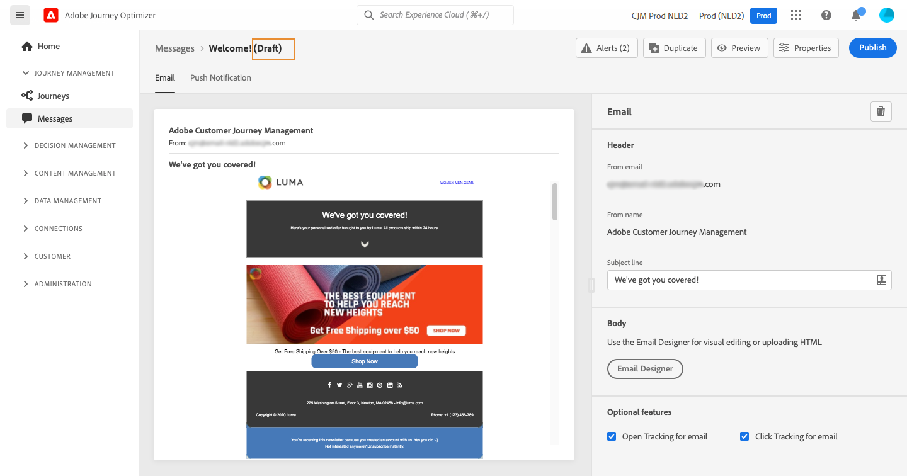

# 發佈您的郵件 {#publish-manage-messages}

## 發佈消息 {#publish-message}

建立消息後，可以發佈該消息以使其可用於執行。

>[!CAUTION]
>
>在發佈之前，請檢查並解決警報。 [了解更多](alerts.md)

發佈消息後，它將添加到消息清單中 **[!UICONTROL Published]** 狀態。

它現在已準備好由一個或多個 [乘](../building-journeys/journey.md)。

>[!NOTE]
>
>對於在已發佈訊息中直接或間接引用的優惠方案、遞補優惠、優惠收藏或優惠決定，現在將在對應訊息中自動反映您的更新，無需重新發佈。 [瞭解更多產品](../offers/get-started/starting-offer-decisioning.md)

## 更新只讀消息 {#modify-message}

發佈後，消息處於只讀模式。 您仍然可以通過建立該消息的新草稿來更新它。

這樣，您就可以更新內容或解決問題，而無需重新發佈使用消息的整個行程。

>[!NOTE]
>
>可在發佈版本仍被發佈並處於活動狀態時編輯草稿版本。

要更新已發佈的消息，請執行以下操作：

1. 從消息清單中，選擇要開啟的消息。

1. 按一下「**[!UICONTROL Modify]**」。

   

1. 確認您的選取。將建立消息的草稿版本。

   

1. 編輯內容或根據需要更改設定。
1. 按一下「**[!UICONTROL Publish]**」。此操作將發佈將用於下一個執行的消息的新版本。

一旦發佈新版本，在下次API調用時，將生成新消息執行。 下一個傳入配置檔案將接收新版本。

<!--For batch messages, the audience/segment being processed in the previous execution will not be affected by the new version. Only the next incoming API call with an audience/segment will generate a new message execution with the new version. -->
