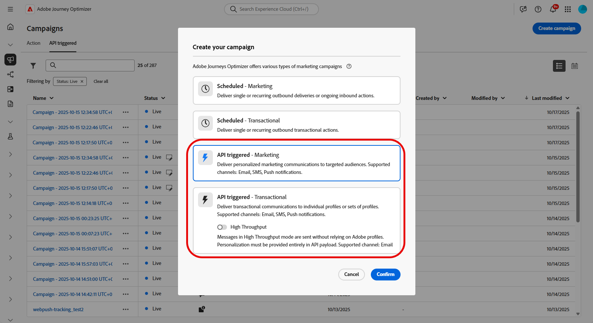
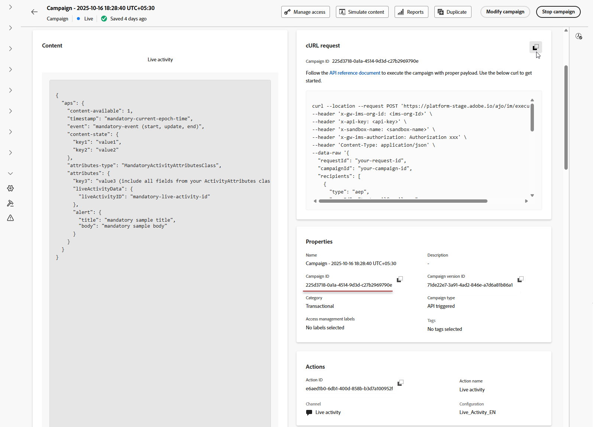

# 建立已上線活動 {#create-mobile-live}

>[!BEGINSHADEBOX]

* [開始使用即時活動](get-started-mobile-live.md)
* [已上線活動設定](mobile-live-configuration.md)
* [與Adobe Experience Platform Mobile SDK的即時活動整合](mobile-live-configuration-sdk.md)
* **[建立已上線的活動](create-mobile-live.md)**
* [常見問題](mobile-live-faq.md)
* [即時活動行銷活動報告](../reports/campaign-global-report-cja-activity.md)

>[!ENDSHADEBOX]

設定行動設定並實作Adobe Experience Platform mobile SDK後，您就可以在Journey Optimizer中開始建立「即時」活動：

1. 存取&#x200B;**[!UICONTROL 促銷活動]**&#x200B;功能表，然後按一下&#x200B;**[!UICONTROL 建立促銷活動]**。

1. 選取&#x200B;**API觸發**&#x200B;行銷活動型別。

   * 針對對象型行銷活動選取&#x200B;**API觸發的行銷**

   * 為個別行銷活動選取&#x200B;**API觸發的交易式**。

   >[!IMPORTANT]
   >
   > 請注意，對於&#x200B;**API觸發的交易式**，不應啟用&#x200B;**[!UICONTROL 高輸送量]**&#x200B;選項。

   

1. 從&#x200B;**[!UICONTROL 屬性]**&#x200B;區段，編輯行銷活動的&#x200B;**[!UICONTROL 標題]**&#x200B;和&#x200B;**[!UICONTROL 描述]**。

1. 在&#x200B;**[!UICONTROL 動作]**&#x200B;區段中，選擇&#x200B;**[!UICONTROL 已上線活動]**，然後選取或建立新的設定。

   在[此頁面](mobile-live-configuration.md)上進一步瞭解即時活動設定。

   

1. 按一下&#x200B;**[!UICONTROL 建立實驗]**&#x200B;以開始設定您的內容實驗，並建立處理以測量其效能，並為您的目標對象識別最佳選項。 [了解更多](../content-management/content-experiment.md)

1. 從&#x200B;**[!UICONTROL 對象]**&#x200B;索引標籤，選擇您的&#x200B;**[!UICONTROL 身分型別]** [深入瞭解](../audience/about-audiences.md)。

1. 行銷活動旨在特定日期或循環頻率執行。 在&#x200B;**[!UICONTROL 本節]**&#x200B;中瞭解如何設定行銷活動的[排程](../campaigns/create-campaign.md#schedule)。

1. 設定之後，按一下&#x200B;**[!UICONTROL 檢閱以啟動]**，然後按一下&#x200B;**[!UICONTROL 啟動]**。

1. 行銷活動啟動後，使用提供的&#x200B;**cURL請求**&#x200B;作為範本以觸發即時活動開始、更新或結束事件。 在執行之前，以您的特定資料更新範例裝載。

   請確定您也複製&#x200B;**[!UICONTROL 促銷活動ID]**&#x200B;識別碼以包含在您的裝載中。

   ➡️請參閱[API觸發的行銷活動檔案](https://developer.adobe.com/journey-optimizer-apis/references/messaging/)以瞭解驗證需求，包括OAuth權杖和API金鑰。

   

   +++ 個別裝載的範例

   請注意，下列裝載範例中的大部分欄位是必填欄位，只有`requestId`、`dismissal-date`和`alert`是選用欄位。

       &grave;&grave;json
       &lbrace;
       &quot;requestId&quot;： &quot;your-request-id&quot;，
       &quot;campaignId&quot;： &quot;your-campaign-id&quot;，
       「收件者」： &lbrack;
       &lbrace;
       &quot;type&quot;： &quot;aep&quot;，
       &quot;userId&quot;： &quot;testemail@gmail.com&quot;，
       &quot;namespace&quot;： &quot;email&quot;，
       &quot;context&quot;： &lbrace;
       &quot;requestPayload&quot;： &lbrace;
       &quot;aps&quot;： &lbrace;
       &quot;content-available&quot;： 1，
       &quot;timestamp&quot;： 1756984054，              //目前紀元時間
       &quot;discipation-date&quot;： 1756984084，         //選擇性 — 當event=&quot;end&quot;
時自動移除       &quot;event&quot;： &quot;update&quot;，                    //開始 | 更新 | end
       
   來自FoodDeliveryLiveActivityAttributes    的
//欄位       &quot;content-state&quot;： &lbrace;
       &quot;orderStatus&quot;： &quot;Delivered&quot;
       ，
       
       &quot;attributes-type&quot;： &quot;FoodDeliveryLiveActivityAttributes&quot;，
       &quot;attributes&quot;： &lbrace;
       &quot;restaurantName&quot;： &quot;Pizza&quot;，
       &quot;liveActivityData&quot;： &lbrace;
       &quot;liveActivityID&quot;： &quot;orderId1&quot;       //客戶參考識別碼
       &rbrace;
       ，
       
       「警示」： &lbrace;
       &quot;title&quot;： &quot;Order Delivered！&quot;，
       「正文」：「您的披薩已到。」
       &rbrace;
       &rbrace;
       &rbrace;
       &rbrace;
       &rbrace;
       &rbrack;
       &rbrace;
       「
+++」   

設計您的即時活動後，您可以使用[內建報告](../reports/campaign-global-report-cja-activity.md)來追蹤測量即時活動的影響。
