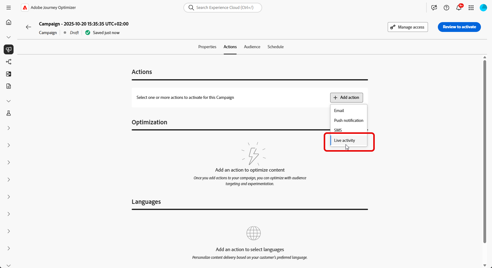

# 建立即時動態 {#create-mobile-live}

>[!BEGINSHADEBOX]

**在此頁面上：**&#x200B;在Journey Optimizer中建立API觸發的行銷活動，以便您可從遠端啟動、更新及結束個別使用者或受眾的「上線」活動。

>[!ENDSHADEBOX]

設定行動設定並實作Adobe Experience Platform mobile SDK後，您就可以在Journey Optimizer中開始建立「即時」活動：

1. 存取&#x200B;**[!UICONTROL 促銷活動]**&#x200B;功能表，然後按一下&#x200B;**[!UICONTROL 建立促銷活動]**。

1. 選取&#x200B;**API觸發**&#x200B;行銷活動型別。

   * 針對客群型行銷活動選取 **API 觸發的行銷**

   * 為個別行銷活動選取&#x200B;**API觸發的交易式**。

   >[!IMPORTANT]
   >
   > 請注意，對於&#x200B;**API觸發的交易式**，不應啟用&#x200B;**[!UICONTROL 高輸送量]**&#x200B;選項。

   

1. 從&#x200B;**[!UICONTROL 屬性]**&#x200B;區段，編輯行銷活動的&#x200B;**[!UICONTROL 標題]**&#x200B;和&#x200B;**[!UICONTROL 描述]**。

1. 在&#x200B;**[!UICONTROL 動作]**&#x200B;區段中，選擇&#x200B;**[!UICONTROL 已上線活動]**，然後選取或建立新的設定。

   在[此頁面](mobile-live-configuration.md)上進一步瞭解即時活動設定。

   

1. 按一下&#x200B;**[!UICONTROL 建立實驗]**&#x200B;以開始設定您的內容實驗，並建立處理以測量其效能，並為您的目標對象識別最佳選項。 [了解更多](../content-management/content-experiment.md)

1. 從&#x200B;**[!UICONTROL 對象]**&#x200B;索引標籤，選擇您的&#x200B;**[!UICONTROL 身分型別]** [深入瞭解](../audience/about-audiences.md)。

   >[!NOTE]
   >
   >針對&#x200B;**API觸發的行銷**&#x200B;行銷活動，您可以從API裝載中檢查APNs channelID訂閱之前，選取做為第一個區段的現有對象。

1. 行銷活動旨在特定日期或循環頻率執行。 在[本節](../campaigns/create-campaign.md#schedule)中瞭解如何設定行銷活動的&#x200B;**[!UICONTROL 排程]**。

1. 設定之後，按一下&#x200B;**[!UICONTROL 檢閱以啟動]**，然後按一下&#x200B;**[!UICONTROL 啟動]**。

1. 行銷活動啟動後，使用提供的&#x200B;**cURL請求**&#x200B;作為範本以觸發即時活動開始、更新或結束事件。 在執行之前，以您的特定資料更新範例裝載。

   請確定您也複製&#x200B;**[!UICONTROL 促銷活動ID]**&#x200B;識別碼以包含在您的裝載中。

   ➡️請參閱[API觸發的行銷活動檔案](https://developer.adobe.com/journey-optimizer-apis/references/messaging)以瞭解驗證需求，包括OAuth權杖和API金鑰。

   

   +++ 單一使用案例（API觸發的交易式行銷活動）的裝載範例

   此裝載範例適用於使用&#x200B;**API觸發的交易式**&#x200B;行銷活動型別的個別行銷活動。 請注意，下列裝載範例中的大部分欄位是必填欄位，只有`requestId`、`dismissal-date`和`alert`是選用欄位。

   ```json
   {
       "requestId": "your-request-id",
       "campaignId": "your-campaign-id",
       "recipients": [
   {
       "type": "aep",
       "userId": "testemail@gmail.com",
       "namespace": "email",
       "context": {
        "requestPayload": {
       "aps": {
       "content-available": 1,
       "timestamp": 1756984054,              // current epoch time
       "dismissal-date": 1756984084,         // optional – auto remove when event="end"
       "event": "update",                    // start | update | end
   
       // Fields from FoodDeliveryLiveActivityAttributes
       "content-state": {
         "orderStatus": "Delivered"
       },
   
       "attributes-type": "FoodDeliveryLiveActivityAttributes",
       "attributes": {
         "restaurantName": "Pizza",
         "liveActivityData": {
           "liveActivityID": "orderId1"       // customer reference ID
         }
       },
   
       "alert": {
         "title": "Order Delivered!",
         "body": "Your pizza has arrived."
       }
     }
   }
   }
   }
   ]
   }
   ```

   +++

   +++ 廣播使用案例（API觸發的行銷活動）的裝載範例

   此裝載範例適用於使用&#x200B;**API觸發的行銷**&#x200B;行銷活動型別的對象型行銷活動。

   ```json
   {
       "requestId": "123400000",
       "campaignId": "d32e6f6c-56df-4a98-a2c0-6db6008f8f32",
       "audience": {
           "id": "508f9416-52d0-4898-ba47-08baaa22e9c7"
       },
       "context": {
           "requestPayload": {
               "aps": {
                   "input-push-channel": "V+8UslywEfAAAOq9SbTrLg==",  //apns-channel-id
                   "content-available": 1,
                   "timestamp": 1770808339,
                   "event": "update",   // start | update | end
   
                   // Fields from GameScoreLiveActivityAttributes
                   "content-state": {
                       "homeTeamScore": 33,
                       "awayTeamScore": 49,
                       "statusText": "Wingdom keeps scoring!"
                   },
                   "attributes-type": "GameScoreLiveActivityAttributes",
                   "attributes": {
                       "liveActivityData": {
                           "channelID": "V+8UslywEfAAAOq9SbTrLg=="   //apns-channel-id, must match the "input-push-channel" value
                       }
                   },
                   "alert": {
                       "title": "This is the title for game",
                       "body": "This is the body for body"
                   }
               }
           }
       }
   }
   ```

   +++

設計您的即時活動後，您可以使用[內建報告](../reports/campaign-global-report-cja-activity.md)來追蹤測量即時活動的影響。

>[!TIP]
>
>如果您的即時活動未如預期出現或更新，請參閱[疑難排解即時活動](troubleshoot-mobile-live.md)以取得逐步偵錯指南。

## 新增具有執行中繼資料的自訂資料 {#metadata}

>[!AVAILABILITY]
>
> `executionMetadata`可用於&#x200B;**API觸發的交易式**&#x200B;和&#x200B;**API觸發的行銷**&#x200B;行銷活動。

使用選用的`executionMetadata`欄位，將您自己的&#x200B;**自訂資料**&#x200B;附加至設定檔，例如訂單ID、忠誠度等級或地區代碼。 Journey Optimizer會將此資料與執行一併儲存，以便您稍後可從&#x200B;**Live活動意見回饋資料集**&#x200B;擷取資料，並將傳遞結果與您自己的業務記錄比對。
若要新增具有執行中繼資料的自訂資料：

* 將`executionMetadata`新增到設定檔，在`userId`和`namespace`旁邊。 僅接受字串鍵和字串值，請在傳送前將任何非字串值轉換為字串。

* 這些值會與傳送時完全記錄。 `executionMetadata`不支援個人化運算式，因此任何`{{...}}`運算式都會被視為常值文字而非已解析。 您應該一律傳送最終常值。

* 每個設定檔最多可攜帶&#x200B;**50個索引鍵/值組**，所有索引鍵和值的組合大小限製為&#x200B;**2 KB**。 超過此限制的中繼資料會被捨棄，但即時活動仍會傳遞。 將裝載限製為報告所需的資訊。

+++ JSON範例

在此範例中，`orderId`、`tier`、`restaurant`和`region`是您自己的值。 觸發「即時」活動後，您可以從意見資料集中將其讀回，以將傳送連結至您的訂單記錄。

```json
{
    "requestId": "your-request-id",
    "campaignId": "your-campaign-id",
    "recipients": [
        {
            "type": "aep",
            "userId": "testemail@gmail.com",
            "namespace": "email",
            "executionMetadata": {
                "orderId": "A-123",
                "tier": "gold",
                "restaurant": "PizzaPlace",
                "region": "EU"
            },
            "context": {
                "requestPayload": {
                    "aps": {
                        "content-available": 1,
                        "timestamp": 1756984054,
                        "dismissal-date": 1756984084,
                        "event": "update",
                        "content-state": {
                            "orderStatus": "Delivered"
                        },
                        "attributes-type": "FoodDeliveryLiveActivityAttributes",
                        "attributes": {
                            "restaurantName": "PizzaPlace",
                            "liveActivityData": {
                                "liveActivityID": "orderId1"
                            }
                        },
                        "alert": {
                            "title": "Order Delivered!",
                            "body": "Your pizza has arrived."
                        }
                    }
                }
            }
        }
    ]
}
```

+++

設計您的即時活動後，您可以使用[內建報告](../reports/campaign-global-report-cja-activity.md)來追蹤測量即時活動的影響。


## 作法影片

探索如何使用 Adobe Journey Optimizer 設定 iOS 即時動態，以在 iPhone 鎖定畫面和動態島上提供豐富的即時更新。

>[!VIDEO](https://video.tv.adobe.com/v/3479864)
