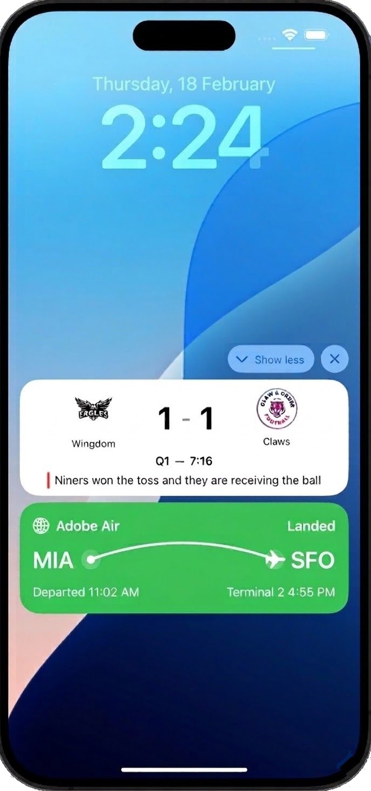

# 開始使用即時動態 {#get-started-mobile-live}

已上線的活動是裝置鎖定畫面上所顯示的永久、可瀏覽的UI元素。 它們可讓您的應用程式呈現即時且最新的資訊，讓使用者在整個進行中的事件中都能保持資訊，而不需要他們開啟應用程式或接收重複的推播通知。

>[!AVAILABILITY]
>
>Adobe Journey Optimizer中的即時活動僅與Apple iOS相容。

與傳統的推播通知不同，已上線的活動代表&#x200B;**以狀態為基礎的參與**：它們不會傳送一次性警報，而是會維持持續的、情境式的存在，並隨著事件的發展而動態更新。

{width="30%" align="left"}

透過Adobe Journey Optimizer，您可以透過API觸發的行銷活動，以程式設計方式從遠端&#x200B;**開始**、**更新**&#x200B;和&#x200B;**結束**&#x200B;上線活動，以大規模支援個別和受眾型使用案例。

即時活動只能&#x200B;**透過** API觸發&#x200B;**行銷活動起始**，可讓您提供自訂裝載，並透過自己的裝載執行所有個人化。
必須根據預期的「上線」活動使用案例選取適當的&#x200B;**API觸發**&#x200B;行銷活動型別：

* 針對廣播使用案例選取&#x200B;**API觸發的行銷** — 大規模傳送的對象型更新：

   * 運動會分數和即時活動倒計時
   * 航線上所有乘客的航班狀態更新
   * 跨使用者區段的共用體驗

* 針對個別使用案例選取&#x200B;**API觸發異動** — 每位使用者有1:1個即時更新：

   * 訂單追蹤與傳遞進度
   * 騎乘或服務狀態更新
   * 即時預約和約會確認

## 主要優點

即時活動將行動參與從通知型轉換為狀態型，讓品牌能夠：

* 在整個高值事件中保持&#x200B;**持續存在**
* **以動態方式更新資訊**，避免使用者因重複通知而不知所措
* 提供與真實世界活動相連結的&#x200B;**更豐富、更情境式**&#x200B;行動時刻
* 在作用中交易或即時體驗期間&#x200B;**增加參與度和保留率**

## 快速入門手冊

完成下列步驟，在您的應用程式中設定並實作上線活動：

1. **[設定 Adobe Journey Optimizer](mobile-live-configuration.md)**

   透過建立行動設定來設定您的環境。

1. **[整合 Adobe Experience Platform Mobile SDK](mobile-live-configuration-sdk.md)**

   與 Adobe Experience Platform Mobile SDK 整合，以啟用鎖定畫面和動態島上的即時動態更新。

1. **[在Journey Optimizer中建立即時活動](create-mobile-live.md)**

   在Journey Optimizer中使用API觸發的行銷活動來啟動您的上線活動。

1. **[監視您的行銷活動](../reports/campaign-global-report-cja-activity.md)**

   開始使用內建報告來衡量您的即時活動的影響。

## 作法影片

瞭解如何使用Adobe Journey Optimizer設定iOS Live活動，以在iPhone鎖定畫面和Dynamic Island上提供豐富的即時更新。

>[!VIDEO](https://video.tv.adobe.com/v/3479875/?captions=chi_hant&learn=on)
