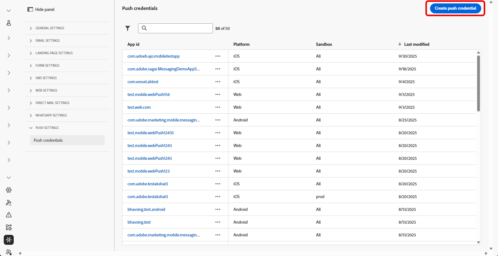
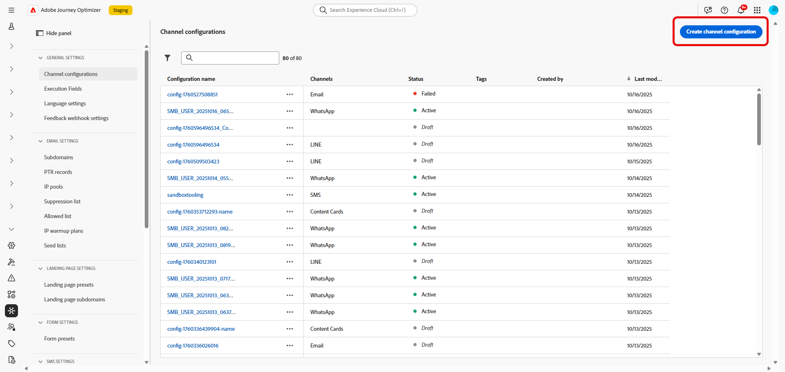
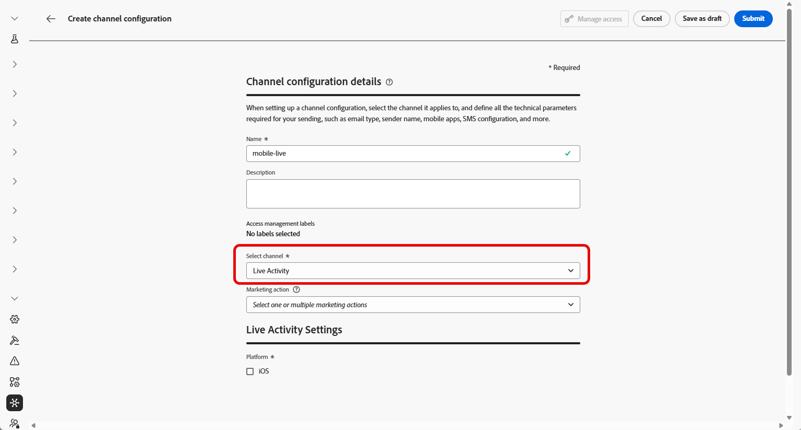
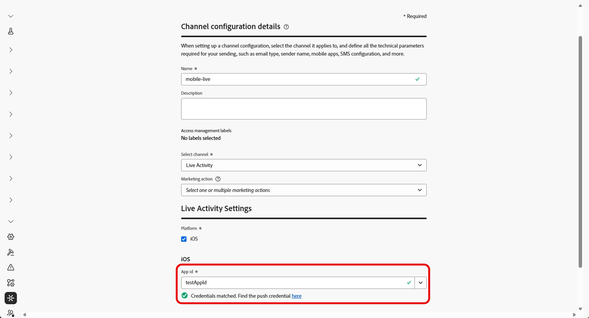

# 開始使用即時活動設定 {#mobile-live-config}

>[!BEGINSHADEBOX]

* [開始使用即時活動](get-started-mobile-live.md)
* **[已上線活動設定](mobile-live-configuration.md)**
* [與Adobe Experience Platform Mobile SDK的即時活動整合](mobile-live-configuration-sdk.md)
* [建立已上線活動](create-mobile-live.md)
* [常見問題](mobile-live-faq.md)
* [即時活動行銷活動報告](../reports/campaign-global-report-cja-activity.md)

>[!ENDSHADEBOX]

在傳送「即時」活動之前，您必須先設定Adobe Journey Optimizer環境。 若要執行此動作：

## 步驟1：在Journey Optimizer中新增應用程式推送認證（選用）{#push-credentials-launch}

行動應用程式推播認證註冊為必填，才能授權Adobe代表您傳送推播通知。

如果您的推送認證已設定，則步驟1為選用，因為這些認證可重複用於即時活動通道設定。 如果未定義認證，您必須為應用程式建立新的推送認證。 請參閱以下詳細步驟：

1. 存取&#x200B;**[!UICONTROL 管道]** > **[!UICONTROL 推播設定]** > **[!UICONTROL 推播認證]**&#x200B;功能表。

1. 按一下&#x200B;**[!UICONTROL 建立推播認證]**。

   

1. 從&#x200B;**[!UICONTROL 平台]**&#x200B;下拉式清單中，選取作業系統：

1. 輸入行動應用程式&#x200B;**[!UICONTROL 應用程式識別碼]**。

   

1. 啟用&#x200B;**[!UICONTROL 套用至所有沙箱]**&#x200B;選項，讓這些推送認證可用於所有沙箱。 如果特定沙箱針對相同的平台和應用程式ID組有自己的認證，系統會優先採用這些沙箱專屬的認證。

1. 已開啟&#x200B;**[!UICONTROL 手動輸入推播認證]**&#x200B;按鈕以新增您的認證。

1. 拖放您的.p8 Apple推播通知驗證金鑰檔案。 此金鑰可從&#x200B;**憑證**、**識別碼**&#x200B;和&#x200B;**設定檔**&#x200B;頁面取得。

1. 提供&#x200B;**金鑰識別碼**。 這是在p8驗證金鑰建立期間指派的10字元字串。 您可以在&#x200B;**憑證**、**識別碼**&#x200B;和&#x200B;**設定檔**&#x200B;頁面中的&#x200B;**金鑰**&#x200B;索引標籤下找到它。

1. 提供&#x200B;**團隊識別碼**。 這是字串值，可在「成員資格」標籤下找到。

1. 按一下&#x200B;**[!UICONTROL 提交]**&#x200B;以建立您的應用程式設定。

## 步驟2：建立您的上線活動設定 {#config-live-activity}

1. 在左側邊欄中，瀏覽至&#x200B;**[!UICONTROL 管理]** > **[!UICONTROL 管道]**&#x200B;並選取&#x200B;**[!UICONTROL 一般設定]** > **[!UICONTROL 管道設定]**。 按一下&#x200B;**[!UICONTROL 建立通道組態]**&#x200B;按鈕。

   

1. 輸入設定的名稱和說明（選用），然後選取WhatsApp通道。

   >[!NOTE]
   >
   > 名稱必須以字母(A-Z)開頭。 它只能包含英數字元。 您也可以使用底線 `_`、點 `.` 和連字號 `-` 字元。

1. 選取&#x200B;**[!DNL Live activity]**&#x200B;作為您的頻道。

   

1. 選取&#x200B;**[!UICONTROL 行銷動作]**，以使用此設定將同意原則與訊息相關聯。 系統會運用與行銷動作相關的所有同意政策，以尊重客戶的偏好設定。 了解更多

1. 選擇iOS作為您的&#x200B;**[!UICONTROL 平台]**。

1. 從下拉式清單中選取與上方設定之&#x200B;**[!UICONTROL 推播認證]**&#x200B;相同的[應用程式識別碼](#push-credentials-launch)，或選擇現有的應用程式識別碼。

   

1. 設定完所有引數後，按一下&#x200B;**[!UICONTROL 提交]**&#x200B;確認。 您也可以將頻道設定儲存為草稿，並稍後繼續其設定。

1. 建立管道設定後，它就會顯示在狀態為&#x200B;**[!UICONTROL 處理中]**&#x200B;的清單中。

   >[!NOTE]
   >
   >如果檢查不成功，請在[本節](../configuration/channel-surfaces.md)中進一步瞭解可能的失敗原因。

1. 檢查成功後，通道設定會取得&#x200B;**[!UICONTROL 作用中]**&#x200B;狀態。 已準備好用於傳遞訊息。

您現在可以開始與Adobe Experience Platform Mobile SDK整合，以在鎖定畫面和動態島上啟用即時動態更新。

➡️ [進一步瞭解Adobe Experience Platform Mobile SDK整合](mobile-live-configuration-sdk.md)
