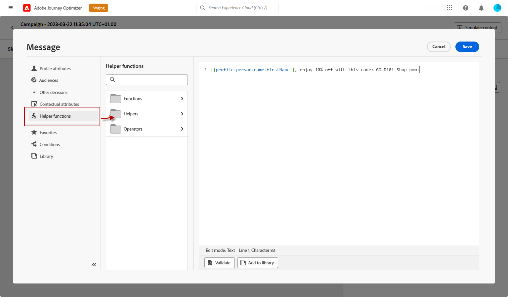

# 設計行動裝置訊息 {#design-mobile}

您可以使用Adobe Journey Optimizer設計和傳送文字(SMS)、豐富通訊(RCS)和多媒體(MMS)訊息。 您首先需要在歷程或行銷活動中新增行動訊息動作，然後定義行動訊息的內容，如下所述。 Adobe Journey Optimizer也提供在傳送前測試行動訊息的功能，讓您可檢查轉譯、個人化屬性和所有其他設定。

根據業界標準及法規，所有SMS/RCS/MMS行銷訊息都必須包含讓設定檔輕鬆取消訂閱的方式。 為此，簡訊設定檔可使用選擇加入和選擇退出關鍵字進行回覆。 [瞭解如何管理選擇退出](../privacy/opt-out.md#opt-out-decision-management)

## 定義您的RCS內容{#rcs-content}

RCS可讓您傳送包含影像、影片、浮動視窗和互動式按鈕的豐富視覺化訊息，這些訊息會透過原生傳訊應用程式在支援的裝置上傳送。 訊息會從品牌認證的寄件者傳送。 當設定檔的裝置或電信業者不支援RCS時，Journey Optimizer會自動回覆為標準SMS。

每個RCS訊息都需要&#x200B;**[!UICONTROL 預設的遞補文字]**：傳送至裝置或電信業者不支援RCS之設定檔的純文字SMS版本。 沒有行銷活動就無法啟用。

撰寫遞補文字時，請記得下列事項：

* **保持簡潔。** SMS訊息限製為每個區段160個字元；較長的訊息會分割成多個部分，並可能會產生額外費用。
* **包含金鑰URL。** 如果您的RCS訊息透過動作按鈕連結至URL，請在遞補文字新增縮短的URL，讓SMS設定檔仍可到達目的地。
* **避免僅RCS參考。** 不要提到簡訊中無法提供的視覺效果、輪播或互動功能。
* **支援Personalization。** 您可以在遞補文字中使用個人化代號，讓訊息在兩個版本中保持一致。

若要定義您的RCS訊息內容，請遵循下列步驟。

1. 在編寫面板中，選擇您的&#x200B;**[!UICONTROL 內容型別]**：

   +++ 文字

   純文字內文，內含選用的互動式按鈕。 最適合用於不需要視覺效果的通知、警示、提醒和對話流程。

   +++

   +++ 媒體

   具有選擇性文字和互動按鈕的獨立影像或視訊。 當單一視覺效果（產品影像、橫幅或視訊片段）成為訊息焦點時，請使用該視覺效果。

   1. 在[頁首]功能表中，輸入指向要顯示的影像或視訊的&#x200B;**[!UICONTROL 媒體URL]**。

   1. 如果媒體是視訊檔案，您可以選擇輸入&#x200B;**[!UICONTROL 縮圖URL]**。

   +++

   +++ 卡片

   結合影像或視訊、標題、內文和動作按鈕的結構化卡片。 使用它以品牌化格式呈現產品、選件或內容專案。

   1. 輸入&#x200B;**[!UICONTROL 標題]**&#x200B;和&#x200B;**[!UICONTROL 描述]**。

   1. 輸入指向要顯示的影像或視訊的&#x200B;**[!UICONTROL 媒體URL]**。

   1. 如果媒體是視訊檔案，您可以選擇輸入&#x200B;**[!UICONTROL 縮圖URL]**。

   +++

   +++ 輪播

   在單一訊息中可水準捲動的一系列豐富卡片，每個卡片都有自己的影像、標題、說明和按鈕。 最適合產品目錄或促銷活動。 至少需要2張卡片。

   1. 選取&#x200B;**[!UICONTROL 卡片寬度]**&#x200B;來控制每個卡片的顯示寬度。
   1. 請為每張卡片輸入&#x200B;**[!UICONTROL 標題]**&#x200B;和&#x200B;**[!UICONTROL 描述]**。

   1. 輸入指向該卡片影像或視訊的&#x200B;**[!UICONTROL 媒體URL]**。

   1. 選擇性地選取&#x200B;**[!UICONTROL 媒體高度]**&#x200B;並新增建議的動作按鈕。

   +++

   +++ 位置

   將地圖釘選傳送至一組座標，在設定檔的傳訊執行緒中顯示為內嵌地圖預覽。 用它來共用商店地址、活動場地或服務區域。

   1. 輸入位置的小數&#x200B;**[!UICONTROL 緯度]**&#x200B;和&#x200B;**[!UICONTROL 經度]**。

   1. 選擇性地輸入&#x200B;**[!UICONTROL 位置名稱]**，以便在地圖圖釘上顯示為標籤。

   +++

1. 在&#x200B;**[!UICONTROL 訊息文字]**&#x200B;欄位中輸入您的訊息內容。 您可以使用個人化來量身打造每個設定檔的文字。 請注意，字元限制依訊息型別而異：多媒體（單一）為3,072字元，基本RCS為160字元。

1. 使用&#x200B;**[!UICONTROL Personalization編輯器]**&#x200B;來定義內容、新增個人化及動態內容。 您可以使用任何屬性，例如設定檔名稱或城市。 您也可以定義條件式規則。

1. 您可以選擇性地新增&#x200B;**[!UICONTROL 建議的動作]**、互動式按鈕，讓設定檔只要點一下即可執行動作。

1. 輸入您的&#x200B;**[!UICONTROL 動作]**&#x200B;的&#x200B;**[!UICONTROL 標籤]**。

1. 選擇您的&#x200B;**[!UICONTROL 動作型別]**：

   * **[!UICONTROL 回覆]**：代表設定檔將預先定義的文字回覆傳送回RCS代理程式。 使用此動作來擷取意圖、推動對話流程或觸發下游歷程事件。 不需要其他欄位，回覆文字元合按鈕標籤。

   * **[!UICONTROL 開啟URL]**：將設定檔重新導向至網頁、深層連結或應用程式內目的地。 支援個人化權杖和UTM追蹤引數，例如`https://www.example.com/offers?id={{profile.userId}}`。

   * **[!UICONTROL 撥號電話號碼]**：開啟預先填入指定電話號碼的裝置撥號器，可供設定檔撥號。

   * **[!UICONTROL 檢視位置]**：在指定的位置開啟裝置的預設地圖應用程式。 提供要顯示位置的小數&#x200B;**[!UICONTROL 緯度]**&#x200B;和&#x200B;**[!UICONTROL 經度]**。

1. 在&#x200B;**[!UICONTROL 預設後援文字]**&#x200B;欄位中，輸入您訊息的純文字SMS版本。 此為必要項，且會傳送至裝置或電信業者不支援RCS的設定檔。

1. 從&#x200B;**[!UICONTROL Webview]**&#x200B;下拉式清單中，選擇傳送&#x200B;**[!UICONTROL 開啟URL]**&#x200B;動作時&#x200B;**[!UICONTROL Webview]**&#x200B;的大小。

1. 按一下「**[!UICONTROL 儲存]**」並在預覽中查看您的訊息。 您現在可以測試並檢查您的訊息內容，如[本節](send-mobile-message.md)所詳述。

## 定義您的簡訊內容{#sms-content}

>[!CONTEXTUALHELP]
>id="ajo_message_sms_content"
>title="定義您的簡訊內容"
>abstract="使用個人化編輯器來定義內容並結合動態元素，以自訂及個人化您的行動訊息。"

若要設定訊息內容，請遵循下列步驟。 MMS的設定在[本節](#mms-content)中有詳細說明。

1. 在歷程或行銷活動設定畫面中，按一下&#x200B;**[!UICONTROL 編輯內容]**&#x200B;按鈕以設定行動訊息內容。

1. 按一下&#x200B;**[!UICONTROL 訊息]**&#x200B;欄位以開啟個人化編輯器。

   

1. 使用[AI Assistant產生文字產生](../content-management/generative-text.md)，產生針對您的對象量身打造的吸引人行動訊息。

1. 使用個人化編輯器來定義內容、新增個人化和動態內容。 您可以使用任何屬性，例如設定檔名稱或城市。 您也可以定義條件式規則。 瀏覽下列頁面，瞭解個人化編輯器中[個人化](../personalization/personalize.md)和[動態內容](../personalization/get-started-dynamic-content.md)的詳細資訊。

1. 定義內容後，您可以將追蹤的URL新增至訊息。 若要這麼做，請存取&#x200B;**[!UICONTROL 協助程式功能]**&#x200B;功能表，然後選取&#x200B;**[!UICONTROL 協助程式]**。

   

1. 選取&#x200B;**[!UICONTROL Url]**&#x200B;並按一下&#x200B;**[!UICONTROL 新增URL]**。 在[本節](../personalization/functions/helpers.md#url)中進一步瞭解`Url`協助程式功能。

   

1. 若要縮短URL，請將它貼到`originalUrl`欄位中，然後按一下&#x200B;**[!UICONTROL 儲存]**。

   >[!CAUTION]
   >
   >若要使用URL縮短功能，您必須先設定子網域，然後再將其連結至您的設定。 [了解更多](mobile-subdomains.md)
   >
   > 短URL的生命週期設為30天。 在此期間之後，將無法再存取這些短URL，且會顯示訊息： `404 short-code not found`。

1. 若要新增可在您的行動應用程式中開啟特定畫面的深層連結，請搭配使用`Url`協助程式函式與`DEEPLINK`型別，如下例所示。 [進一步瞭解深層連結](../email/deeplinks.md)

   ```
   {{url originalUrl='<<deeplink_url>>' type='DEEPLINK' action='CLICK'}}
   ```

   >[!CAUTION]
   >
   >在使用深層連結之前，請確定您已在Journey Optimizer中完成對應的[設定步驟](../email/deeplinks.md#configuration)，並在您的行動應用程式中實作[深層連結處理](../email/deeplinks.md#mobile-implementation)。 如果您尚未這麼做，深層連結不會將使用者導向至預期的應用程式內內容。
   >
   >此外，請確定已在您歷程或行銷活動的&#x200B;**[!UICONTROL 動作]**&#x200B;區段中啟用連結追蹤，以便透過Adobe系統重新寫入URL。

1. 從&#x200B;**[!UICONTROL 決策]**&#x200B;功能表，您可以使用&#x200B;**決策**&#x200B;個人化並最佳化行動訊息的內容。 此功能可讓您使用優先順序分數、公式或AI模型，以動態方式選取並向客戶顯示最佳內容。

   如需如何在行動訊息中建立和使用決定原則的詳細資訊，請參閱[本節](../experience-decisioning/create-decision.md)。

1. 按一下「**[!UICONTROL 儲存]**」並在預覽中查看您的訊息。 您現在可以測試並檢查您的訊息內容，如[本節](send-mobile-message.md)所詳述。

## 定義多媒體簡訊內容{#mms-content}

您可以透過傳送多媒體訊息服務(MMS)訊息、啟用視訊、圖片、音訊剪輯和GIF等媒體共用，來增強您的通訊能力。 此外，MMS最多可在您的訊息中使用1600個字元文字。

>[!NOTE]
>
> MMS頻道在[此頁面](../start/guardrails.md#sms-guardrails)上提供一些限制。

若要建立MMS內容，請遵循下列步驟：

1. 建立行動訊息，如[本節](#create-sms-journey-campaign)所述。

1. 編輯您的SMS內容，如[此區段](#sms-content)中所詳述。

1. 啟用MMS選項以將媒體新增到您的SMS內容。

   

1. 將&#x200B;**[!UICONTROL 標題]**&#x200B;新增至您的媒體。

1. 在&#x200B;**[!UICONTROL 媒體]**&#x200B;欄位中輸入您的媒體URL。

   

1. 按一下「**[!UICONTROL 儲存]**」並在預覽中查看您的訊息。 您現在可以測試和檢查您的訊息內容，如下所述。

一旦您執行測試並驗證內容後，您就可以將行動訊息傳送給對象。 這些步驟在[此頁面](send-mobile-message.md)上詳細說明

