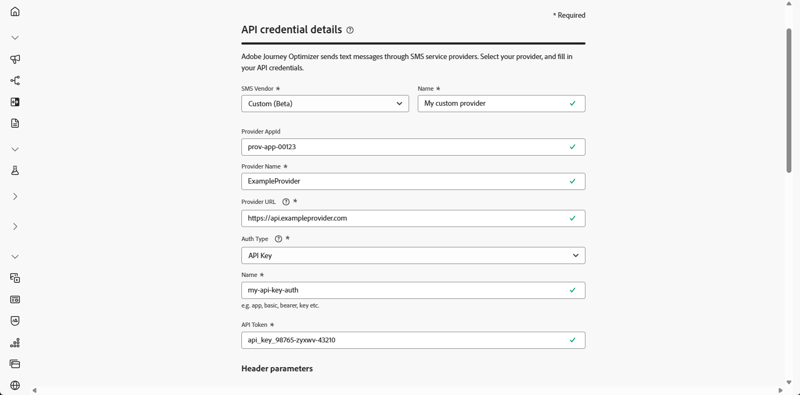

# 設定自訂提供者 {#sms-configuration-custom}

>[!CONTEXTUALHELP]
>id="ajo_admin_sms_api_byop_provider_url"
>title="提供者 URL"
>abstract="指定您計劃連線之外部 API 的 URL。 此 URL 會做為存取 API 功能的端點。"

>[!CONTEXTUALHELP]
>id="ajo_admin_sms_api_byop_header_parameters"
>title="標頭參數"
>abstract="指定附加標頭的標籤、類型和值，以啟用正確的驗證、內容格式和有效的 API 通訊。 "

>[!CONTEXTUALHELP]
>id="ajo_admin_sms_api_byop_provider_payload"
>title="提供者承載"
>abstract="提供要求承載，確保能發送用於進行處理和產生回應的正確資料。"

此功能可讓您整合及設定自己的傳訊提供者，除了預設選項（Sinch、Twilio和Infobip）以外，還提供了彈性。 如此一來，行動訊息就能順暢地撰寫、傳送、報告和同意管理。

透過自訂提供者設定，您可以直接在Journey Optimizer中連線協力廠商傳訊服務、自訂動態內容的訊息裝載，以及管理選擇加入/選擇退出偏好設定，以確保在SMS和RCS通道間保持一致。

若要設定自訂提供者，請遵循下列步驟：

1. [建立API認證](#api-credential)
1. [建立 Webhook](mobile-webhook.md)
1. [建立頻道設定](mobile-configuration-surface.md)
1. [透過簡訊頻道動作建立歷程或行銷活動](create-mobile-message.md)

## 建立您的API認證 {#api-credential}

若要在Journey Optimizer中使用Adobe未提供的現成自訂提供者（例如Sinch、Infobip、Twilio）傳送行動訊息，請遵循下列步驟：

1. 在左側邊欄中，瀏覽至&#x200B;**[!UICONTROL 管理]** `>` **[!UICONTROL 管道]**，選取&#x200B;**[!UICONTROL 簡訊設定]**&#x200B;下的&#x200B;**[!UICONTROL API認證]**&#x200B;功能表，然後按一下&#x200B;**[!UICONTROL 建立新的API認證]**&#x200B;按鈕。

   

1. 設定您的SMS API認證，如下所述：

   * **[!UICONTROL SMS供應商]**：自訂。

   * **[!UICONTROL 名稱]**：輸入您的API認證名稱。

   * **[!UICONTROL 提供者AppId]**：輸入您的SMS提供者提供的應用程式ID。

   * **[!UICONTROL 提供者名稱]**：輸入您的SMS提供者的名稱。

   * **[!UICONTROL 提供者URL]**：輸入簡訊提供者的URL。

   * **[!UICONTROL 驗證型別&#x200B;]**：選取您的授權型別，並根據選取的驗證方法[完成對應的欄位](#auth-options)。

     

1. 啟用&#x200B;**[!UICONTROL mTLS支援]**&#x200B;選項，以確保使用者端和伺服器在建立安全連線之前互相驗證。

   若要僅使用mTLS，請從&#x200B;**[!UICONTROL 驗證型別]**&#x200B;下拉式清單中選取&#x200B;**[!UICONTROL 無驗證]**，然後啟用&#x200B;**[!UICONTROL mTLS支援]**。

1. 在&#x200B;**[!UICONTROL 標頭]**&#x200B;區段中，按一下&#x200B;**[!UICONTROL 新增引數]**&#x200B;以指定將傳送給外部服務的要求訊息的HTTP標頭。

   **Content-Type**&#x200B;和&#x200B;**Charset**&#x200B;標頭欄位已預設設定，無法刪除。

   

1. 新增您的&#x200B;**[!UICONTROL 提供者裝載]**，以驗證及自訂您的要求裝載。

   對於RCS訊息，此承載稍後會在[內容設計](create-mobile-message.md#sms-content)期間使用。

   >[!NOTE]
   >
   >設定具有基本或持有者驗證的自訂SMS提供者時，您必須在JSON裝載中包含`authOption`引數。 此外，**提供者承載**&#x200B;必須參考範本變數`{{fromNumber}}`、`{{toNumber}}`和`{{message}}`。

1. 選取&#x200B;**[!UICONTROL 使用傳入的自訂資料集]**，將此認證的傳入SMS路由至您從下拉式清單中選擇的預先建立資料集。 [進一步瞭解如何使用傳入關鍵字的自訂資料集](custom-dataset-inbound-keywords.md)

   >[!NOTE]
   >
   >資料集結構描述必須是&#x200B;**[!UICONTROL XDM ExperienceEvent]**，而且至少包含下列欄位群組：
   >* Adobe CJM ExperienceEvent — 訊息互動細節
   >* Adobe CJM ExperienceEvent — 訊息執行詳細資料
   >* Adobe CJM ExperienceEvent — 訊息設定檔詳細資料
   >
   >必須為設定檔啟用結構描述和資料集。

1. 完成API認證的設定時，請按一下&#x200B;**[!UICONTROL 提交]**。

1. 在&#x200B;**[!UICONTROL API認證]**&#x200B;功能表中，按一下以刪除您的API認證。

   

1. 若要修改現有認證，請找到所需的API認證，然後按一下&#x200B;**[!UICONTROL 編輯]**&#x200B;選項以進行必要的變更。

   

1. 從您現有的API認證按一下&#x200B;**[!UICONTROL 驗證SMS連線]**，透過傳送範例訊息至指定裝置來測試及驗證SMS API認證。

1. 填寫&#x200B;**數字**&#x200B;和&#x200B;**訊息**&#x200B;欄位，然後按一下&#x200B;**[!UICONTROL 驗證連線]**。

   >[!IMPORTANT]
   >
   >訊息的結構必須符合提供者的裝載格式。

   

在建立及設定您的API認證後，您現在需要為Webhook](#webhook)設定[簡訊的傳入設定。

### 自訂 SMS 提供者的驗證選項 {#auth-options}

>[!CONTEXTUALHELP]
>id="ajo_admin_sms_api_byop_auth_type"
>title="驗證類型"
>abstract="指定存取此 API 所需的驗證方法，可確保與外部服務進行安全且獲授權的通訊。"

>[!BEGINTABS]

>[!TAB API金鑰]

建立API認證後，請完成API金鑰驗證所需的欄位：

* **[!UICONTROL 名稱]**&#x200B;：輸入API金鑰組態的名稱。
* **[!UICONTROL API Token]**&#x200B;：輸入您的SMS提供者提供的API Token。

>[!TAB MAC驗證]

建立API認證後，請完成MAC驗證所需的欄位：

* **[!UICONTROL 名稱]**&#x200B;：輸入MAC驗證組態的名稱。
* **[!UICONTROL API Token]**&#x200B;：輸入您的SMS提供者提供的API Token。
* **[!UICONTROL API秘密金鑰]**：輸入您的SMS提供者提供的API秘密金鑰。 此金鑰用於產生MAC （訊息驗證代碼），以進行安全通訊。
* **[!UICONTROL Mac授權雜湊格式]**：選擇MAC驗證的雜湊格式。

>[!TAB OAuth驗證]

建立API認證後，請完成OAuth驗證所需的欄位：

* **[!UICONTROL 名稱]**&#x200B;：輸入您OAuth驗證組態的名稱。

* **[!UICONTROL API Token]**&#x200B;：輸入您的SMS提供者提供的API Token。

* **[!UICONTROL OAuth URL]**&#x200B;：輸入用於取得OAuth權杖的URL。

* **[!UICONTROL OAuth內文]**&#x200B;：提供JSON格式的OAuth要求內文，包括`grant_type`、`client_id`和`client_secret`等引數。

>[!TAB JWT驗證]

建立API認證後，請完成JWT驗證所需的欄位：

* **[!UICONTROL 名稱]**&#x200B;：輸入JWT驗證組態的名稱。

* **[!UICONTROL API Token]**&#x200B;：輸入您的SMS提供者提供的API Token。

* **[!UICONTROL JWT裝載]**&#x200B;：輸入包含JWT所需宣告的JSON裝載，例如簽發者、主體、對象和到期日。

>[!ENDTABS]

## 作法影片 {#video}

>[!VIDEO](https://video.tv.adobe.com/v/3431625)

