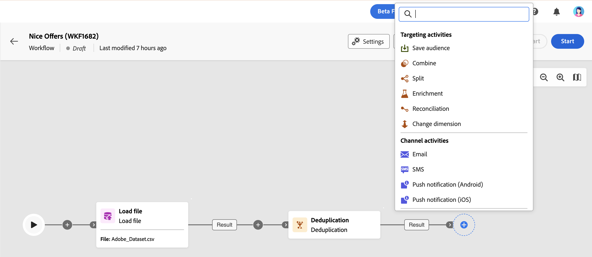

# 關於多步驟行銷活動活動 {#ms-campaign-activities}

多步驟行銷活動會分組為三個類別。 可用的活動可能會依據內容而有所不同。

以下各節會詳細介紹所有活動：

* [目標定位和資料管理活動](#targeting)
* [管道活動](#channel)
* [流量控制活動](#flow-control)

## 目標定位活動 {#targeting}

這些活動特定於定位。 這些活動可讓您使用交集、聯合或排除作業定義客群並分割或結合這些客群，從而建置一個或多個目標。

* [建立對象](build-audience.md)：定義您的目標母體。 您可以選取現有對象，或使用查詢建模器來定義您自己的查詢。
* [變更維度](change-dimension.md)：當您建置多步驟行銷活動時，請變更目標維度。
* [合併](combine.md)：對傳入母體執行分段。 您可以使用聯合、交集或排除。
* [重複資料刪除](deduplication.md)：刪除傳入活動結果中的重複專案。
* [擴充](enrichment.md)：定義要在您的多步驟行銷活動中處理的其他資料。 透過此活動，您可以利用傳入轉變並設定活動，以使用其他資料完成傳出轉變。
* [調解](reconciliation.md)：定義Journey Optimizer資料中的資料與工作表中的資料之間的連結，例如從外部檔案載入的資料。
* [儲存對象](save-audience.md)：更新現有的對象，或是從多步驟行銷活動中的母體運算上游建立新的對象。
* [分割](split.md)：將傳入母體分割成數個子集。

## 資料管理活動 {#data}

這些活動專門用於操控和豐富人口資料。

* [載入檔案](load-file.md)：使用儲存在外部檔案中的設定檔和資料。
* [更新資料](update-data.md)：對資料庫中的欄位執行大量更新。 數個選項可讓您個人化資料更新。

## 管道活動 {#channel}

Adobe Journey Optimizer可讓您跨多個管道自動執行行銷活動。 您可以將頻道活動結合到畫布中，以建立跨頻道多步驟行銷活動，其可根據客戶行為觸發動作。 以下&#x200B;**頻道**&#x200B;活動可供使用：電子郵件、簡訊、Android和iOS推播通知。 [瞭解如何在多步驟行銷活動的內容中設定傳遞](channels.md)。

## 流程控制活動 {#flow-control}

>[!CONTEXTUALHELP]
>id="ajo_orchestration_end"
>title="結束活動"
>abstract="**End**&#x200B;活動可讓您以圖形方式標示多步驟行銷活動的結尾。 此活動並不會造成任何功能性影響，因此為選用。"

以下活動專用於組織和執行多步驟行銷活動。 這些活動的主要任務是協調其他活動：

* [並加入](and-join.md)：同步多步驟行銷活動的多個執行分支。
* **結束**：以圖形方式標示多步驟行銷活動的結束。 此活動對功能沒有影響，因此是選用的
* [分支](fork.md)：建立出站轉變，以同時啟動多個活動。
* [排程器](scheduler.md)：排程多步驟行銷活動何時開始。
* [測試](test.md)：根據指定的條件啟用轉換。
* [等待](wait.md)：暫時暫停執行多步驟行銷活動的一部分。
