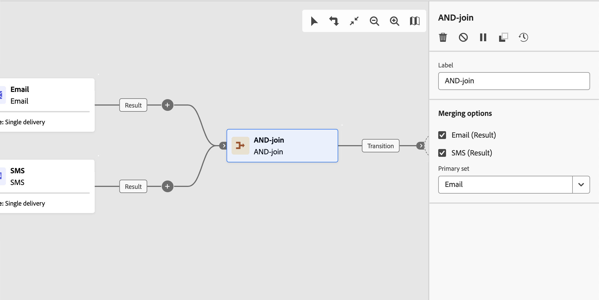
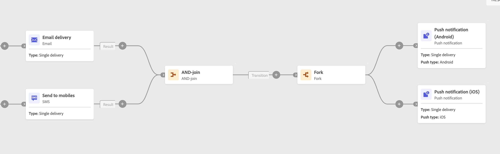

# 合併連結 {#join}

>[!CONTEXTUALHELP]
>id="ajo_orchestration_and-join"
>title="AND-join 活動"
>abstract="「**合併連結**」活動可讓您同步處理多步驟行銷活動的多個執行分支。一旦所有前面的活動皆已完成，即觸發此活動。這可讓您在確保特定活動已完成後，再繼續多步驟行銷活動。"

「**合併連結**」活動是一種&#x200B;**流程控制**&#x200B;活動。它可讓您同步多步驟行銷活動的多個執行分支。

此活動只會在所有傳入轉變啟動後，才會觸發其傳出轉變，換句話說，會在所有之前的活動完成後觸發。這可讓您在繼續執行多步驟行銷活動之前，確定特定活動已完成。

## 設定合併連結活動{#and-join-configuration}

>[!CONTEXTUALHELP]
>id="ajo_orchestration_and-join_merging"
>title="合併選項"
>abstract="選取您要參加的活動。在「**主要集合**」下拉選單中，選擇您要保留的傳入轉變群體。"

請按照以下步驟設定「**合併連結**」活動：

1. 新增多個活動，例如「管道」活動，以形成至少兩個不同的執行分支。
1. 新增「**合併連結**」活動至任何分支。
1. 在「**合併選項**」一節中，勾選您之前希望加入的所有活動。
1. 在「**主要集合**」下拉選單中，選擇您要保留的傳入轉變群體。傳出轉變只能包含其中一個傳入轉變群體。

## 範例{#and-join-example}

以下範例顯示兩個具有電子郵件和簡訊傳遞的多步驟行銷活動分支。 同時啟用兩個傳入轉變時，「合併連結」即會觸發。只有在兩個傳遞都完成後，接著才會傳送推播通知。

{zoomable="yes"}
