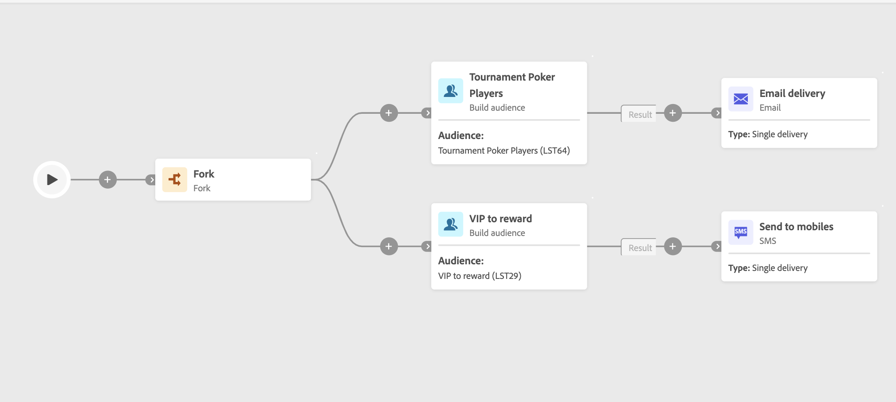

# 建置客群 {#build-audience}

>[!CONTEXTUALHELP]
>id="ajo_orchestration_build_audience"
>title="建置對象活動"
>abstract="**建立對象**&#x200B;活動可讓您定義將進入協調行銷活動的對象。 在協調的行銷活動內容中傳送訊息時，訊息對象未定義於頻道活動中，而是定義於&#x200B;**建立對象**&#x200B;活動中。"

身為行銷人員，您可以使用使用者易記的介面輕鬆建立複雜的查詢，讓我能根據廣泛的條件和行為來細分您的對象，以更有效率地量身打造您的行銷活動。

若要執行此動作，請使用&#x200B;**建置對象**&#x200B;目標定位活動。 此活動可讓您定義將進入協調行銷活動的對象。 在協調的行銷活動內容中傳送訊息時，訊息對象未定義於頻道活動中，而是定義於&#x200B;**建立對象**&#x200B;活動中。

若要定義客群群體，您可以：

* 選取現有對象。
* 選取預先定義的篩選器。
* 定義並結合篩選條件，以使用查詢模型工具建立新對象。

>[!NOTE]
>
>使用「建立對象」活動無法鎖定從檔案載入的對象。 若要這麼做，您必須先使用&#x200B;**載入檔案**&#x200B;活動，然後再使用&#x200B;**調解**&#x200B;活動。

## 設定建置對象活動 {#build-audience-configuration}

>[!CONTEXTUALHELP]
>id="ajo_orchestration_build_audience_audienceselector"
>title="客群"
>abstract="選取您的對象，與您設計新傳遞時使用對象的方式相同。"

請按照以下步驟設定「**建置客群**」活動：

1. 新增「**建置客群**」活動。
1. 定義標籤。
1. 定義客群類型：「**建立您自己的**」或是「**讀取客群**」。
1. 請依照下列標籤中詳述的步驟設定您的對象。

若要建立自己的查詢，請依照下列步驟進行：

1. 選取「**建立您自己的 (查詢)**」。
1. 選擇「**目標定位維度**」。目標市場選擇維度可讓您定義作業的目標群體：收件者、合約受益人、操作者、訂閱者等。預設情況下，會從收件者中選取目標。
1. 按一下&#x200B;**繼續**。
1. 使用查詢建模器來定義您的查詢。 [在本節中進一步瞭解查詢模型工具](../ms-query-modeler.md)

## 範例{#build-audience-examples}

以下是包含兩個&#x200B;**建立對象**&#x200B;活動的協調行銷活動範例。 第一個目標是撲克玩家客群，然後是電子郵件傳遞。第二個目標是 VIP 用戶端客群，然後是簡訊傳遞。

