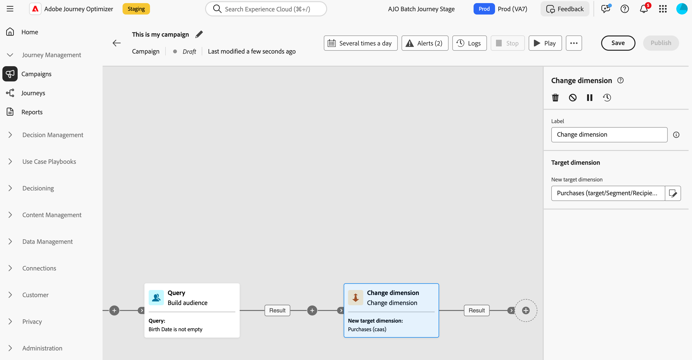

# 變更維度 {#change-dimension}

>[!CONTEXTUALHELP]
>id="ajo_orchestration_dimension_complement"
>title="產生補集"
>abstract="您可以使用剩餘族群 (其已因重複而排除) 產生額外的傳出轉變。若要這樣做，請開啟「**產生補集**」選項"

>[!CONTEXTUALHELP]
>id="ajo_orchestration_change_dimension"
>title="變更維度活動"
>abstract="此活動可讓您在建立對象時變更目標市場選擇維度。其會根據資料範本和輸入維度來移動軸。例如，您可以從「合約」維度切換到「用戶端」維度。"

行銷人員可以在協調的行銷活動中，將目標維度從一個實體切換至另一個連結的實體，並根據不同的資料集調整對象目標，例如從設定使用者到將其特定動作或預訂做為目標。

若要執行此動作，請使用&#x200B;**變更維度**&#x200B;目標定位活動。 此活動可讓您在建立協調的行銷活動時變更目標維度。 它會根據資料範本和輸入維度來移動軸。

例如，您可以將協調行銷活動的目標維度從「設定檔」切換為「合約」，以傳送訊息給目標合約所有者。

<!--
>[!IMPORTANT]
>
>Please note that the **[!UICONTROL Change Dimension]** and **[!UICONTROL Change Data source]** activities should not be added in one row. If you need to use both activities consecutively, make sure you include an **[!UICONTROL Enrichement]** activity in between them. This ensures proper execution and prevents potential conflicts or errors.-->

## 設定變更維度活動 {#configure}

請依照下列步驟設定&#x200B;**變更維度**&#x200B;活動：

1. 新增&#x200B;**變更維度**&#x200B;活動至您協調的行銷活動。

   

1. 定義&#x200B;**新目標維度**。 在維度變更期間，會保留所有記錄。

1. 執行協調的行銷活動以檢視結果。 比較變更維度活動前後表格中的資料，以及比較協調的行銷活動表格結構。

## 範例 {#example}

在此範例中，我們要傳送SMS傳送給已購買的所有設定檔。 若要這麼做，我們先使用連結至自訂「購買」目標維度的&#x200B;**[!UICONTROL 建立對象]**&#x200B;活動，以鎖定所有發生的購買。

然後使用&#x200B;**[!UICONTROL 變更維度]**&#x200B;活動，將協調的行銷活動目標維度切換為「收件者」。 這可讓我們鎖定符合查詢的收件者。

