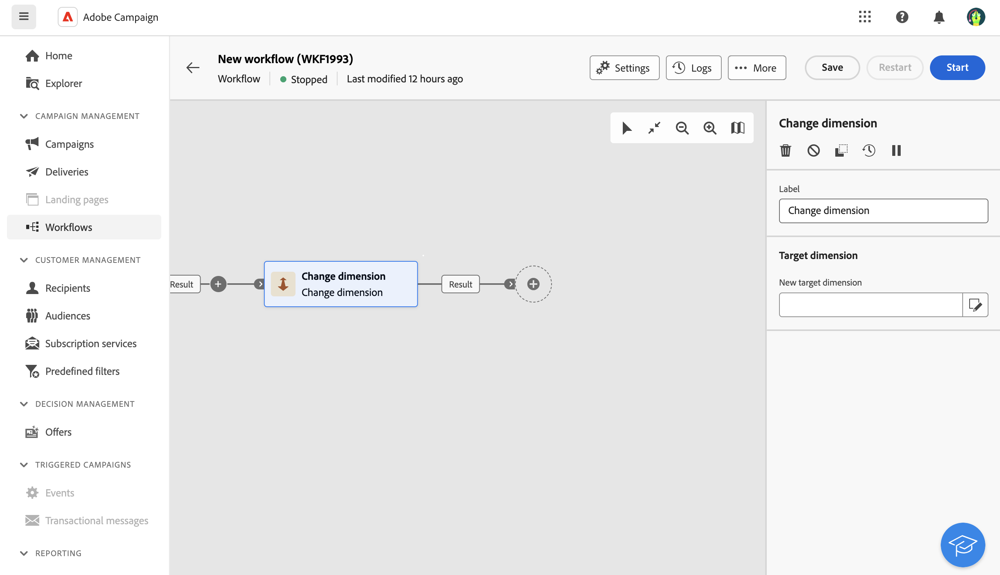
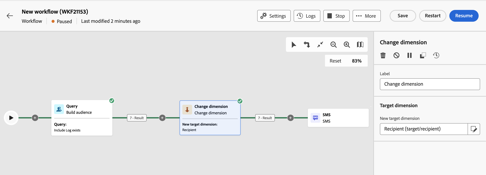

# 變更維度 {#change-dimension}

>[!CONTEXTUALHELP]
>id="ajo_orchestration_dimension_complement"
>title="產生補集"
>abstract="您可以使用剩餘族群 (其已因重複而排除) 產生額外的傳出轉變。若要這樣做，請開啟「**產生補集**」選項"

>[!CONTEXTUALHELP]
>id="ajo_orchestration_change_dimension"
>title="變更維度活動"
>abstract="此活動可讓您在建立對象時變更目標市場選擇維度。其會根據資料範本和輸入維度來移動軸。例如，您可以從「合約」維度切換到「用戶端」維度。"

**變更維度**&#x200B;活動是&#x200B;**鎖定目標**&#x200B;活動。 此活動可讓您在建置多步驟行銷活動時變更目標維度。 它會根據資料範本和輸入維度來移動軸。

例如，您可以將多步驟行銷活動的目標維度從「收件者」切換為「訂閱者應用程式」，以傳送推播通知給目標收件者。

>[!IMPORTANT]
>
>請注意，不應將&#x200B;**[!UICONTROL 變更維度]**&#x200B;和&#x200B;**[!UICONTROL 變更資料來源]**&#x200B;活動新增到一列。 如果您需要連續使用這兩個活動，請務必在它們之間包含&#x200B;**[!UICONTROL 擴充]**&#x200B;活動。 這可確保正確執行並防止潛在的衝突或錯誤。

## 設定變更維度活動 {#configure}

請依照下列步驟設定&#x200B;**變更維度**&#x200B;活動：

1. 新增&#x200B;**變更維度**&#x200B;活動至您的多步驟行銷活動。

   

1. 定義&#x200B;**新目標維度**。 在維度變更期間，會保留所有記錄。 尚未提供其他選項。

1. 執行多步驟行銷活動以檢視結果。 比較變更維度活動前後表格中的資料，並比較多步驟行銷活動表格的結構。

## 範例 {#example}

在此範例中，我們要傳送SMS傳送給已購買的所有設定檔。 若要這麼做，我們先使用連結至自訂「購買」目標維度的&#x200B;**[!UICONTROL 建立對象]**&#x200B;活動，以鎖定所有發生的購買。

然後使用&#x200B;**[!UICONTROL 變更維度]**&#x200B;活動，將多步驟行銷活動目標維度切換為「收件者」。 這可讓我們鎖定符合查詢的收件者。

