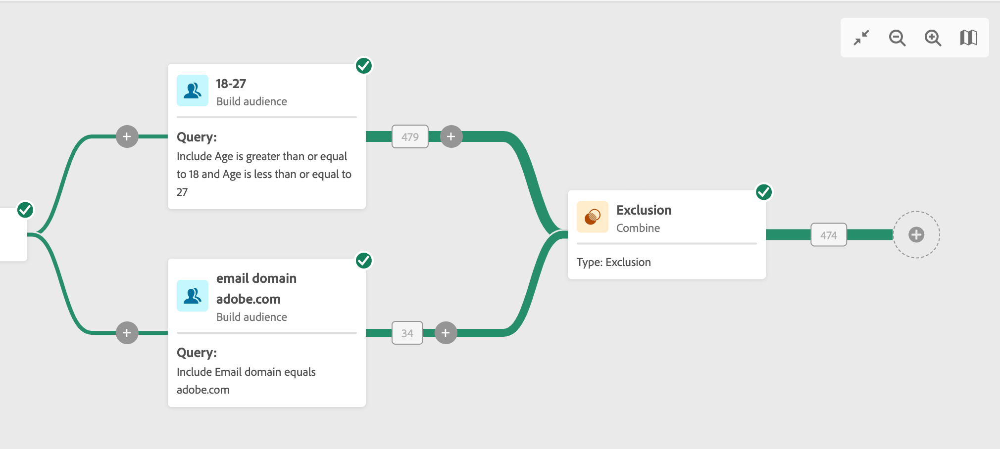

# 合併 {#combine}

>[!CONTEXTUALHELP]
>id="ajo_orchestration_combine"
>title="組合活動"
>abstract="「**組合**」活動可讓您對傳入群體執行分段。您因此可以組合好幾個群體、排除其中的一部分或僅保留幾個目標通用資料。"

**合併**&#x200B;活動是&#x200B;**鎖定目標**&#x200B;活動。 此活動則可讓您對傳入群體執行分段。您因此可以組合好幾個群體、排除其中的一部分或僅保留幾個目標通用資料。以下是可用的分段類型：

<!--
The **Combine** activity can be placed after any other activity, but not at the beginning of the workflow. Any activity can be placed after the **Combine**.
-->

* 「**聯合**」可讓您將多個活動的結果重新分組至單一目標。
* 「**交集**」活動可讓您僅保留活動中不同傳入群體的通用元素。
* 「**排除**」讓您根據特定條件排除一個群體中的元素。

## 設定合併活動 {#combine-configuration}

>[!CONTEXTUALHELP]
>id="ajo_orchestration_intersection_merging_options"
>title="交集合併選項"
>abstract="交集讓您僅保留活動中不同輸入群體的通用元素。在「要加入的集合」區段中，勾選您之前希望加入的所有活動。"

>[!CONTEXTUALHELP]
>id="ajo_orchestration_exclusion_merging_options"
>title="排除合併選項"
>abstract="「排除」讓您根據特定條件排除一個群體中的元素。在「要加入的集合」區段中，勾選您之前希望加入的所有活動。"

>[!CONTEXTUALHELP]
>id="ajo_orchestration_combine_options"
>title="選取分段類型"
>abstract="選取如何結合對象。「**聯合**」讓您將多個活動的結果重新組合成單一目標。「**交集**」讓您僅保留活動中不同輸入群體的通用元素。「**排除**」讓您根據特定條件排除一個群體中的元素。 "

請按照以下常見步驟開始設定「**組合**」活動：

1. 新增多個活動，例如「**建置客群**」活動，以形成至少兩個不同的執行分支。
1. 對上述的任一個分支新增「**組合**」活動。
1. 選取分段類型：[聯合](#union)、[交集](#intersection)或是[排除](#exclusion)。
1. 按一下&#x200B;**繼續**。
1. 在「**要加入的集合**」一節中，勾選您之前希望加入的所有活動。

## 聯合 {#combine-union}

>[!CONTEXTUALHELP]
>id="ajo_orchestration_combine_reconciliation"
>title="調和選項"
>abstract="選取「**調和類型**」，以定義處理重複項目的方式。「**金鑰**」選項預設為啟用，表示當來自不同輸入轉變的元素具有相同金鑰時，活動僅保留一個元素。使用「**欄的選取範圍**」選項來定義已套用資料調和的欄清單。"

在&#x200B;**合併**&#x200B;活動中，您可以設定&#x200B;**聯合**。 為此，您需要選取&#x200B;**調解型別**&#x200B;以定義如何處理重複專案：

* **僅限索引鍵**：這是預設模式。當來自不同入站轉變的元素具有相同索引鍵時，活動只會保留一個元素。如果入站群體是同質的，則只能使用此選項。
* **選取的欄**：選取此選項可定義套用資料協調的欄清單。 首先，必須選取主要集合 (其中包含來源資料)，然後指定用於加入的欄。

## 交集 {#combine-intersection}

>[!CONTEXTUALHELP]
>id="ajo_orchestration_intersection_reconciliation_options"
>title="交集調和選項"
>abstract="選取「**調和類型**」，以定義處理重複項目的方式。「**金鑰**」選項預設為啟用，表示當來自不同輸入轉變的元素具有相同金鑰時，活動僅保留一個元素。使用「**欄的選取範圍**」選項來定義已套用資料調和的欄清單。"

在&#x200B;**組合**&#x200B;活動中，您可以設定&#x200B;**交集**。 為此，您需要遵循以下額外步驟：

1. 選取「**調節類型**」，以定義處理重複項目的方式。請參閱[聯合](#union)一節。
1. 如果您希望處理剩餘的群體，可勾選「**產生補集**」選項。此補集會包含所有傳入活動減去交集的聯合結果。然後，額外的傳出轉變會新增到活動中。

## 排除 {#combine-exclusion}

>[!CONTEXTUALHELP]
>id="ajo_orchestration_exclusion_options"
>title="排除規則"
>abstract="如有必要，您可以操控傳入表格。事實上，若要從另一個維度排除目標，必須將此目標傳回主要目標的同一目標市場選擇維度。為了進行此步驟，請按一下「排除規則」一節中的「新增規則」，並指定維度變更條件。資料調和會透過屬性或加入執行。"

>[!CONTEXTUALHELP]
>id="ajo_orchestration_combine_sets"
>title="選取要組合的集合"
>abstract="在「**要加入的集合**」一節中，從傳入轉變中選取「**主要集合**」。這是從中排除元素的集。其他集會先設定相符的元素，然後才會從主要集予以排除。"

>[!CONTEXTUALHELP]
>id="ajo_orchestration_combine_exclusion"
>title="排除規則"
>abstract="如有必要，您可以操控傳入表格。事實上，若要從另一個維度排除目標，必須將此目標傳回主要目標的同一目標市場選擇維度。為了進行此步驟，請按一下「排除規則」一節中的「新增規則」，並指定維度變更條件。資料調和會透過屬性或加入執行。"

>[!CONTEXTUALHELP]
>id="ajo_orchestration_combine_complement"
>title="合併產生補集"
>abstract="切換開啟「產生補集」選項，在額外轉變中處理其餘的群體。"

在&#x200B;**合併**&#x200B;活動中，您可以設定&#x200B;**排除專案**。 為此，您需要遵循以下額外步驟：

1. 在「**要加入的集合**」一節中，從傳入轉變中選取「**主要集合**」。這是從中排除元素的集。其他集會先設定相符的元素，然後才會從主要集予以排除。
1. 如有必要，您可以操控傳入表格。事實上，若要從另一個維度排除目標，必須將此目標傳回主要目標的同一目標市場選擇維度。為了進行此步驟，請按一下「**排除規則**」一節中的「**新增規則**」，並指定維度變更條件。資料調和會透過屬性或加入執行。
1. 如果您希望處理剩餘的群體，可勾選「**產生補集**」選項。請參閱[交集](#intersection)一節。

## 範例{#combine-examples}

在下列範例中，我們使用&#x200B;**組合**&#x200B;活動，並新增&#x200B;**聯合**&#x200B;以擷取兩個查詢的所有設定檔：18至27歲的人以及34至40歲的人。

以下範例會顯示兩個查詢活動之間的&#x200B;**交集**。在這裡會將它用於擷取年齡在 18 至 27 歲之間且已提供其電子郵件地址的輪廓。

以下「**排除**」範例會顯示兩個查詢，設定為篩選年齡在 18 歲至 27 歲之間且擁有 Adobe 電子郵件網域的輪廓。然後從第一個集合中排除包含 Adobe 電子郵件地址網域的輪廓。

