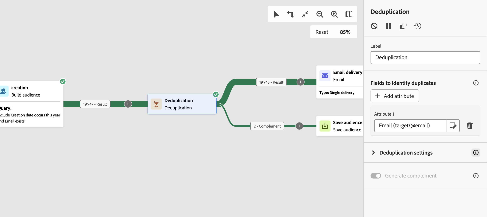

# 重複資料刪除 {#deduplication}

>[!CONTEXTUALHELP]
>id="ajo_orchestration_deduplication_fields"
>title="用於識別重複資料的欄位"
>abstract="在&#x200B;**&#x200B;用於識別重複資料的欄位&#x200B;**&#x200B;區段，按一下&#x200B;**&#x200B;新增屬性**&#x200B;按鈕以指定可允許識別重複資料之相同值的欄位，例如：電子郵件地址、名字、姓氏等。欄位的順序可讓您指定首要處理的條件。"

>[!CONTEXTUALHELP]
>id="ajo_orchestration_deduplication"
>title="重複資料刪除活動"
>abstract="「**重複資料刪除**」活動可讓您刪除傳入活動結果中的重複資料。其主要在目標市場選擇活動之後和允許使用目標資料的活動之前使用。"

>[!CONTEXTUALHELP]
>id="ajo_orchestration_deduplication_complement"
>title="產生補集"
>abstract="您可以使用剩餘族群 (其已因重複而排除) 產生額外的傳出轉變。若要這樣做，請開啟「**產生補集**」選項"

>[!CONTEXTUALHELP]
>id="ajo_orchestration_deduplication_settings"
>title="重複項目刪除設定"
>abstract="若要刪除傳入資料中的重複項目，請在以下欄位中定義重複項目刪除方法。預設只會保留一筆記錄。您還應該根據運算式或屬性選取重複項目刪除模式。預設會隨機選取要避免重複的記錄。"

**重複資料刪除**&#x200B;活動是&#x200B;**鎖定目標**&#x200B;活動。 This activity allows you to delete duplicates in the result(s) of the inbound activities, for example duplicated profiles in the recipient list. The **Deduplication** activity is generally used following targeting activities, and before activities that allow the use of targeted data.

## 設定重複資料刪除活動{#deduplication-configuration}

請依照下列步驟設定&#x200B;**重複資料刪除**&#x200B;活動：

1. Add a **Deduplication** activity to your orchestrated campaign.

1. 在&#x200B;**&#x200B;用於識別重複資料的欄位&#x200B;**&#x200B;區段，按一下&#x200B;**&#x200B;新增屬性**&#x200B;按鈕以指定可允許識別重複資料之相同值的欄位，例如：電子郵件地址、名字、姓氏等。欄位的順序可讓您指定首要處理的條件。

1. 在&#x200B;**重複資料刪除設定**&#x200B;區段中，選取要保留的不重複&#x200B;**重複專案數目**。 此欄位的預設值為 1。如果值為 0 則可讓您保留所有重複項目。

   例如，如果記錄 A 和 B 被視為記錄 Y 的重複項目，而記錄 C 被視為記錄 Z 的重複項目：

   * 如果該欄位的值為 1：僅保留 Y 和 Z 記錄。
   * 如果該欄位的值為 0：會保留所有記錄。
   * 如果該欄位的值為 2：會保留記錄 C 和 Z，並且將保留 A、B 和 Y 中的兩條記錄，這是偶然的或取決於之後所選取的重複資料刪除方法。

1. 選取要使用的&#x200B;**重複資料刪除方法**：

   * **Random selection**: Randomly selects the record to be kept out of the duplicates.
   * **Using an expression**: Keep the records in which the value of the expression entered is the smallest or the biggest.
   * **Non-empty values**: Keep the records for which the expression is not empty.
   * **Following a list of values**: Define a value priority for one or more fields. To define the values, click **Attribute** to select a field or create an expression, then add the value(s) into the appropriate table. To define a new field, click the **Add button** located above the list of values.

1. Check the **Generate complement** option if you wish to exploit the remaining population. 補充包含所有重複專案。 An additional transition will then be added to the activity.

## 範例{#deduplication-example}

在下列範例中，使用重複資料刪除活動，在傳送傳遞之前從目標中排除重複專案。 識別的重複設定檔會新增到專用受眾，必要時可重複使用。 選擇&#x200B;**電子郵件**&#x200B;地址以識別重複專案。 保留1個專案，並選取&#x200B;**隨機**&#x200B;重複資料刪除方法。

