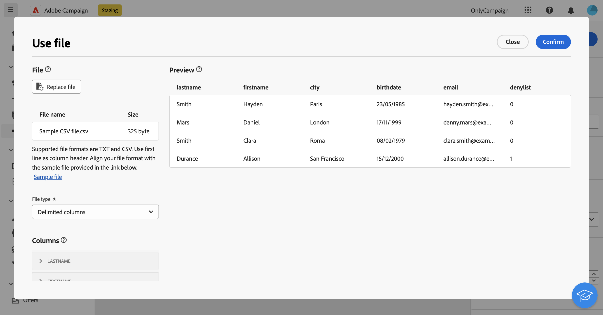
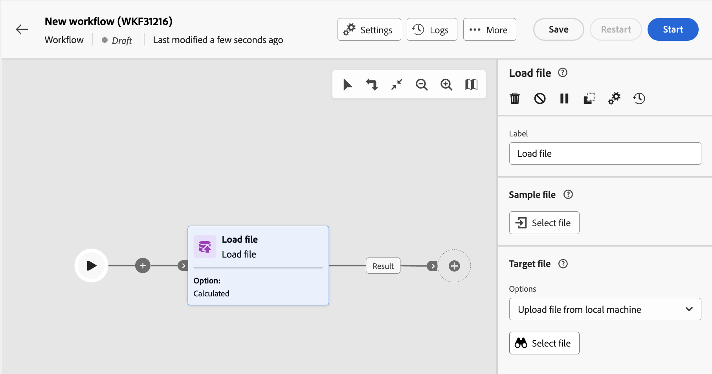

# 載入檔案 {#load-file}

>[!CONTEXTUALHELP]
>id="ajo_orchestration_loadfile"
>title="載入檔案活動"
>abstract="**載入檔案**&#x200B;活動為&#x200B;**資料管理**&#x200B;活動。使用此活動可以處理儲存在外部檔案中的資料。設定檔和資料不會新增到資料庫中，但輸入檔中的所有欄位皆可用於個人化，或用於更新設定檔或任何其他表格。 "

>[!CONTEXTUALHELP]
>id="ajo_orchestration_loadfile_outboundtransition"
>title="拒絕管理傳出轉變"
>abstract="拒絕管理傳出轉變"

>[!CONTEXTUALHELP]
>id="ajo_orchestration_loadfile_outboundtransition_reject"
>title="拒絕管理拒絕的傳出轉變"
>abstract="拒絕管理拒絕的傳出轉變"

**載入檔案**&#x200B;活動為&#x200B;**資料管理**&#x200B;活動。使用此活動來處理儲存在外部檔案中的設定檔和資料。 設定檔和資料不會新增到資料庫中，但輸入檔中的所有欄位皆可用於個人化，或用於更新設定檔或任何其他表格。

>[!NOTE]
>支援的檔案格式包括：文字 (TXT) 和逗號分隔值 (CSV)。您可以載入大小上限為50MB的檔案。

此活動可與[調解](reconciliation.md)活動搭配使用，以將未識別的資料連結至現有資源。 例如，如果您將非標準資料匯入資料庫中，**載入檔案**&#x200B;活動可以放在&#x200B;**調解**&#x200B;活動之前。

## 設定載入檔案活動 {#load-configuration}

**載入檔案**&#x200B;活動組態包含兩個步驟。 首先，您需要透過上傳範例檔案來定義預期的檔案結構。完成此操作後，您可以指定要匯入其資料的檔案原點。 請依照下列步驟設定活動。

### 設定範例檔案 {#sample}

>[!CONTEXTUALHELP]
>id="ajo_orchestration_loadfile_samplefile"
>title="範例檔案"
>abstract="透過上傳範例檔案來選取所需的檔案結構。"

>[!CONTEXTUALHELP]
>id="ajo_orchestration_loadfile_formatting"
>title="載入檔案活動的格式化"
>abstract="在「**格式化**」區段中，指定檔案設定格式的方式，以確保可正確匯入該資料。"

>[!CONTEXTUALHELP]
>id="ajo_orchestration_loadfile_valueremapping"
>title="載入檔案活動的值重新對應"
>abstract="使用此選項可將載入檔案中的特定值與新值相對應。例如，如果欄包含「True」/「False」值，您可以新增對應以自動將這些值取代為「0」/「1」字元。"

請依照下列步驟，設定用來定義預期檔案結構的範例檔案：

1. 新增&#x200B;**載入檔案**&#x200B;活動至您協調的行銷活動。

1. 選取要用來定義預期檔案結構的範例檔案。 若要這麼做，請按一下&#x200B;**[!UICONTROL 範例檔案]**&#x200B;區段中的&#x200B;**選取檔案**&#x200B;按鈕，並選取要使用的本機檔案。

1. 此時會顯示範例檔案的預覽，最多顯示30行。

1. 在&#x200B;**[!UICONTROL 檔案型別]**&#x200B;下拉式清單中，指定檔案是使用分隔欄還是固定寬度欄。

   

1. 對於分隔欄檔案型別，請使用&#x200B;**欄**&#x200B;區段來設定每個欄的屬性。

   +++檔案欄的可用選項

   * **[!UICONTROL 標籤]**：要針對資料行顯示的標籤。
   * **[!UICONTROL 資料型別]**：資料行中包含的資料型別。
   * **[!UICONTROL 寬度]** （字串資料型別）：欄中可顯示的最大字元數。
   * **[!UICONTROL 資料轉換]** （字串資料型別）：將轉換套用至資料行中包含的值。
   * **[!UICONTROL 空白字元管理]** （字串資料型別）：指定如何管理資料行中包含的空格。
   * **[!UICONTROL 分隔符號]** （日期、時間、整數和數字資料型別）*：指定要做為分隔符號使用的字元。
   * **[!UICONTROL 允許NULL]**：指定如何管理資料行中的空白值。
   * **[!UICONTROL 處理]**&#x200B;時發生錯誤（字串資料型別）：請指定其中一行發生錯誤時的行為。
   * **[!UICONTROL 值重新對應]**：此選項可讓您將特定值與新值對應。 例如，如果欄包含「True」/「False」值，您可以新增對應以自動將這些值取代為「0」/「1」字元。

+++

1. 在「**格式化**」區段中，指定檔案設定格式的方式，以確保可正確匯入該資料。

### 定義要上傳的目標檔案 {#target}

>[!CONTEXTUALHELP]
>id="ajo_orchestration_loadfile_targetfile"
>title="載入檔案活動的目標檔案"
>abstract="在「**[!UICONTROL 目標檔案]**」區段中，指定如何擷取要上傳到伺服器上的檔案。"

>[!CONTEXTUALHELP]
>id="ajo_orchestration_loadfile_nameofthefile"
>title="檔案名稱"
>abstract="指定要上傳到伺服器上的欄位名稱。按一下「**[!UICONTROL 開啟個人化對話框]**」圖示以利用運算式編輯器 (包含事件變數) 來計算檔案名稱。"

>[!CONTEXTUALHELP]
>id="ajo_orchestration_loadfile_targetdb"
>title="目標資料庫"
>abstract="如果您正在存取已設定的「**[!UICONTROL 載入檔案]**」活動，則在您已設定將檔案上傳至外部資料庫的活動時，有其他「**[!UICONTROL 目標資料庫]**」區段可用。"

>[!CONTEXTUALHELP]
>id="ajo_orchestration_loadfile_command"
>title="載入檔案命令"
>abstract="允許任意命令進行預處理是一個安全性問題，停用安全選項 XtkSecurity_Disable_Preproc 以強制使用預先定義的命令清單。"

>[!CAUTION]
>
>在載入目標檔案之前，請確定它符合範例檔案格式。 檔案格式、欄結構或欄數的任何差異都可能導致在協調的行銷活動執行期間發生錯誤。

若要定義要上傳的目標檔案，請執行下列步驟：

1. 在&#x200B;**[!UICONTROL 目標檔案]**&#x200B;區段中，指定擷取要在伺服器上載的檔案時要執行的動作。

   * **[!UICONTROL 從本機電腦上傳檔案]**：選取要從您的電腦上傳的檔案。

   * **[!UICONTROL 已在轉變中指定]**：上傳從先前活動（例如&#x200B;**[!UICONTROL 傳輸檔案]**）即將到來的入站轉變中指定的檔案。

   * **[!UICONTROL 預先處理檔案]**：上傳在上一個轉換中指定的檔案，並套用預先處理命令至該檔案，例如&#x200B;**[!UICONTROL 解壓縮]**&#x200B;或&#x200B;**[!UICONTROL 解密]**。

   * **[!UICONTROL 已計算]**：上傳在&#x200B;**[!UICONTROL 檔案名稱]**&#x200B;欄位中指定的檔案。 按一下「**[!UICONTROL 開啟個人化對話框]**」圖示以利用運算式編輯器 (包含事件變數) 來計算檔案名稱。

   

   >[!NOTE]
   >
   >如果您正在存取已設定的&#x200B;**[!UICONTROL 載入檔案]**&#x200B;活動，如果您已將活動設定為上傳檔案至外部資料庫，則會顯示額外的&#x200B;**[!UICONTROL 目標資料庫]**&#x200B;區段。 它可讓您指定要將檔案上傳至Campaign伺服器或外部資料庫。

### 其他選項 {#options}

>[!CONTEXTUALHELP]
>id="ajo_orchestration_loadfile_rejectmgt"
>title="拒絕載入檔案活動的管理"
>abstract="在「**拒絕管理**」區段中，指定活動在發生錯誤時應有的行為。您可以定義允許的最大錯誤數，並切換「**[!UICONTROL 將拒絕保留在檔案中]**」選項以在伺服器上下載包含匯入期間發生之錯誤的檔案。"

>[!CONTEXTUALHELP]
>id="ajo_orchestration_loadfile_delete"
>title="匯入後刪除檔案"
>abstract="切換「**匯入後刪除檔案**」在匯入檔案後，從伺服器刪除原始檔案。"

1. 在&#x200B;**拒絕管理**&#x200B;區段中，指定活動在發生錯誤時的行為方式：

   * 在&#x200B;**[!UICONTROL 允許的錯誤數]**&#x200B;欄位中，指定處理要載入的檔案時授權的錯誤數上限。 例如，如果該值設為「20」，則載入檔案時若發生超過20個錯誤，協調的行銷活動執行將會失敗。

   * 若要保留載入檔案時發生的錯誤，請開啟&#x200B;**[!UICONTROL 保留檔案中的拒絕]**&#x200B;選項，並在&#x200B;**[!UICONTROL 拒絕檔案]**&#x200B;欄位中指定檔案的所要名稱。

     啟用此選項後，會在活動後新增一個名為「補充」的額外輸出轉變。 匯入期間發生的任何錯誤都會儲存在伺服器上指定的檔案中。

1. 若要在執行協調的行銷活動後，從伺服器刪除上傳的檔案，請切換&#x200B;**[!UICONTROL 匯入後刪除檔案]**&#x200B;選項。

   

1. 當設定正確時，按一下「**確認**」。

## 範例 {#load-example}

[此區段](reconciliation.md#reconciliation-example)中有與&#x200B;**調解**&#x200B;活動搭配使用的外部檔案載入範例。
