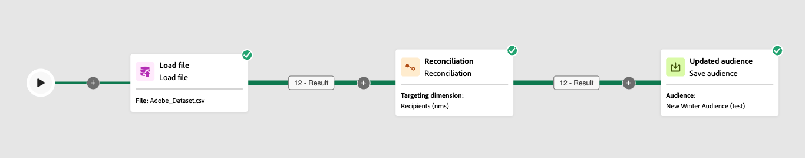

# 調和 {#reconciliation}

>[!CONTEXTUALHELP]
>id="ajo_orchestration_reconciliation"
>title="調和活動"
>abstract="「**調和**」活動是&#x200B;**目標定位**&#x200B;活動，可讓您定義 Adobe Journey Optimizer 和工作表資料之間的連結。"

>[!CONTEXTUALHELP]
>id="ajo_orchestration_reconciliation_field"
>title="調和選取欄位"
>abstract="調和選取欄位"

>[!CONTEXTUALHELP]
>id="ajo_orchestration_reconciliation_condition"
>title="調和建立條件"
>abstract="調和建立條件"

>[!CONTEXTUALHELP]
>id="ajo_orchestration_reconciliation_complement"
>title="調和產生補集"
>abstract="調和產生補集"

**調解**&#x200B;活動是&#x200B;**鎖定目標**&#x200B;活動，可讓您定義Adobe Journey Optimizer中的資料與工作表中的資料之間的連結，例如從外部檔案載入的資料。

## 最佳作法 {#reconciliation-best-practices}

雖然&#x200B;**擴充**&#x200B;活動可讓您定義要在多步驟行銷活動中處理的其他資料（您可以使用&#x200B;**擴充**&#x200B;活動來合併來自多組資料，或建立臨時資源的連結），但&#x200B;**調解**&#x200B;活動可讓您將未識別的資料連結到現有資源。

>[!NOTE]
>調解作業表示連結維度的資料已在資料庫中。  例如，如果您匯入購買檔案，顯示何時購買了哪些產品、哪個客戶等，則產品和客戶必須已存在於資料庫中。

## 設定調和活動 {#reconciliation-configuration}

>[!CONTEXTUALHELP]
>id="ajo_orchestration_reconciliation_targeting"
>title="目標市場選擇維度"
>abstract="選取新的目標市場選擇維度。維度可讓您定義目標群體：收件者、應用程式訂閱者、操作者、訂閱者等。預設會選取目前的目標市場選擇維度。"

>[!CONTEXTUALHELP]
>id="ajo_orchestration_reconciliation_rules"
>title="調和規則"
>abstract="選取用於重複資料刪除的調和規則。若要使用屬性，請選取&#x200B;**簡單屬性**&#x200B;選項，然後選擇來源欄位和目的地欄位。若要使用查詢建模工具建立您自己的調和條件，請選取&#x200B;**進階調和條件**&#x200B;選項。"
>additional-url="https://experienceleague.adobe.com/zh-hant/docs/campaign-web/v8/query-database/query-modeler-overview" text="使用查詢建模工具"

>[!CONTEXTUALHELP]
>id="ajo_orchestration_reconciliation_targeting_selection"
>title="選取目標市場選擇維度"
>abstract="選取要調和之輸入資料的目標市場選擇維度。"
>additional-url="https://experienceleague.adobe.com/docs/campaign-web/v8/audiences/gs-audiences-recipients.html?#targeting-dimensions" text="目標市場選擇維度"

>[!CONTEXTUALHELP]
>id="ajo_orchestration_keep_unreconciled_data"
>title="保留未調和的資料"
>abstract="依預設，未調和的資料保留在傳出轉變中，並可在工作表中供未來使用。若要移除未調和的資料，請停用「**保留未調和的資料**」選項。"

>[!CONTEXTUALHELP]
>id="ajo_orchestration_reconciliation_attribute"
>title="調和屬性"
>abstract="選取用於調和資料的屬性，然後按一下「確認」。"

請依照下列步驟設定&#x200B;**調解**&#x200B;活動：

1. 將&#x200B;**調解**&#x200B;活動新增至您的多步驟行銷活動。

1. 選取新的目標市場選擇維度。維度可讓您定義目標母體：收件者、應用程式訂閱者、操作者、訂閱者等。

1. 選取要用於調解的欄位。 您可以使用一個或多個調和標準。

   1. 若要使用屬性來調解資料，請選取&#x200B;**簡單屬性**&#x200B;選項。 **Source**&#x200B;欄位會列出輸入轉變中可供調解的欄位。 **目的地**&#x200B;欄位對應到所選目標維度的欄位。 當來源和目的地相等時，資料就會進行協調。 例如，選取&#x200B;**電子郵件**&#x200B;欄位，以根據設定檔的電子郵件地址刪除重複設定檔。

      若要新增其他調解條件，請按一下&#x200B;**新增規則**&#x200B;按鈕。 如果指定了多個連線條件，則必須全部驗證這些條件，才能將資料連結在一起。

      

   1. 若要使用其他屬性來調解資料，請選取&#x200B;**進階調解條件**&#x200B;選項。 然後，您可以使用查詢建模器建立自己的調解條件。

1. 您可以使用&#x200B;**建立篩選器**&#x200B;按鈕來篩選要調解的資料。 這可讓您使用查詢建模器建立自訂條件。

依預設，未調解的資料會保留在出站轉變中，並可在工作表中供未來使用。 若要移除未調和的資料，請停用「**保留未調和的資料**」選項。

## 範例 {#reconciliation-example}

下列範例會示範多步驟行銷活動，其會直接從包含新客戶之匯入檔案建立設定檔對象。 它由下列活動組成：

多步驟行銷活動的設計如下：




它是透過以下活動建置：

* [載入檔案](load-file.md)活動會上傳包含從外部工具擷取之輪廓資料的檔案。

  例如：

  ```
  lastname;firstname;email;birthdate;
  JACKMAN;Megan;megan.jackman@testmail.com;07/08/1975;
  PHILLIPS;Edward;phillips@testmail.com;09/03/1986;
  WEAVER;Justin;justin_w@testmail.com;11/15/1990;
  MARTIN;Babe;babeth_martin@testmail.net;11/25/1964;
  REESE;Richard;rreese@testmail.com;02/08/1987;
  ```

* 使用&#x200B;**電子郵件**&#x200B;和&#x200B;**出生日期**&#x200B;欄位作為調解條件，將傳入資料識別為設定檔的&#x200B;**調解**&#x200B;活動。

  

* [儲存對象](save-audience.md)活動，以根據這些更新建立新的對象。 如果您不需要建立或更新特定對象，您也可以以&#x200B;**結束**&#x200B;活動取代&#x200B;**儲存對象**&#x200B;活動。 收件者設定檔會在您執行多步驟行銷活動時更新。
