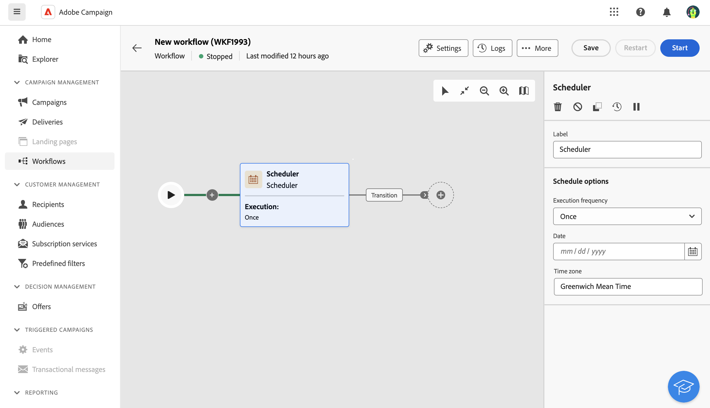
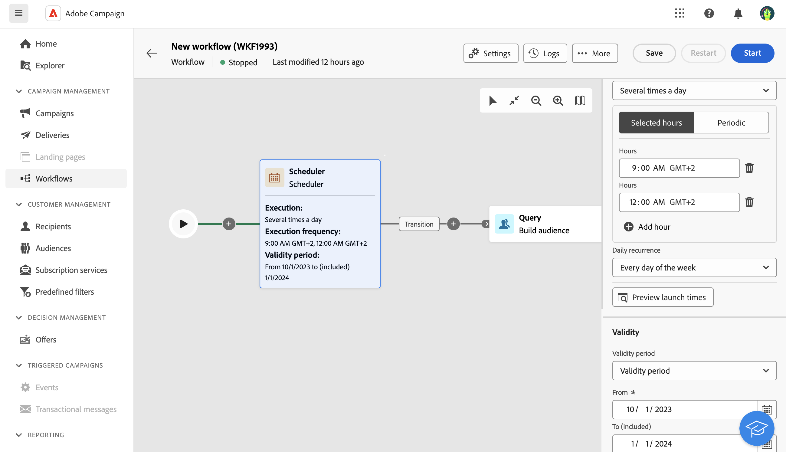

# 排程器 {#scheduler}

>[!CONTEXTUALHELP]
>id="ajo_orchestration_scheduler"
>title="排程器活動"
>abstract="**排程器**&#x200B;活動可讓您排程何時開始協調的行銷活動。 此活動應視為已排程的開始。它只能用作已協調行銷活動的第一個活動。"

**排程器**&#x200B;活動是&#x200B;**流程控制**&#x200B;活動。 它可讓您排程何時開始協調的行銷活動。 此活動應視為已排程的開始。它只能用作已協調行銷活動的第一個活動。

## 最佳作法{#scheduler-best-practices}

* 請勿將精心安排的行銷活動排程為超過每15分鐘執行一次，因為它可能會阻礙整體系統效能並在資料庫中建立區塊。
* 如果您想要在協調的行銷活動中傳送單次傳遞，可以新增排程器活動，並將其設定為執行&#x200B;**一次**。 您也可以在傳遞的設定中定義&#x200B;**排程**。
* 如果您想要在協調的行銷活動中傳送循環傳遞，您需要使用&#x200B;**排程器**&#x200B;活動並設定執行頻率。 循環傳遞活動不允許您定義排程。

## 設定排程器活動 {#scheduler-configuration}

>[!CONTEXTUALHELP]
>id="ajo_orchestration_schedule_validity"
>title="排程器有效性"
>abstract="您可以定義排程器的有效期限。它可以是永久的 (預設)，也可以在特定日期之前有效。"

>[!CONTEXTUALHELP]
>id="ajo_orchestration_schedule_options"
>title="排程器選項"
>abstract="定義排程器的頻率。它可以在特定時刻執行，可每天、每週或每月執行一次或多次。"

請依照下列步驟設定&#x200B;**排程器**&#x200B;活動：

1. 將&#x200B;**排程器**&#x200B;活動新增至您協調的行銷活動。

1. 設定&#x200B;**執行頻率**：

   * **一次**：協調的行銷活動只執行一次。

   * **每日**：協調的行銷活動在特定時間執行，一天一次。

   * **Several times a day:** the orchestrated campaign is regularly executed several times a day. 您可以設定在特定時間或定期執行。

   * **Weekly**: the orchestrated campaign is executed at a specified moment, once or several times a week.

   * **每月**：協調的行銷活動會在指定的時間執行，每月執行一或數次。 當您需要執行協調的行銷活動時，可以選取月份。 您也可以在月份的指定週日（例如，當月的第二個星期二）設定執行。

1. 根據所選頻率定義執行詳細資訊。詳細欄位可能會依使用的頻率（時間、重複頻率、指定天數等）而有所不同。

1. 按一下&#x200B;**預覽啟動時間**&#x200B;以檢查您協調行銷活動接下來十個執行的排程。

1. 定義排程器的有效期間：

   * **永久（永不過期）**：根據指定的頻率執行協調的行銷活動，對時間範圍或反複專案數沒有任何限制。

   * **有效期間**：協調的行銷活動會根據指定的頻率執行，直到特定日期為止。 您必須指定開始和結束日期。

>[!NOTE]
>
>If you want to start the orchestrated campaign right away, you can click the **Execute pending task** in the scheduler&#39;s top action bar. This button is only available when you have started the orchestrated campaign.

## 範例{#scheduler-example}

在下列範例中，活動已設定為讓協調的行銷活動在每日早上9點和12點執行數次，從2025年10月1日到2026年1月1日的每週每一天。

