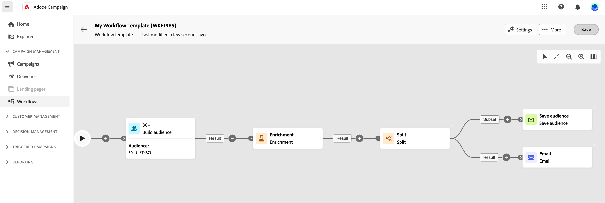

# 建立協調行銷活動 {#create-first-campaign}

>[!CONTEXTUALHELP]
>id="ajo_campaign_creation_workflow"
>title="多步驟行銷活動清單"
>abstract="**多重步驟**&#x200B;索引標籤會列出所有多重步驟行銷活動。 按一下多步驟行銷活動的名稱以進行編輯。 使用&#x200B;**建立多步驟行銷活動**&#x200B;按鈕以新增新的多步驟行銷活動。"

## 先決條件

### 權限

### 設定

新管理員設定>結構描述、執行欄位、合併原則的概觀。 [了解更多](ms-schemas.md)

## 建立步驟

若要建立多步驟行銷活動，請遵循下列步驟：

1. 若要建立&#x200B;**多步驟行銷活動**，請瀏覽至&#x200B;**行銷活動**&#x200B;功能表。

1. 按一下畫面右上角的&#x200B;**[!UICONTROL 建立多步驟行銷活動]**&#x200B;按鈕。

1. 在多步驟行銷活動&#x200B;**屬性**&#x200B;對話方塊中，選取要用來建立多步驟行銷活動的範本（您也可以使用預設的內建範本）。 [進一步瞭解多步驟行銷活動範本](#campaign-templates)。

1. 輸入多步驟行銷活動的標籤。 此外，強烈建議您在畫面的&#x200B;**[!UICONTROL 其他選項]**&#x200B;區段的專屬欄位中，為多步驟行銷活動新增說明。

1. 展開&#x200B;**[!UICONTROL 其他選項]**&#x200B;區段，為多步驟行銷活動設定更多設定。

1. 按一下&#x200B;**[!UICONTROL 建立多步驟行銷活動]**&#x200B;按鈕，以確認建立您的多步驟行銷活動。

您的多步驟行銷活動現在已建立，並可在工作流程清單中使用。 您現在可以存取其視覺畫布，並開始新增、設定和協調其將執行的任務。 [瞭解如何協調多步驟行銷活動](orchestrate-activities.md)。

## 使用多步驟行銷活動範本 {#campaign-templates}

>[!CONTEXTUALHELP]
>id="ajo_workflow_template_for_campaign"
>title="多步驟行銷活動範本"
>abstract="多步驟行銷活動範本包含預先設定的設定和活動，可重複用於建立新的多步驟行銷活動。"

>[!CONTEXTUALHELP]
>id="ajo_workflow_template_creation_properties"
>title="多步驟行銷活動屬性"
>abstract="多步驟行銷活動範本包含預先設定的設定和活動，可重複用於建立新的多步驟行銷活動。 在此畫面中，輸入多步驟行銷活動範本的標籤，並設定其設定，例如其內部名稱、資料夾和執行資料夾、時區及主管群組。"

多步驟行銷活動範本包含預先設定的設定和活動，可重複用於建立新的多步驟行銷活動。 建立多步驟行銷活動時，您可以從多步驟行銷活動屬性中選取多步驟行銷活動的範本。 預設會提供空白範本。

您可以從現有的多步驟行銷活動建立範本，或從頭開始建立新範本。 兩種方法皆詳述於下方。

>[!BEGINTABS]

>[!TAB 從現有的多步驟行銷活動建立範本]

若要從現有的多步驟行銷活動建立多步驟行銷活動範本，請遵循下列步驟：

1. 開啟&#x200B;**行銷活動**&#x200B;功能表，並瀏覽至多步驟行銷活動以另存為範本。
1. 按一下多步驟行銷活動名稱右側的三個點，然後選擇&#x200B;**復製為範本**。
1. 在快顯視窗中，確認範本建立。
1. 在多步驟行銷活動範本畫布中，視需要檢查、新增及設定活動。
1. 從&#x200B;**設定**&#x200B;按鈕瀏覽至設定，以變更多步驟行銷活動範本的名稱，並輸入說明。
1. 選取範本的&#x200B;**資料夾**&#x200B;和&#x200B;**執行資料夾**。 資料夾是儲存多步驟行銷活動範本的位置。 執行資料夾是指儲存根據此範本建立之多步驟行銷活動的資料夾。
1. 儲存您的變更。

範本清單現在提供多步驟行銷活動範本。 您可以根據此範本建立多步驟行銷活動。 此多步驟行銷活動會使用範本中定義的設定和活動進行預先設定。

>[!TAB 從頭開始建立範本]

若要從頭開始建立多步驟行銷活動範本，請遵循下列步驟：

1. 開啟&#x200B;**促銷活動**&#x200B;功能表，並瀏覽至&#x200B;**範本**&#x200B;標籤。 您可以檢視可用的多步驟行銷活動範本清單。
1. 按一下畫面右上角的&#x200B;**[!UICONTROL 建立範本]**&#x200B;按鈕。
1. 輸入標籤，然後開啟其他選項，以輸入多步驟行銷活動範本的說明。
1. 選取範本的資料夾和執行資料夾。 資料夾是儲存多步驟行銷活動範本的位置。 執行資料夾是指儲存根據此範本建立之多步驟行銷活動的資料夾。
1. 按一下「**建立**」按鈕以確認您的設定。
1. 在多步驟行銷活動範本畫布中，視需要新增及設定活動。

   {zoomable="yes"}

1. 儲存您的變更。

範本清單現在提供多步驟行銷活動範本。 您可以根據此範本建立多步驟行銷活動。 此多步驟行銷活動會使用範本中定義的設定和活動進行預先設定。

>[!ENDTABS]
