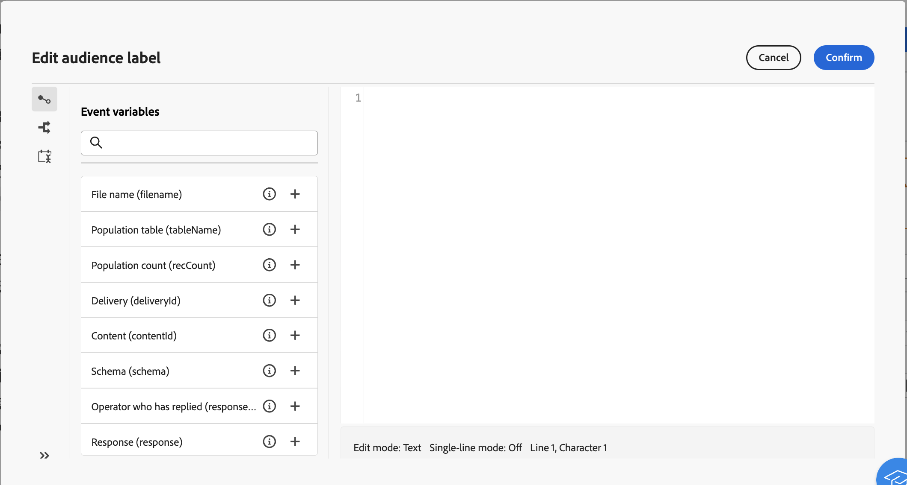

# 多步驟行銷活動事件變數 {#event-variables}

有些多步驟行銷活動可讓您在運算式編輯器中編輯指令碼以執行特定動作，例如擷取來自先前活動的資料、建置條件或根據事件變數計算檔案名稱。

## 什麼是事件變數 {#scripting}

在多步驟行銷活動內容中執行的指令碼會存取一系列其他全域&#x200B;**物件**，例如正在執行的多步驟行銷活動本身(`ìnstance`)、其各種工作(`task`)，或啟動指定工作(`event`)的事件。

**物件**&#x200B;的每個型別都與&#x200B;**變數**&#x200B;的類別相關聯，當在如&#x200B;**[!UICONTROL JavaScript程式碼]**&#x200B;或&#x200B;**[!UICONTROL 測試]**&#x200B;之類的活動中編輯指令碼時，可在運算式編輯器中運用這些變數。

* **執行個體變數** (`instance.vars.xxx`)可與全域變數比較。 所有活動都會共用這些區段。
* **工作變數** (`task.vars.xxx`)可與區域變數比較。 它們僅供目前任務使用。 持續性活動會使用這些變數來保留資料，這些變數有時也用於在相同活動的不同指令碼之間交換資料。
* **事件變數** (`vars.xxx`)可在多步驟行銷活動程式的基本工作之間交換資料。 這些變數是由啟動進行中任務的任務所傳遞。 然後會傳遞至下列活動。 **事件變數**&#x200B;是最常使用的變數，應該優先使用它們而不是執行個體變數。

## 在運算式編輯器中善用事件變數 {#expression-editor}

預先定義的事件變數可用於運算式編輯器左側窗格。 您也可以在程式碼中初始化新變數，以建立新的變數。

除了這些事件變數之外，您還可以利用左窗格中的&#x200B;**[!UICONTROL 條件]**&#x200B;功能表來建置條件，並使用&#x200B;**[!UICONTROL 新增目前日期]**&#x200B;功能表來使用與日期格式相關的功能。
