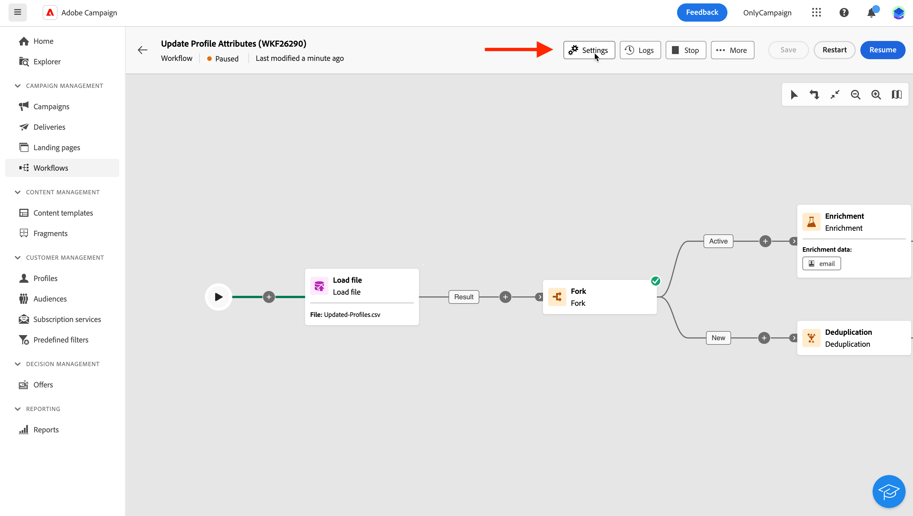

# 設定多步驟行銷活動設定 {#workflow-settings}

>[!CONTEXTUALHELP]
>id="ajo_workflow_creation_properties"
>title="多步驟行銷活動屬性"
>abstract="在此畫面中，選擇用來建立多步驟行銷活動的範本並指定標籤。 展開&#x200B;**其他選項**&#x200B;區段以設定更多設定，例如多步驟行銷活動內部名稱、其資料夾、時區和主管群組。 強烈建議選取一個主管群組，以便在發生錯誤時警告操作者。"

在畫布中建立多步驟行銷活動或協調多步驟行銷活動時，您可以存取與多步驟行銷活動相關的進階設定。 例如，您可以為多步驟行銷活動設定特定時區、管理多步驟行銷活動在發生錯誤時的行為方式，或管理應清除多步驟行銷活動歷史記錄的延遲。

這些設定是在建立多步驟行銷活動時，在選取的範本中預先設定的，但可視需要為此特定的多步驟行銷活動進行編輯。

{zoomable="yes"}{width="70%" align="left"}

## 多步驟行銷活動屬性 {#properties}

>[!CONTEXTUALHELP]
>id="ajo_workflow_settings_properties"
>title="多步驟行銷活動屬性"
>abstract="本節提供一般的多步驟行銷活動屬性，您也可以在建立多步驟行銷活動時存取這些屬性。 您可以選擇要用來建立多步驟行銷活動的範本，並指定標籤。 展開其他選項區段以設定特定設定，例如儲存資料夾或時區的多步驟行銷活動。"

**[!UICONTROL 屬性]**&#x200B;區段提供一般設定，可在建立多步驟行銷活動時進行設定。 若要存取現有多步驟行銷活動的屬性，請按一下多步驟行銷活動畫布上方動作列中的&#x200B;**[!UICONTROL 設定]**&#x200B;按鈕。

{zoomable="yes"}{width="70%" align="left"}

這些屬性包括：

* 顯示在清單中的多步驟行銷活動的&#x200B;**[!UICONTROL 標籤]**。
* 多步驟行銷活動的&#x200B;**[!UICONTROL 內部名稱]**。
* 應儲存多步驟行銷活動的&#x200B;**[!UICONTROL 資料夾]**。
* 用於所有多步驟行銷活動中的預設&#x200B;**[!UICONTROL 時區]**。 依預設，多步驟行銷活動的時區是為目前行銷活動運運算元定義的時區。
可能的值包括：
   * **伺服器時區**，使用您Adobe Experience Platform組織的時區
   * **運運算元時區**，使用執行多步驟行銷活動的運運算元的時區
   * **資料庫**&#x200B;的時區，以使用資料庫伺服器的時區
   * 特定時區
* 當多步驟行銷活動失敗時，屬於&#x200B;**[!UICONTROL 監督員]**&#x200B;欄位中所選操作員群組的操作員會收到電子郵件通知。
* 您也可以輸入多步驟行銷活動的&#x200B;**[!UICONTROL 說明]**。

## 細分設定  {#segmentation-settings}

>[!CONTEXTUALHELP]
>id="ajo_workflow_settings_segmentation"
>title="細分設定"
>abstract="在此區段中，您可以選取目標維度，以在多步驟行銷活動中定位設定檔，並選擇在兩個執行之間保留工作流程結果。 此選項僅能用於測試目的，絕不可在生產環境多步驟行銷活動中啟用。"

* **[!UICONTROL 目標維度]**：選取目標維度，以用於目標定位設定檔：收件者、合約受益者、操作員、訂閱者等。

* **[!UICONTROL 保留兩個執行之間的臨時母體結果]**：依預設，僅保留多步驟行銷活動的最後一次執行的工作表。 技術性的多步驟行銷活動會清除先前執行的工作表，並每天執行。

  如果啟用此選項，即使執行多步驟行銷活動後，也會保留工作表。 您可以將其用於測試目的，因此&#x200B;**只能**&#x200B;用於開發或中繼環境。 在生產環境多步驟行銷活動中絕對不可核取它。

## 執行設定  {#exec-settings}

>[!CONTEXTUALHELP]
>id="ajo_workflow_settings_execution"
>title="執行設定"
>abstract="在此區段中，您可以設定與工作流程執行相關的設定，例如保留多步驟行銷活動歷史記錄的天數。"

* **[!UICONTROL 歷程記錄（以天為單位）]**：指定必須清除歷程記錄的天數。 歷史記錄包含與多步驟行銷活動相關的元素：記錄、任務、事件（連結至多步驟行銷活動操作的技術物件）。 現成可用的多步驟行銷活動範本預設值為30天。 清除歷史記錄是由資料庫清理技術多步驟行銷活動執行，預設為每天執行

  >[!IMPORTANT]
  >
  >如果「**[!UICONTROL 歷史記錄 (天)]**」欄位為空白，欄位值將被視為「1」，表示歷史記錄將在 1 天後清除。

* **[!UICONTROL 預設相似性]**：如果您的安裝包含數個多步驟行銷活動伺服器，請使用此欄位來指定將在其中執行多步驟行銷活動的伺服器。 這會在特定伺服器上強制執行該多步驟行銷活動。 您可以選擇任何現有的相似性名稱，但請勿使用空格或標點符號。 如果您使用不同的伺服器，請指定不同的名稱（以逗號分隔）。

  >[!IMPORTANT]
  >
  >如果此欄位中定義的值不存在於任何伺服器上，則多步驟行銷活動將維持擱置狀態。

* **[!UICONTROL 將SQL查詢儲存在記錄檔中]**：核取此選項以將workflmulti-step campaignow中的SQL查詢儲存在記錄檔中。 此功能保留給進階使用者使用。它適用於包含&#x200B;**[!UICONTROL 建立對象]**&#x200B;等目標定位活動的多步驟行銷活動。 啟用此選項後，在多步驟行銷活動執行期間傳送到資料庫的SQL查詢會顯示在多步驟行銷活動的記錄中，好讓您分析這些查詢以最佳化查詢或診斷問題。

## 錯誤管理設定  {#error-settings}

>[!CONTEXTUALHELP]
>id="ajo_workflow_settings_error"
>title="錯誤管理設定"
>abstract="在此區段中，您可以定義多步驟行銷活動在執行期間應如何管理錯誤。 您可以選擇暫停程式、忽略特定數目的錯誤，或停止多步驟行銷活動執行。"

* **[!UICONTROL 錯誤管理]**：此欄位可讓您定義多步驟行銷活動任務發生錯誤時要採取的動作。 有三個可能的選項：

   * **[!UICONTROL 暫停處理序]**：多步驟行銷活動會自動暫停，其狀態變更為&#x200B;**[!UICONTROL 失敗]**。 問題解決後，請使用&#x200B;**[!UICONTROL 繼續]**&#x200B;按鈕繼續多步驟行銷活動。
   * **[!UICONTROL 忽略]**：觸發錯誤的工作狀態變更為&#x200B;**[!UICONTROL 失敗]**，但多步驟行銷活動會保留&#x200B;**[!UICONTROL 已啟動]**&#x200B;狀態。<!-- TO ADD ONCE SCHEUDLER IS AVAILABLE This configuration is relevant for recurring tasks: if the branch includes a scheduler, it will start normally next time the workflow is executed.-->
   * **[!UICONTROL 中止處理序]**：多步驟行銷活動已自動停止，其狀態變更為&#x200B;**[!UICONTROL 失敗]**。 問題解決後，使用&#x200B;**[!UICONTROL 開始]**&#x200B;按鈕重新啟動多步驟行銷活動。

* **[!UICONTROL 連續錯誤]**：在&#x200B;**[!UICONTROL 發生錯誤]**&#x200B;欄位中選取&#x200B;**[!UICONTROL 忽略]**&#x200B;值時，此欄位將可供使用。 您可以指定程序停止之前可以忽略的錯誤數。一旦達到此數目，多步驟行銷活動狀態就會變更為&#x200B;**[!UICONTROL 失敗]**。 如果此欄位的值為0，則無論錯誤數量如何，多步驟行銷活動都不會停止。

## 初始化指令碼 {#initialization-script}

**初始化指令碼**&#x200B;可讓您初始化變數或修改活動屬性。 按一下&#x200B;**編輯程式碼**&#x200B;按鈕，然後輸入要執行的程式碼片段。 執行多步驟行銷活動時會呼叫指令碼。 請參閱與[事件變數](event-variables.md)相關的章節。

