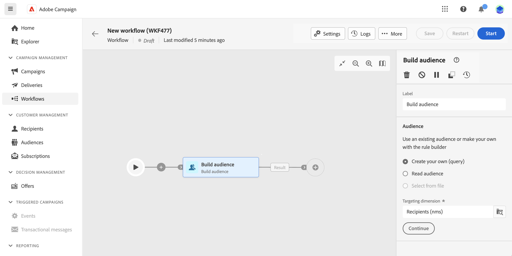
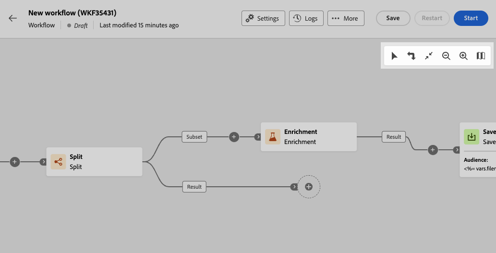
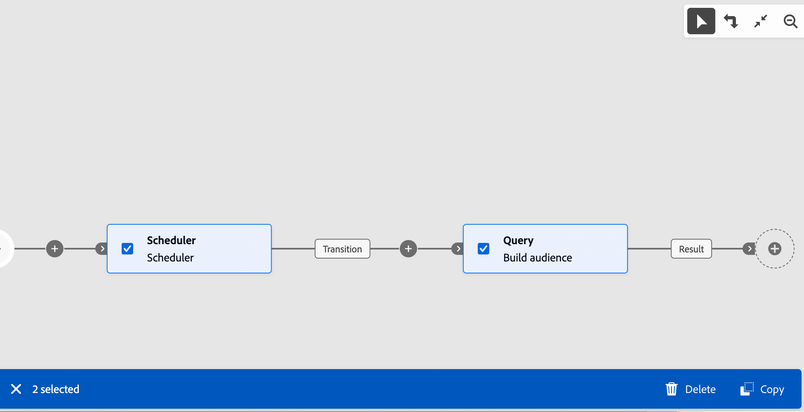
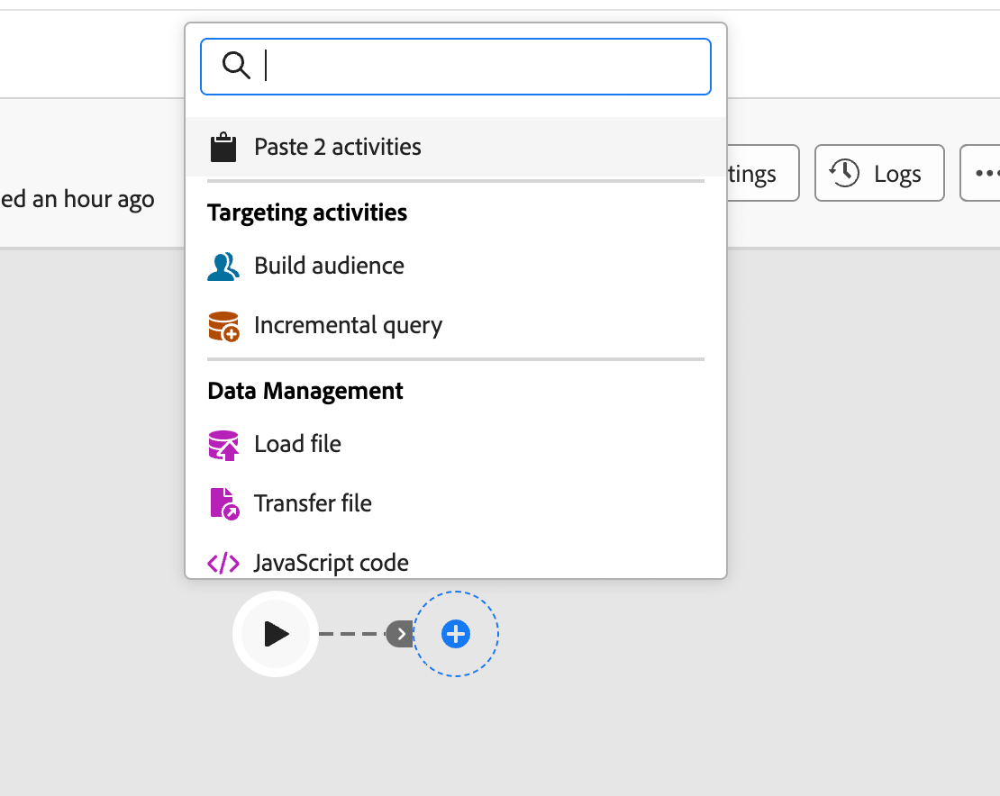

# 協調多步驟行銷活動 {#orchestrate}

一旦您[建立了多步驟行銷活動](gs-campaign-creation.md)，無論是從多步驟行銷活動選單還是在行銷活動中，您都可以開始協調它將執行的不同工作。 為此，提供了視覺畫布，可讓您建構多步驟行銷活動圖表。 在此圖表中，您可以新增各種活動，並依序連線它們。

## 新增活動 {#add}

在設定的這個階段，圖表會顯示開始圖示，代表多步驟行銷活動的開始。 若要新增您的第一個活動，請按一下連線到開始圖示的&#x200B;**+**&#x200B;按鈕。

可新增至圖表的活動清單隨即顯示。 可用的活動取決於您在多步驟行銷活動圖表中的位置。 例如，新增第一個活動時，您可以透過鎖定對象、分割多步驟行銷活動路徑或設定&#x200B;**等待**&#x200B;活動以延遲多步驟行銷活動執行來開始多步驟行銷活動。 另一方面，在&#x200B;**建立對象**&#x200B;活動後，您可以調整目標定位活動、傳送傳遞內容給具有頻道活動的對象，或組織具有流量控制活動的多步驟行銷活動程式。

{zoomable="yes"}

將活動新增到圖表後，右側窗格會出現，可讓您使用特定設定來設定新新增的活動。 有關如何設定每個活動的詳細資訊，請參閱[本節](activities/about-activities.md)。

{zoomable="yes"}

重複此程式，根據您想要多步驟行銷活動執行的工作，視需要新增更多活動。 請注意，您也可以在兩個活動之間插入新活動。 若要這麼做，請按一下活動之間轉變上的&#x200B;**+**&#x200B;按鈕，選取所需的活動，並在右窗格中設定它。

若要移除活動，請在畫布中選取該活動，然後按一下活動屬性中的&#x200B;**刪除**&#x200B;圖示。

>[!TIP]
>
>您可以選擇個人化每個活動之間的轉變名稱。 要執行此操作，請選取轉變並在右窗格中變更其標籤。

## 工具列 {#toolbar}

位於畫布右上角的工具列提供可輕鬆操控活動並在畫布中導覽的選項：

* **多重選取模式**：選取多個活動以一次刪除所有活動，或複製並貼上這些活動。 請參閱[本節](#copy)。
* **旋轉**：垂直切換畫布。
* **符合熒幕大小**：調整畫布縮放等級以符合熒幕。
* **縮小** / **放大**：縮小或進入畫布。
* **顯示地圖**：開啟顯示您所在位置的畫布快照。

{zoomable="yes"}{width="50%"}

## 管理活動 {#manage}

新增活動時，屬性窗格中會顯示動作按鈕，可讓您執行多項作業。

{zoomable="yes"}

您可以：

* 從畫布中&#x200B;**刪除**&#x200B;活動。
* **停用/啟用**&#x200B;活動。 執行多步驟行銷活動時，停用的活動不會執行同一路徑上的下列活動，且多步驟行銷活動會停止。
* **暫停/繼續**&#x200B;活動。 執行多步驟行銷活動時，會在暫停的活動中暫停。 系統不會執行對應的任務，以及在相同路徑中跟隨著該任務的所有任務。
* **複製**&#x200B;活動。 請參閱[本節](#copy)。
* **將**&#x200B;活動及其所有子節點移至另一個轉變。 請參閱[此節](#move)
* 存取活動的&#x200B;**執行選項**。
* 存取活動的&#x200B;**記錄檔與工作**。

若干&#x200B;**目標定位**&#x200B;活動（例如&#x200B;**合併**&#x200B;或&#x200B;**重複資料刪除**），可讓您處理剩餘母體，並將其納入其他出站轉變中。 例如，如果您使用&#x200B;**分割**&#x200B;活動，則補數包含不符合任何先前定義之子集的母體。 若要使用此功能，請啟動&#x200B;**產生補充**&#x200B;選項。

## 移動或複製活動 {#move-copy}

### 複製貼上活動 {#copy}

您可以複製多步驟行銷活動並貼到任何工作流程中。 目的地多步驟行銷活動可在不同的瀏覽器索引標籤中。

若要複製活動，您有兩個選擇：

* 使用動作按鈕複製一個活動。

  {zoomable="yes"}{width="70%"}

* 使用工具列按鈕複製多個活動。

  {zoomable="yes"}{width="70%"}

若要貼上複製的活動，請按一下轉變上的&#x200B;**+**&#x200B;按鈕，然後選取「貼上X活動」。

{zoomable="yes"}{width="50%"}

### 移動活動及其子節點 {#move}

Journey Optimizer可讓您將活動及其子節點的全部內容（包括其內的所有轉變和活動）移動到相同多步驟行銷活動中另一個轉變的結尾。

此程式會中斷活動及其出站轉變中所有專案與初始位置的連線，並將其移至新的目標轉變。

若要移動活動：

1. 選取您要移動的活動。
1. 在活動的屬性窗格中，按一下&#x200B;**移動**&#x200B;按鈕。
1. 選取您要放置活動及其出站轉變的轉變，然後確認。

## 執行選項 {#execution}

所有活動均可讓您管理其執行選項。 選取活動並按一下&#x200B;**執行選項**&#x200B;按鈕。 這可讓您定義活動的執行模式和發生錯誤時的行為。

{zoomable="yes"}{width="70%"}

### 屬性

**執行**&#x200B;欄位可讓您定義工作啟動時要執行的動作。

**最長執行期間**&#x200B;欄位可讓您指定期間，例如&quot;30s&quot;或&quot;1h&quot;。 如果活動在指定的持續時間過後仍未完成，則會觸發警報。 這對多步驟行銷活動的運作方式沒有影響。

**時區**&#x200B;欄位可讓您選取活動的時區。 Adobe Journey Optimizer可讓您在同一例項上管理多個國家/地區之間的時間差異。 套用的設定會在建立執行個體時進行設定。

**相似性**&#x200B;欄位可讓您強制在特定電腦上執行多步驟行銷活動或多步驟行銷活動。 若要這麼做，您必須為討論中的多步驟行銷活動或活動指定一或多個相關性。

**行為**&#x200B;欄位可讓您定義在使用非同步工作時要遵循的程式。

### 錯誤管理

**發生錯誤**&#x200B;欄位可讓您指定活動發生錯誤時要執行的動作。

### 初始化指令碼

**初始化指令碼**&#x200B;可讓您初始化變數或修改活動屬性。 按一下&#x200B;**編輯程式碼**&#x200B;按鈕，然後輸入要執行的程式碼片段。 當活動執行時，會呼叫指令碼。

## 範例 {#example}

以下為多步驟行銷活動範例，其設計是以電子郵件傳送給所有對咖啡機感興趣的客戶(VIP客戶除外)。

{zoomable="yes"}{zoomable="yes"}

為達成此目的，已新增下列活動：

* **[!UICONTROL 分支]**&#x200B;活動會將多步驟行銷活動分成三個路徑（每組客戶一個路徑），
* **[!UICONTROL 建立對象]**&#x200B;活動，以鎖定三組客戶：

   * 擁有電子郵件的客戶，
   * 屬於既有「感興趣的咖啡機」受眾的客戶，
   * 屬於既有「VIP或獎勵」對象的客戶。

* **[!UICONTROL 合併]**&#x200B;活動，將電子郵件和咖啡機愛好者的客戶分組，
* 排除VIP客戶的&#x200B;**[!UICONTROL 合併]**&#x200B;活動，
* **[!UICONTROL 電子郵件傳遞]**&#x200B;活動，會傳送電子郵件給產生的客戶。

完成多步驟行銷活動後，在圖表結尾新增&#x200B;**[!UICONTROL 結束]**&#x200B;活動。 此活動可讓您以視覺化方式標示工作流程的結尾，而不會對功能造成影響。

成功設計多步驟行銷活動圖表後，您可以執行多步驟行銷活動並追蹤其各種任務的進度。 [瞭解如何開始多步驟行銷活動並監視其執行](start-monitor-campaigns.md)
