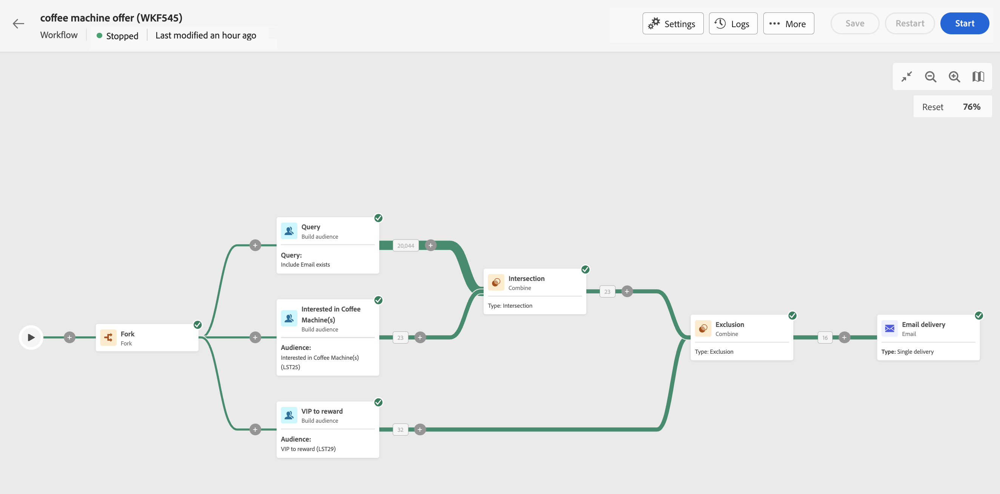
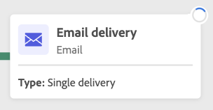
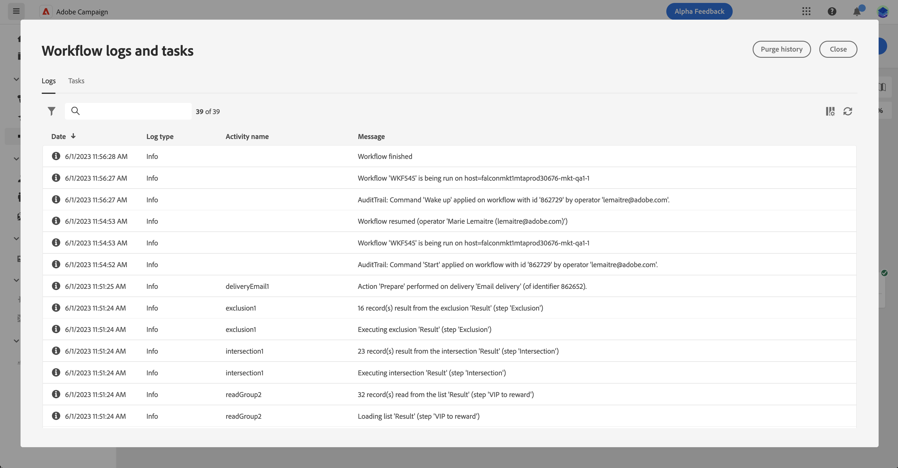

# 開始和監視您協調的行銷活動 {#start-monitor}

<!--
<audio controls><source src="../ms/assets/do-not-localize/sound.mp3" type="audio/mpeg">Your browser does not support the audio element.</audio> -->

>[!CONTEXTUALHELP]
>id="ajo_campaign_publication"
>title="發佈協調的行銷活動"
>abstract="若要開始您的行銷活動，您必須將其發佈。 確保在發佈之前清除所有警告。"

一旦您建立了協調流程並設計了要在畫布中執行的任務，您就可以發佈它並監視其執行方式。

## 開始協調的行銷活動 {#start}

若要開始協調的行銷活動，請導覽至&#x200B;**[!UICONTROL 行銷活動]**&#x200B;功能表的&#x200B;**[!UICONTROL 多重步驟]**&#x200B;標籤，並選取要開始的行銷活動，然後按一下畫布右上角的&#x200B;**[!UICONTROL 開始]**&#x200B;按鈕。

一旦執行協調的行銷活動後，畫布中的每個活動就會依序執行，直到達到協調的行銷活動結束為止。

您可以使用視覺流量即時追蹤目標設定檔的進度。 這可讓您快速識別每個活動的狀態，以及活動中轉換的個人檔案數。

{zoomable="yes"}

## 協調的行銷活動轉換 {#transitions}

在協調的行銷活動中，透過轉變從一個活動傳輸到另一個活動的資料會儲存在臨時工作表中。 此資料可針對每個轉變顯示。 要執行此操作，請選取轉變以在熒幕右側開啟其屬性。

* 按一下&#x200B;**[!UICONTROL 預覽結構描述]**&#x200B;以顯示工作表的結構描述。
* 按一下&#x200B;**[!UICONTROL 預覽結果]**，以視覺化方式呈現所選轉變中傳輸的資料。

{zoomable="yes"}

## 監視活動執行 {#activities}

每個活動方塊右上角的視覺指示器可讓您檢查其執行：

| 視覺指示器 | 說明 |
|-----|------------|
| {zoomable="yes"}{width="70%"} | 活動目前正在執行。 |
| {zoomable="yes"}{width="70%"} | 活動需要您注意。 這可能涉及確認傳遞的傳送或採取必要行動。 |
| {zoomable="yes"}{width="70%"} | 活動發生錯誤。 若要解決此問題，請開啟協調的行銷活動記錄檔，以取得詳細資訊。 |
| {zoomable="yes"}{width="70%"} | 已成功執行活動。 |

## 監視日誌和任務 {#logs-tasks}

監視工作流程記錄和任務是分析協調行銷活動並確保其正常執行的關鍵步驟。 可從動作工具列及每個活動屬性窗格中的&#x200B;**[!UICONTROL 記錄檔]**&#x200B;圖示存取。

**[!UICONTROL 記錄檔與工作]**功能表提供協調行銷活動執行的歷程記錄，記錄所有使用者動作和遇到的錯誤。
{zoomable="yes"}

提供兩種資訊：

* **[!UICONTROL Log]**&#x200B;索引標籤包含所有已協調行銷活動的執行歷程記錄。 其會按時間順序，對執行的操作和執行錯誤進行索引。
* **[!UICONTROL 任務]**&#x200B;索引標籤詳細說明活動的執行順序。

在這兩個標籤中，您可以選擇顯示的欄及其順序、套用篩選器，並使用搜尋欄位來快速尋找所需的資訊。

## 協調的行銷活動執行命令 {#execution-commands}

右上角的動作列提供可讓您管理協調行銷活動執行的命令。 您可以：

* **[!UICONTROL 開始]** / **[!UICONTROL 繼續]**&#x200B;執行   已協調的行銷活動，接著會採取進行中狀態。 如果協調的行銷活動已暫停，則會繼續，否則會啟動行銷活動，然後啟動初始活動。

* **[!UICONTROL 暫停]**&#x200B;執行協調的行銷活動，接著會呈現「已暫停」狀態。 在繼續之前，不會啟用任何新活動，但不會暫停進行中的作業。

* **[!UICONTROL 停止]**&#x200B;正在執行的協調行銷活動，其狀態會變成「已完成」。 如果可能的話，進行中的作業會被中斷。 您無法從已停止的同一個位置繼續從協調的行銷活動。
