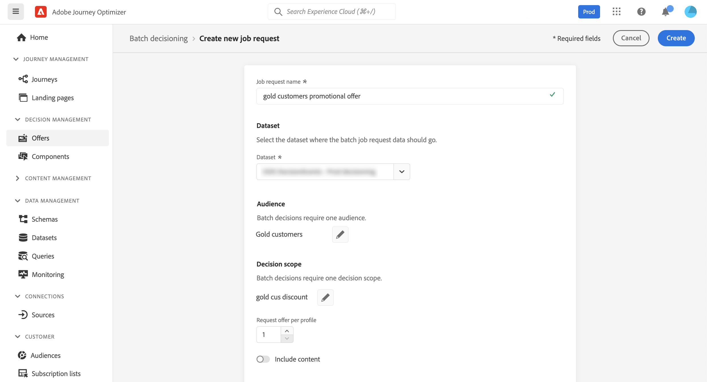
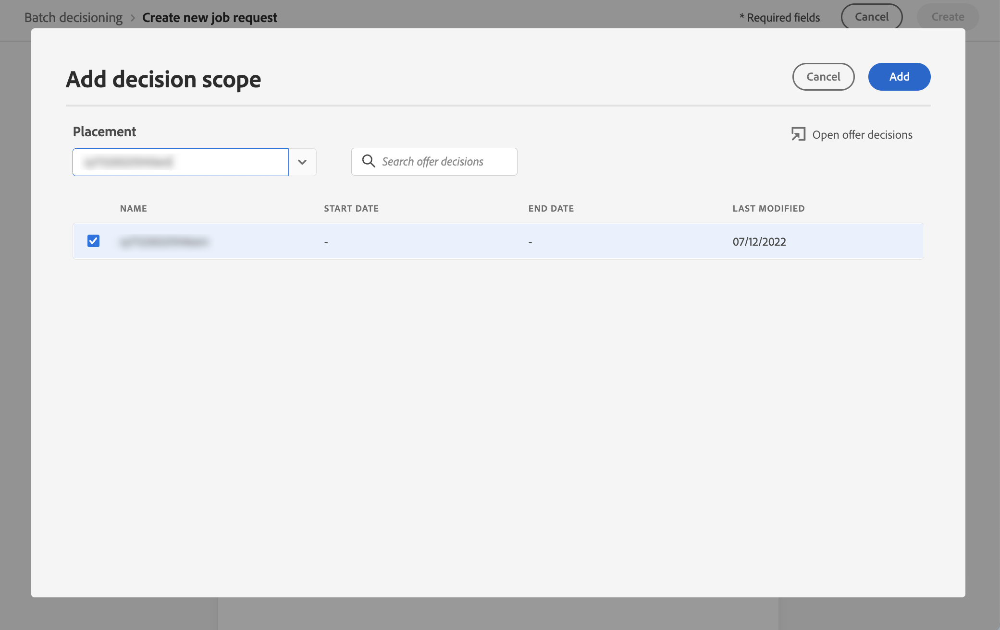
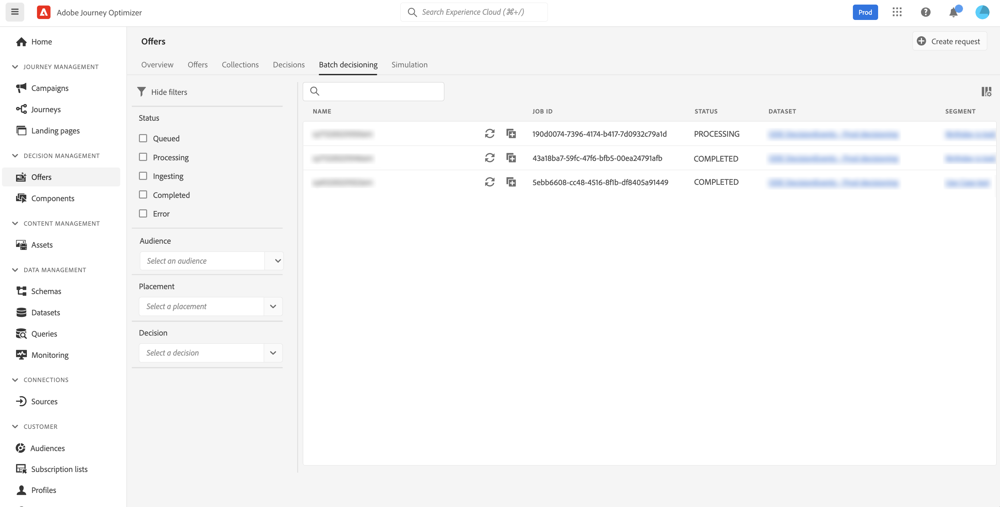

# 批次決策 {#deliver}

## 開始使用批次決策 {#start}

Journey Optimizer可讓您將優惠決定傳送給特定Adobe Experience Platform對象中的所有設定檔。

為此，您需要在Journey Optimizer中建立工作請求，其中包含要定位之對象和要使用之優惠決定的相關資訊。 然後，對象中每個設定檔的選件內容會放入Adobe Experience Platform資料集，以供自訂批次工作流程使用。

也可以使用API執行批次傳送。 如需詳細資訊，請參閱[批次決策API檔案](api-reference/offer-delivery-api/batch-decisioning-api.md)。

## 先決條件 {#prerequisites}

在設定工作請求之前，請確定您已建立：

* Adobe Experience Platform中的&#x200B;**資料集**。 此資料集將用於儲存使用「ODE DecisionEvents」結構描述的決策結果。 進一步瞭解[資料集檔案](https://experienceleague.adobe.com/docs/experience-platform/catalog/datasets/overview.html?lang=zh-Hant)。

* Adobe Experience Platform中的&#x200B;**對象**。 應評估對象並加以更新。 在[Segmentation Service檔案](https://www.adobe.com/go/segmentation-overview-en_tw)中瞭解如何更新對象成員資格評估

  >[!NOTE]
  >
  >批次工作會以每天發生一次的設定檔快照執行。 批次決定會限制頻率，並一律從最近的快照載入設定檔。 嘗試批次決策API之前，預計在建立對象後最多可等待24小時。

* Adobe Journey Optimizer中的&#x200B;**決定**。 [瞭解如何建立決定](offer-activities/create-offer-activities.md)

<!-- in API doc, remove these info and add ref here-->

## 建立工作請求

若要建立新的工作請求，請遵循下列步驟。

1. 在&#x200B;**[!UICONTROL 選件]**&#x200B;功能表中，開啟&#x200B;**[!UICONTROL 批次決策]**&#x200B;標籤，然後按一下&#x200B;**[!UICONTROL 建立請求]**。

   

1. 為工作請求命名，然後選取工作資料應傳送到的資料集。

1. 選取要鎖定的Adobe Experience Platform對象。

1. 選取您要用來將優惠傳送給對象的一或多個優惠決定範圍：
   1. 從清單中選取位置。
   1. 所選位置可用的決定會顯示出來。 選取您選擇的決定並按一下[新增]。**&#x200B;**
   1. 重複此作業，視需要新增儘可能多的決定範圍。

   

1. 依預設，會為每個設定檔傳回一個決定範圍優惠。 您可以使用每個設定檔&#x200B;**[!UICONTROL 要求選件]**&#x200B;選項來調整傳回的選件數目。 例如，您若選取「2」，則會針對所選取的決策範圍顯示最佳的 2 項產品建議。

   >[!NOTE]
   >
   >您最多可以為每個決定範圍請求30個優惠。

1. 如果您想要在資料集中包含選件內容，請開啟&#x200B;**[!UICONTROL 包含內容]**&#x200B;選項。 此選項預設為停用。

1. 按一下&#x200B;**[!UICONTROL 建立]**&#x200B;以執行工作要求。

## 監視批次作業

所有要求的批次工作都可以從&#x200B;**[!UICONTROL 批次決策]**&#x200B;索引標籤存取。 此外，搜尋和篩選工具也可協助您調整清單。

### 工作請求狀態

建立工作請求後，批次工作會經歷多種狀態：

>[!NOTE]
>
>為確保您獲得有關工作請求狀態的最新資訊，請使用工作旁邊的省略符號按鈕以重新整理。

1. **[!UICONTROL 已排入佇列]**：工作要求已建立並已進入處理佇列。 每個資料集一次最多可執行5個批次工作。 具有相同輸出資料集的任何其他批次請求都會新增至佇列。 擷取已排入佇列的工作，以便在前一個工作執行完畢後進行處理。
1. **[!UICONTROL 正在處理]**：正在處理工作要求
1. **[!UICONTROL 擷取]**：工作要求已執行，結果資料正在擷取到選取的資料集中，
1. **[!UICONTROL 已完成]**：工作要求已執行，結果資料現在已儲存到選取的資料集中。

   >[!NOTE]
   >
   >您可以按一下工作清單中的名稱，存取儲存工作結果的資料集。

如果執行工作要求時發生錯誤，將會取得&#x200B;**[!UICONTROL 錯誤]**&#x200B;狀態。 請嘗試複製批次工作，以建立新請求。 [瞭解如何複製批次工作](#duplicate)

### 批次工作處理時間

每個批次工作的端對端時間是從工作負載建立時間到輸出資料集中提供決定結果時的持續時間。

對象人數是影響端對端批次決定時間的主要因素。 如果符合資格的優惠方案已啟用全域頻率上限，則批次決定需要額外時間才能完成。 以下是其各自對象規模的端對端處理時間的一些近似值，針對合格優惠方案有和不有頻率上限：

已為合格優惠方案啟用頻率上限：

| 對象規模 | 端對端處理時間 |
|--------------|----------------------------|
| 1萬個以下的設定檔 | 7 分鐘 |
| 100萬個以下的設定檔 | 30 分鐘 |
| 1500萬個以下的設定檔 | 50 分鐘 |

符合資格的優惠方案沒有頻率上限：

| 對象規模 | 端對端處理時間 |
|--------------|----------------------------|
| 1萬個以下的設定檔 | 6 分鐘 |
| 100萬個以下的設定檔 | 8 分鐘 |
| 1500萬個以下的設定檔 | 16 分鐘 |

## 複製工作請求 {#duplicate}

您可以重複使用現有工作的資訊來建立新請求。

若要這麼做，請按一下重複圖示，編輯工作資訊（如有需要），然後按一下[建立] **[!UICONTROL 以建立新要求。]**

