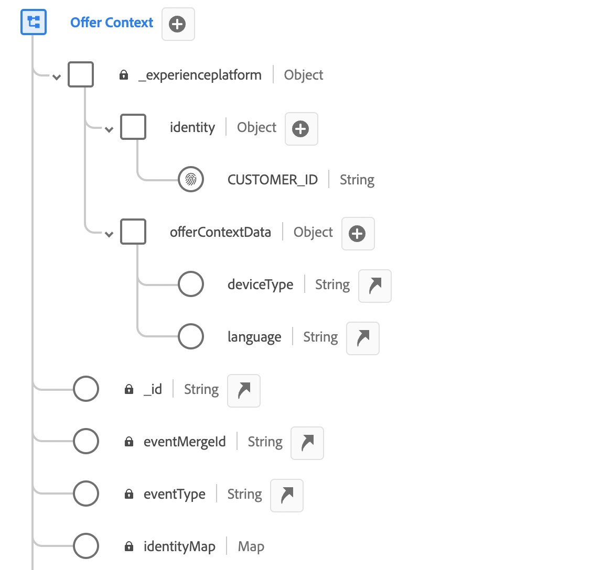
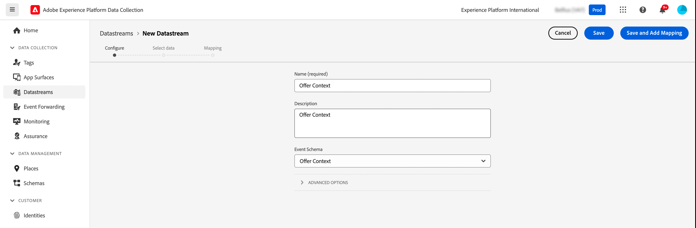
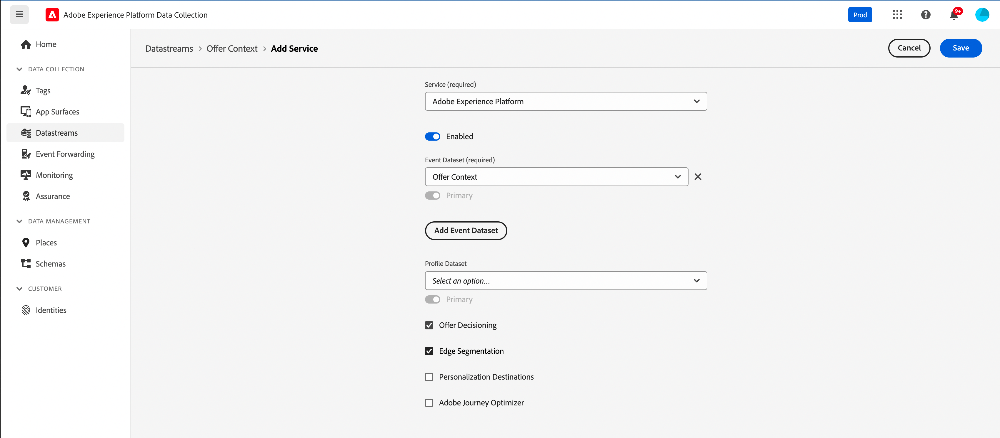
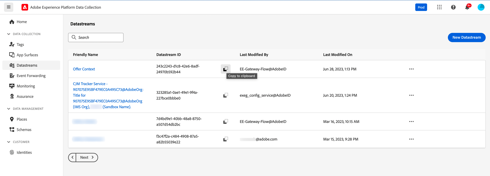
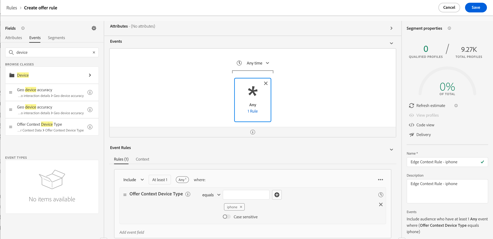
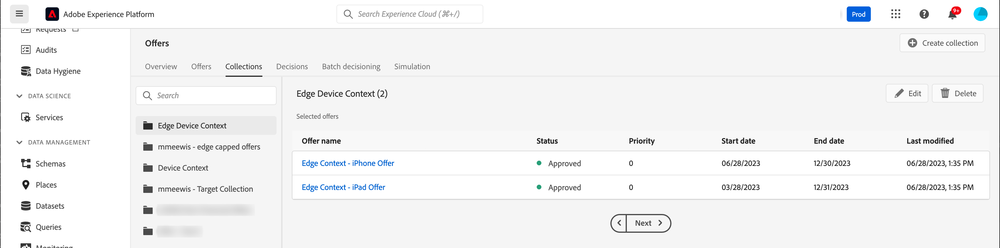
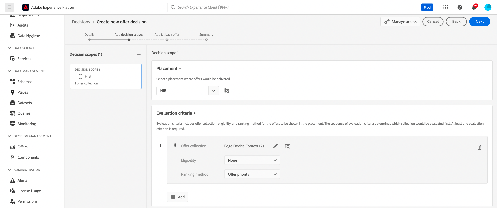
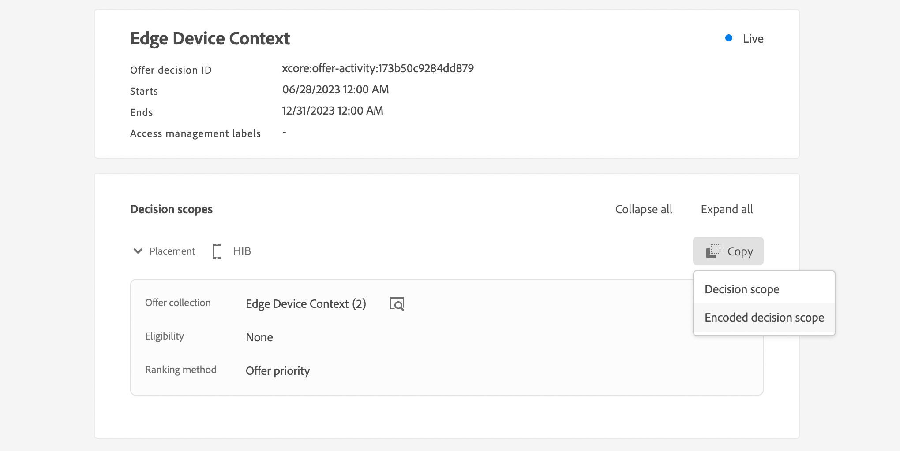

# 內容資料與邊緣決策請求 {#edge}

本節將引導您在Edge Decisioning請求中傳遞內容資料，並在適用性規則中使用這些資料。 我們將探索端對端使用案例，以示範如何根據客戶使用的裝置型別提供個人化優惠方案。

此使用案例涉及幾個關鍵步驟：

1. [設定先決條件](#prerequisites)：確定已完成所有必要步驟，以便在您的請求中傳遞內容資料。
1. [在適用性規則中使用內容資料](#rules)：建立根據使用者的裝置型別決定要顯示哪些優惠方案的規則。
1. [設計裝置特定優惠方案](#offers)：為每個裝置型別建立量身打造的優惠方案，並將其連結至對應的規則。
1. [建立優惠方案集合](#collection)：將所有優惠方案群組為一個靜態集合。
1. [設定決定](#decision) ：建立新決定，利用優惠決定引擎根據使用者的裝置型別，挑選要呈現給使用者的最佳優惠。
1. [在Edge Decisioning請求中傳遞內容資料](#request)：透過您的API請求傳遞內容資料，以擷取並向使用者呈現適當的選件。

>[!BEGINSHADEBOX]

若要更進一步，您也可以將內容資料運用到&#x200B;**排名公式**&#x200B;中，或是&#x200B;**動態個人化優惠方案表示**。 例如，您可以建立單一選件，並使用個人化欄位來根據內容資料調整其表示。 例如，如果使用者有iphone，會顯示指定的影像，而另一個影像則會顯示給ipad使用者。 如需詳細資訊，請參閱下列章節：

* [排名公式 — 根據內容資料提升優惠](../offers/ranking/create-ranking-formulas.md#context-data)
* [根據內容資料個人化表示](../offers/offer-library/add-representations.md#context-data)

>[!ENDSHADEBOX]

## 在Edge Decisioning請求中傳遞內容資料的先決條件 {#prerequisites}

與使用決策API以相當自由的格式傳遞內容不同，Edge決策內容裝載必須符合XDM體驗事件。 為此，需要將內容定義為用於資料收集的「XDM體驗事件」的一部分。

1. 定義體驗事件結構描述。 在此使用案例中，系統會建立「優惠方案內容」結構，且優惠方案內容欄位是「優惠方案內容」欄位群組的一部分。 事實上，欄位群組會新增至體驗事件結構描述，用於與「Edge收集網路」資料流相關聯的資料收集。

   >[!NOTE]
   >
   >優惠內容體驗事件結構描述必須屬於設定檔的一部分，且「CUSTOMER_ID」欄位會當作主要身分。

   在此範例中，「選件內容」欄位群組有兩個屬性：language和deviceType。 這些屬性將用於優惠排名和適用性規則。

   {width="60%" align="center" zoomable="yes"}

   在Adobe Experience Platform [Experience Data Model (XDM)指南](https://experienceleague.adobe.com/zh-hant/docs/experience-platform/xdm/home){target="_blank"}中瞭解如何使用結構描述

1. 建立資料集（此處為「選件內容」）並確保已為設定檔啟用它。

1. 從&#x200B;**[!UICONTROL 資料彙集]** > **[!UICONTROL 資料串流]**&#x200B;功能表建立新的資料串流。 瞭解如何在Adobe Experience Platform [資料串流指南](https://experienceleague.adobe.com/zh-hant/docs/experience-platform/datastreams/configure){target="_blank"}中建立和設定資料串流

   我們已建立「優惠內容」資料流，並選取「優惠內容」事件結構描述。

   

1. 編輯新建立的資料流，並選取「Adobe Experience Platform」作為服務，選取「選件內容」作為事件資料集。

   

1. 儲存資料流並複製其ID。 此ID將用於您的API要求端點。 [瞭解如何建立API呼叫](#request)

   

## 在適用性規則中使用內容資料 {#rules}

建立適用性規則，根據使用者的裝置型別決定要顯示哪些優惠方案：



* iphone裝置規則：

   * 規則名稱： 「Edge內容規則 — iphone」
   * 設定： deviceType = &#39;iphone&#39;
   * PQL語法：

     ```
     select _Any1 from xEvent where _Any1._experienceplatform.offerContextData.deviceType.equals("iphone", false)
     ```

* ipad裝置規則：

   * 規則名稱： 「Edge內容規則 — ipad」
   * 設定： deviceType = &#39;ipad&#39;
   * PQL語法

     ```
     select _Any1 from xEvent where _Any1._experienceplatform.offerContextData.deviceType.equals("ipad", false)
     ```

## 建立優惠 {#offers}

為每個裝置型別建立選件，並將其連結至先前建立的對應適用性規則：

* 適用於iphone使用者的選件：

   * 選件名稱：「Edge內容 — iPhone選件內容」
   * 相關規則：「Edge內容規則 — iphone」

* ipad使用者適用的優惠方案：

   * 選件名稱： Edge內容 — iPad選件內容：
   * 相關規則：「Edge內容規則 — ipad」

此外，建立遞補優惠（此處為「內容遞補內容」），以在不符合特定裝置條件時顯示。

## 在集合中新增優惠方案 {#collection}

將先前建立的選件新增至靜態集合，並命名為「Edge裝置內容」。 此集合是優惠決定挑選合格優惠呈現在客戶的地方。



## 建立優惠決定 {#decision}

建立新決定，利用優惠決定引擎在選取「內容遞補」優惠作為遞補優惠時，根據使用者的裝置型別，挑選要呈現給使用者的最佳優惠。



>[!NOTE]
>
>若要更進一步，您可以將內容資料運用到排名公式中，並將其指派給您的決定。 新增資訊

## 在Edge Decisioning請求中傳遞內容資料 {#request}

### 端點

在端點中，使用先前建立的[資料串流](#prerequisites)的識別碼。

`https://edge.adobedc.net/ee/irl1/v1/interact?configId=f3c47f2a-c484-4908-87a5-a82b55039e22`

### 承載

以下是傳遞內容資料的請求範例。

* 有關裝置型別的資訊已傳入`xdm:ContextData`節點。
* 在`decisionScopes`節點中，複製並貼上先前設定之[優惠決定](#decision)的決定範圍。

  +++擷取決定範圍的位置

  

  +++

```
{
    "events": [{
        "xdm": {
            "identityMap": {
                "customerId": [{
                    "id": "0000158216",
                    "authenticatedState": "authenticated",
                    "primary": true
                }]
            },
            "_experienceplatform": {
                "identity": {
                    "core": {
                        "customerId": "0000158216"
                    }
                },
                "offerContextData" : {
                    "language" : "NL",
                    "deviceType" : "iphone"
                }
            }
        }
    }],
    "query": {
        "personalization": {
            "decisionScopes": ["eyJ4ZG06YWN0aXZpdHlJZCI6Inhjb3JlOm9mZmVyLWFjdGl2aXR5OjE3M2I1MGM5Mjg0ZGQ4NzkiLCJ4ZG06cGxhY2VtZW50SWQiOiJ4Y29yZTpvZmZlci1wbGFjZW1lbnQ6MTZhMzQxZWQ4ZDYyMzc2MSJ9"]
        }
    }
}
```

### 回應

以下是範例回應：

```
{
    "requestId": "14a2d3f5-a6fa-494e-b42c-cc65a845284a",
    "handle": [
        {
            "payload": [
                {
                    "id": "1eafc831-4819-4800-8e25-c9e9f0838e09",
                    "scope": "eyJ4ZG06YWN0aXZpdHlJZCI6Inhjb3JlOm9mZmVyLWFjdGl2aXR5OjE3M2I1MGM5Mjg0ZGQ4NzkiLCJ4ZG06cGxhY2VtZW50SWQiOiJ4Y29yZTpvZmZlci1wbGFjZW1lbnQ6MTZhMzQxZWQ4ZDYyMzc2MSJ9",
                    "activity": {
                        "id": "xcore:offer-activity:173b50c9284dd879",
                        "etag": "1",
                        "name": "Edge Device Context"
                    },
                    "placement": {
                        "id": "xcore:offer-placement:16a341ed8d623761",
                        "etag": "1",
                        "name": "HIB",
                        "channel": "https://ns.adobe.com/xdm/channel-types/mobile",
                        "componentType": "https://ns.adobe.com/experience/offer-management/content-component-json"
                    },
                    "items": [
                        {
                            "id": "xcore:personalized-offer:173b4e05676d87f5",
                            "etag": "3",
                            "name": "Edge Context - iPhone Offer",
                            "priority": 0,
                            "schema": "https://ns.adobe.com/experience/offer-management/content-component-json",
                            "data": {
                                "id": "xcore:personalized-offer:173b4e05676d87f5",
                                "format": "application/json",
                                "language": [
                                    "en-gb"
                                ],
                                "content": "{\n    \"name\" : \"iphone offer\"\n}"
                            }
                        }
                    ]
                }
            ],
            "type": "personalization:decisions",
            "eventIndex": 0
        },
        {
            "payload": [],
            "type": "activation:pull",
            "eventIndex": 0
        },
        {
            "payload": [],
            "type": "personalization:decisions",
            "eventIndex": 0
        },
        {
            "payload": [
                {
                    "scope": "Target",
                    "hint": "37",
                    "ttlSeconds": 1800
                },
                {
                    "scope": "AAM",
                    "hint": "6",
                    "ttlSeconds": 1800
                },
                {
                    "scope": "EdgeNetwork",
                    "hint": "irl1",
                    "ttlSeconds": 1800
                }
            ],
            "type": "locationHint:result"
        },
        {
            "payload": [
                {
                    "key": "kndctr_907075E95BF479EC0A495C73_AdobeOrg_identity",
                    "value": "CiY0MDAwMDgyMjMzNTEzNzU1OTcwMjQ0NDcyNjU1MTAyMDEwNDQ3MVIRCNnE4Y6QMRABGAEqBElSTDHwAdnE4Y6QMQ==",
                    "maxAge": 34128000
                },
                {
                    "key": "kndctr_907075E95BF479EC0A495C73_AdobeOrg_cluster",
                    "value": "irl1",
                    "maxAge": 1800
                }
            ],
            "type": "state:store"
        }
    ]
}
```
