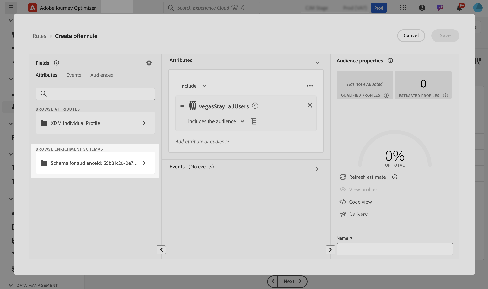
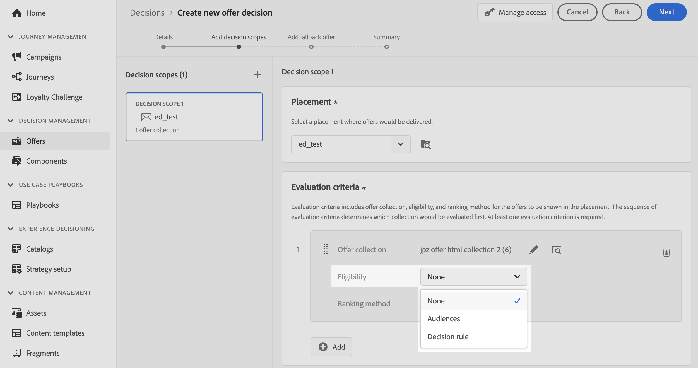
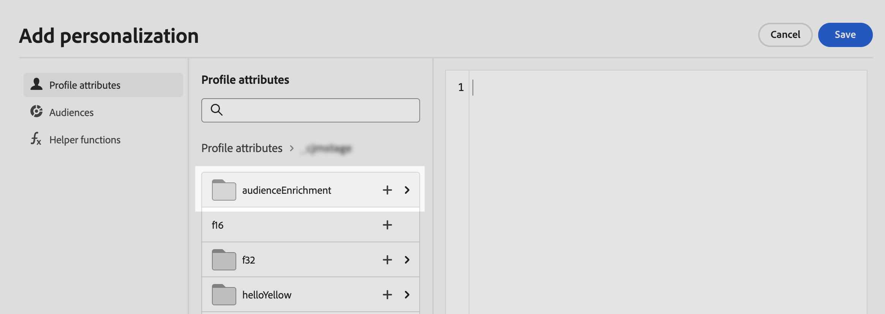

# 善用自訂上傳對象，以便做決策 {#custom-upload-decisioning}

透過Journey Optimizer，您可以利用使用自訂上傳（CSV檔案）建立的對象資料至Adobe Experience Platform來支援您的決策管理工作流程。 當設定檔上不需要資料，但在決策用途中仍然是必要資料時，這會特別有用。

來自自訂上傳對象的資料可在決策管理中用於以下用途：

1. 優惠和決定中的資格標準。
2. 在優惠代表中個人化內容。

如需自訂上傳對象的詳細資訊，請參閱區段：
* [開始使用audiences和Journey Optimizer](../audience/about-audiences.md)
* [在Adobe Experience Platform中匯入對象](https://experienceleague.adobe.com/zh-hant/docs/experience-platform/segmentation/ui/audience-portal#import-audience){target="_blank"}

## 必讀 {#must-read}

* 僅&#x200B;**決定管理**&#x200B;支援此功能，Decisioning （先前稱為「Experience Decisioning」）不支援。
* 它只能透過&#x200B;**決策API （中樞）**&#x200B;請求使用，**Edge決策API**&#x200B;或&#x200B;**批次決策**&#x200B;不支援。
 

## 使用自訂上傳對象作為資格條件 {#eligibilty}

您可以在優惠或決定層級使用自訂上傳對象作為資格條件。 新增後，這些條件可從資格中排除優惠或優惠方案集合。 以下是您可以善用自訂上傳對象來調整優惠和決定資格的各種位置：

* 使用自訂上傳對象建立決定規則：

   1. 編寫規則時，請存取&#x200B;**對象**&#x200B;索引標籤，然後在清單中搜尋您的CSV對象。 將對象拖放至規則畫布。
   1. 使用&#x200B;**屬性**&#x200B;標籤，並導覽至連結至所選對象的擴充結構，以存取CSV檔案中的所有資料，並在您的規則中使用這些資料。 這可讓您使用CSV檔案中的欄位來調整規則。 [瞭解如何建立決定規則](../offers/offer-library/creating-decision-rules.md)
   1. 儲存規則。 建立規則後，即可在優惠和決定層級使用，以精簡適用性。

  

* 使用自訂上傳對象作為選件限制。 [瞭解如何將限制新增至優惠方案](../offers/offer-library/add-constraints.md)

  編寫優惠方案時，請在&#x200B;**新增限制**&#x200B;步驟中執行以下任一操作：

   * 使用自訂上傳對象來定義優惠方案適用性，
   * 套用規則以運用自訂上傳對象。

  

* 在決定層級使用自訂上傳對象。

  設定決定時，在&#x200B;**新增決定範圍**&#x200B;步驟中，您可以使用自訂上傳對象作為優惠集合的評估標準。 [瞭解如何定義決定範圍](../offers/offer-activities/create-offer-activities.md#add-decision-scopes)

  

## 使用自訂上傳對象來個人化優惠方案宣告

自訂上傳對象也可以參考CSV檔案中的資料，用來個人化優惠方案表示的內容。 [瞭解如何新增代表至優惠方案](../offers/offer-library/add-representations.md)

為了能夠利用自訂上傳對象的屬性進行個人化，您首先需要新增自訂對象作為限制。 若要這麼做，在製作選件時，請在&#x200B;**新增限制**&#x200B;步驟中，新增對象作為限制，或選取運用自訂上傳對象的規則。

對象新增為限制後，您可使用其屬性來個人化表示內容。 若要這麼做，請存取&#x200B;**設定檔屬性**&#x200B;索引標籤，並搜尋自訂上傳對象。 從對象中選取相關屬性，以個人化選件內容。

